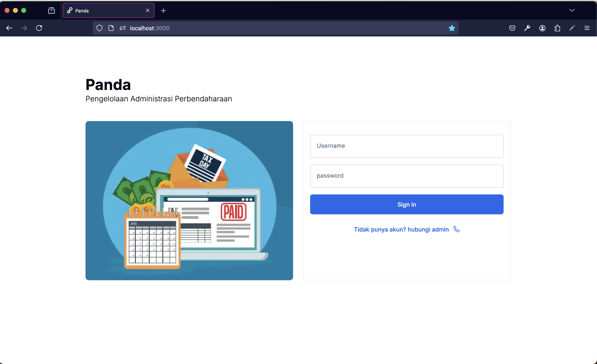
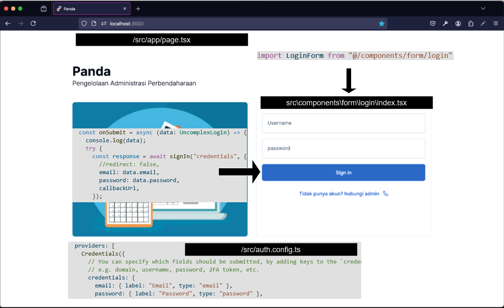
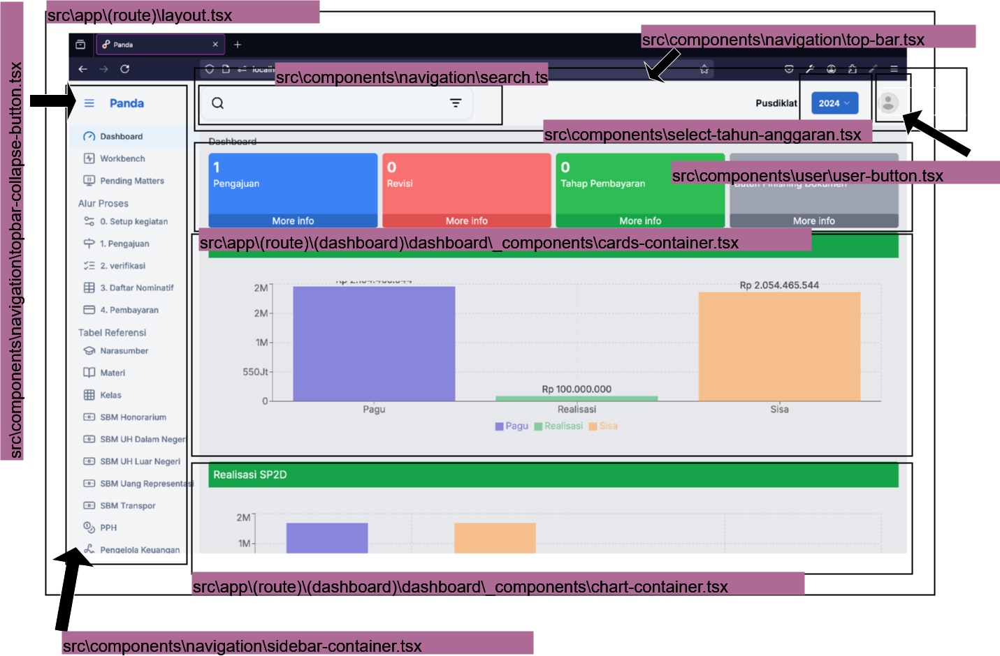
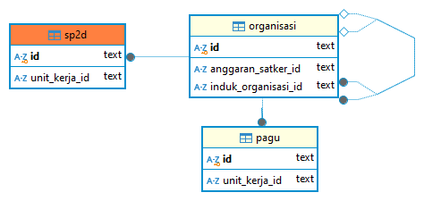
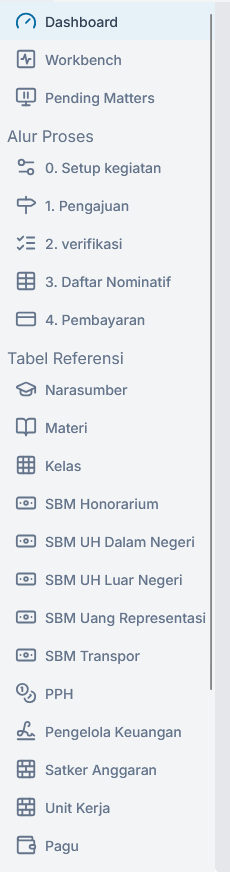
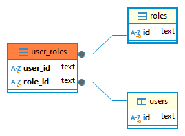
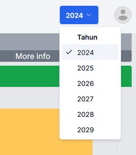
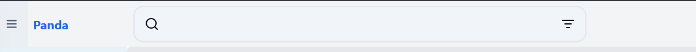
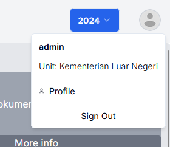

# **5. Arsitektur dan Implementasi Aplikasi Next.js**

## **5.1 Teknologi yang Digunakan**  

Aplikasi ini menggunakan serangkaian pustaka open-source berikut:  

### **Frontend**  

- **Next.js**: Framework React untuk pengembangan aplikasi web modern dengan dukungan *server-side rendering* dan *static site generation*.  
- **Tailwind CSS**: Pustaka utilitas CSS untuk membangun antarmuka secara cepat dan konsisten.  
- **ShadCN UI**: Komponen antarmuka berbasis Tailwind yang siap pakai dan dapat disesuaikan.  
- **React**: Pustaka JavaScript untuk membangun antarmuka pengguna berbasis komponen.  

### **Backend**  

- **Next.js**: Menyediakan API Routes dan Server Components untuk pengelolaan data dan backend.  
- **PostgreSQL**: Basis data relasional yang andal dan fleksibel untuk menyimpan data aplikasi.  
- **Prisma ORM**: Alat untuk mengelola akses database secara efisien menggunakan model berbasis TypeScript.  
- **Redis**: Penyimpanan data *in-memory* untuk caching dan pengelolaan sesi.  

### **Utilities**  

- **React Hook Form**: Pustaka untuk mengelola formulir dengan performa tinggi.  
- **Zod**: Pustaka validasi skema untuk memastikan data sesuai dengan spesifikasi.  
- **Zustand**: Pustaka manajemen state ringan untuk React.  

### **PDF Handling**  

- **PDFLib**: Pustaka untuk membuat dan memodifikasi PDF secara programatik.  
- **PDFKit**: Alat untuk menghasilkan file PDF dengan fitur lengkap, seperti grafik dan teks.  

### **Charting**  

- **Recharts**: Pustaka untuk membuat grafik interaktif berbasis React.  

### **Authentication**  

- **Auth.js**: Solusi autentikasi yang mendukung berbagai penyedia identitas dan strategi login.  

## **5.2 Pedoman Struktur dan Penulisan Kode**  

### **5.2.1 Penulisan Kode**

Kode ditulis secara modular untuk meningkatkan *readability* dan mempermudah pengelolaan. Setiap fungsi, komponen, atau modul dipisahkan dengan jelas sesuai dengan tanggung jawabnya sehingga mudah dipahami dan dimodifikasi.  

### **5.2.2 Struktur Folder**

1. **Komponen Lokal** yang hanya digunakan di bagian tertentu akan disimpan di folder `_components` di dalam direktori terdekat tempat komponen tersebut digunakan.  
2. **Kode Bersama** yang digunakan di berbagai bagian aplikasi ditempatkan di:
     - **`/src/lib`**: Untuk kode spesifik yang hanya relevan dengan aplikasi ini.  
     - **`/src/utils`**: Untuk kode yang bersifat umum atau dapat digunakan kembali di proyek lain.
3. **Skema Prisma** disimpan di folder `/src/prisma/db-honorarium/schema.prisma`
4. **Skema Zod** disimpan di folder `/src/zod/schemas`
5. **Custom hooks** disimpan di folder `/src/hooks`

### **5.2.3 Prinsip Akses Data**

- Untuk *client components*, data diambil dari server action yang berada di folder `/actions`.  
- Untuk *server components*, data diakses melalui fungsi-fungsi di folder `/data`.  
- Di folder `/actions`, penggunaan Prisma ORM untuk akses langsung ke database diminimalkan.  
- Jika memungkinkan, server action di `/actions` akan memanggil fungsi dari folder `/data`.  
- Semua fungsi di folder `/data` bertanggung jawab penuh atas query database menggunakan Prisma ORM, memastikan pengelolaan query terkonsentrasi dan terstruktur dengan baik.  

Pendekatan ini dirancang untuk menjaga konsistensi, skalabilitas, dan kemudahan dalam pengembangan serta pemeliharaan aplikasi.

## **5.3 Penjabaran Alur dan Fungsi Komponen Aplikasi**

### **5.3.1 Halaman Login**

#### **5.3.1.1 Route**

<https://d01.pirsani.id> atau <https://d01.pirsani.id/login>

#### **5.3.1.2 Tampilan visual**



gambar 5.1 halaman login

#### **5.3.1.2 komponen login**



gambar 5.2 halaman login dan file terkait

#### **5.3.1.3 file terkait login**

1. **page** `src\app\page.tsx` atau `src\app\(auth)\login\page.tsx`
2. **components:**
    - form `src\components\form\login\index.tsx`
    - input `src\components\form\login\input.tsx`
3. **login handler:**
    - `src\auth.ts`
    - `src\auth.config.ts`
4. **library**
    - [Auth.js](https://authjs.dev/getting-started)
  
pada saat pengguna melakukan login dan berhasil, sistem akan menyimpan data user satker dan roles di session.

```ts
// src\auth.config.ts

import { getNearestSatkerAnggaran } from "./data/organisasi";
import { getUser, getUserRoles } from "./data/user";


// kode lainnya ...

satkerAnggaran = await getNearestSatkerAnggaran(user.organisasiId);

// kode lainnya ...

const roles = await getUserRoles(user.id);
```

Session ini diextend dari default session library `Auth.js`.

```ts
// src\next-auth.d.ts

declare module "next-auth" {
  /**
   * Returned by `useSession`, `getSession` and received as a prop on the `SessionProvider` React Context
   */
  interface User {
    id: string;
    nip?: string | null;
    unitKerjaId?: string | null; // ini basically adalah organisasiId
    unitKerjaNama?: string | null;
    unitKerjaNamaSingkat?: string | null;
    satkerId?: string | null; // sedangkan ini adalah organisasiId terdekat yang merupakan satker anggaran
    satkerNama?: string | null;
    satkerNamaSingkat?: string | null;
    organisasiId?: string | null;
    organisasiNama?: string | null;
    organisasiNamaSingkat?: string | null;
    roles?: string[];
    permissions?: string[];
  }
  interface Session {
    user: User & DefaultSession["user"];
  }
}
```

penjelasan tentang cara extend session dapad dibaca di [https://authjs.dev/guides/extending-the-session](https://authjs.dev/guides/extending-the-session)

### **5.3.2 Middleware untuk pengecekan otentikasi**

referensi: <https://nextjs.org/docs/app/building-your-application/routing/middleware>

Middleware dijalankan sebelum sebuah request selesai. Pada saat pengguna mengakses aplikasi, middleware akan melakukan pengecekan apakah user tersebut mempunyai sesi akses. jika belum maka akan diarahkan ke halaman login.

#### **5.3.2.1 file terkait middleware**

- `src\middleware.ts` : file utama yang akan dijalankan saat pengguna mengakses aplikasi
- `src\route.ts` : file ini mendefinisikan route untuk `dashboardRoutes`,`alurProsesRoutes`,`dataReferensiRoutes`

Agar middleware ini dapat dijalankan dengan ringan, maka middleware hanya melakukan pengecekan session(otentikasi). Proses untuk otorisasi akan dijalankan pada masing-masing halaman atau `server action`

```ts
// src\middleware.ts
    const { nextUrl } = req;
    const session = req.auth;
    const isLoggedIn = !!session;
```

### **5.3.3 Otorisasi dengan accesscontrol dan in memory data Redis**

> **library** <https://onury.io/accesscontrol/>
>
> **in Memory Cache** <https://redis.io/docs/latest/operate/oss_and_stack/>
>

#### **5.3.3.1 file terkait middleware**

- src\actions\pengguna\session.ts
- src\lib\redis\access-control.ts
- src\lib\redis\index.ts

Saat pengguna melakukan akses ke halaman tertentu, akan selalu di cek kembali

1. apakah mempunyai login?
2. apakah mempunyai permission yang diperlukan

Pengecekan untuk setiap halaman secara sederhana dilakukan dari kode berikut:

```ts
import { getLoggedInPengguna } from "@/actions/pengguna/session";
// kode lainnya
  const pengguna = await getLoggedInPengguna();
  if (!pengguna) {
    return <div>Anda tidak memiliki akses ke halaman ini</div>;
  }
```

sedangkan untuk otorisasi digunakan implementasi pustaka [accesscontrol](https://onury.io/accesscontrol/). `accesscontrol` akan diload ke memory menggunakan [Redis](<https://redis.io/docs/latest/operate/oss_and_stack/>) sehingga sistem tidak perlu melakukan query ke database setiap kali pengecekan permission untuk role.

```ts

// src\app\(route)\(dashboard)\some\page.tsx

import {
  checkSessionPermission,
  getLoggedInPengguna,
} from "@/actions/pengguna/session";

const somePage = async () => {
  const pengguna = await getLoggedInPengguna();

  if (!pengguna) {
    redirect("/");
  }

  const createAny = await checkSessionPermission({
    actions: ["read:any"],
    resource: "some-resource",
  });

  const createOwn = await checkSessionPermission({
    actions: ["read:own"],
    resource: "some-resource",
  });

  if (!createAny && !createOwn) {
    return "Anda tidak memiliki akses ke halaman ini";
  }

  # jika login dan punya akses lanjut
}
  
```

kode `checkSessionPermission`

```ts
// src\actions\pengguna\session.ts
interface Acl {
  actions: string | string[];
  resource: string;
  attributes?: string[];
  redirectOnUnauthorized?: boolean;
}
export const checkSessionPermission = async ({
  actions,
  resource,
  attributes = [],
  redirectOnUnauthorized = true,
}: Acl) => {
  const pengguna = await getSessionPengguna();
  console.log("[checkSessionPermission]", actions);
  if (!pengguna.success || !pengguna.data?.roles) {
    // redirect to login
    console.error("Pengguna not found or has no roles");
    redirect("/login");
  }

  const roles = pengguna.data.roles;
  console.log("Roles", roles);

  // string to array
  let actionsArray: string[] = [];
  if (typeof actions === "string") {
    actionsArray = [actions];
  } else {
    actionsArray = actions;
  }
  let hasPermission = false;
  // iterate over actions
  console.log("[actionsArray]", actionsArray);
  for (const action of actionsArray) {
    hasPermission = await checkPermission(roles, action, resource);
    console.log("Has permission", action, resource, hasPermission);
    if (hasPermission) {
      return hasPermission;
    }
  }

  //const hasPermission = await checkPermission(roles, action, resource);
  if (!hasPermission && redirectOnUnauthorized) {
    // redirect to unauthorized
    console.error("Unauthorized");
    redirect("/");
  }
  return hasPermission;
};
```

Pada saat sistem memeriksa `permissions` sistem akan memeriksa apakah sistem sudah menyimpan `accesscontrol` di memori menggunakan `Redis`, jika sudah maka hanya akan membaca dari memory, sedangkan jika belum maka sistem akan melakukan query ke database dan menyimpannya ke memory.

```ts

// src\lib\redis\access-control.ts
export async function initAcl() {
  try {
    
    const isAclLoaded = await isAccessControlLoaded();
    if (!isAclLoaded) {
      console.log("AccessControl is not loaded. Initializing...");
      await initializeAccessControl();
    }
    return true;
  } catch (error) {
    console.error("Failed to initialize AccessControl:", error);
    return false;
  }
}
// Permission checker
export async function checkPermission(
  role: string | string[],
  action: string,
  resource: string
): Promise<boolean> {
  await initAcl();
  const ac = await loadAccessControl();

  console.log("Checking permission for", role, action, resource);

  if (!ac) {
    throw new Error("AccessControl is not initialized.");
  }

  console.log("AccessControl", ac.getGrants());

  try {
    const permission = ac.permission({
      role,
      resource,
      action,
    });
    return permission.granted; // true or false
  } catch (error: any) {
    if (error.name === "AccessControlError") {
      console.error("AccessControlError:", error.message);
    } else {
      console.error("Unexpected error:", error.message);
    }
  }

  return false;
}

```

### **5.3.4 Halaman Dashboard**

#### **5.3.4.1 Route**

<https://d01.pirsani.id/dashboard>

#### **5.3.4.1 Tampilan visual**


gambar 5.3 halaman dashboard

#### **5.3.4.1 komponen dashboard**



gambar 5.4 halaman dashboard dan file terkait

#### **5.3.4.3 file terkait dashboard**

1. **page** `src\app\(route)\(dashboard)\dashboard\page.tsx`
2. **layout** `src\app\(route)\layout.tsx`
3. **components layout:**

    - Top Bar `src\components\navigation\top-bar.tsx`
    - Collapse Button `src\components\navigation\topbar-collapse-button.tsx`
    - Navbar `src\components\navigation\navbar.tsx`
    - Sidebar `src\components\navigation\sidebar-container.tsx`
    - Group of item `src\components\navigation\sidebar-items.tsx`
    - Item `src\components\navigation\sidebar-item.tsx`
    - Pilihan Tahun `src\components\select-tahun-anggaran.tsx`
    - User Button `src\components\user\user-button.tsx`
  
4. **component content:**
    - Card Container `src\app\(route)\(dashboard)\dashboard\_components\cards-container.tsx`
    - Chart Container `src\app\(route)\(dashboard)\dashboard\_components\chart-container.tsx`

5. **library**
    - [Recharts](https://recharts.org/en-US/)

#### **5.3.4.4 Tabel dan data**

Untuk menampilkan pagu dan realisasi tabel yang digunakan adalah `organisasi`, `sp2d` dan `pagu`



Untuk memudahkan pemanggilan query maka di buat fungsi `get_pagu_realisasi`

```sql
-- DROP FUNCTION public.get_pagu_realisasi(int4, text);
-- USAGE EXAMPLE
-- select * from get_pagu_realisasi(2024,'cm2btc0ro0016cazwuqcaunam')

CREATE OR REPLACE FUNCTION public.get_pagu_realisasi(p_year integer, p_satker_id text)
 RETURNS TABLE(year integer, unit_kerja_id text, nama text, singkatan text, realisasi bigint, pagu bigint, sisa bigint)
 LANGUAGE plpgsql
AS $function$
BEGIN
    RETURN QUERY
    WITH sp2d_totals AS (
        SELECT
            sd.unit_kerja_id,
            EXTRACT(YEAR FROM sd.tanggal_sp2d) AS year,
            SUM(sd.jumlah_dibayar)::BIGINT AS total_dibayar
        FROM 
            sp2d sd
        GROUP BY 
            sd.unit_kerja_id, 
            EXTRACT(YEAR FROM sd.tanggal_sp2d)
    ),
    pagu_with_totals AS (
        SELECT
            pg.tahun AS year,
            pg.unit_kerja_id,
            pg.pagu,
            COALESCE(st.total_dibayar, 0)::BIGINT AS total_dibayar
        FROM 
            pagu pg
        LEFT JOIN 
            sp2d_totals st 
        ON 
            pg.unit_kerja_id = st.unit_kerja_id
            AND pg.tahun = st.year
    )
    SELECT
        pwt.year,
        pwt.unit_kerja_id,
        org.nama,
        org.singkatan,
        pwt.total_dibayar AS realisasi,
        pwt.pagu,
        (pwt.pagu - pwt.total_dibayar) AS sisa
    FROM 
        pagu_with_totals pwt
    JOIN 
        organisasi org
    ON 
        pwt.unit_kerja_id = org.id
    WHERE 
        pwt.year = p_year
        AND org.induk_organisasi_id = p_satker_id
    ORDER BY 
        pwt.year, 
        pwt.unit_kerja_id;
END;
$function$
;
```

fungsi ini akan dipanggil di `src\data\pagu\index.ts`

```ts
// src\data\pagu\index.ts
export const getPaguRealisasiUnitKerjaBySatker = async (
  tahun: number,
  satkerId: string
) => {
  // cast tahun to integer
  console.log("[getPaguRealisasiUnitKerjaBySatker]", tahun, satkerId);
  const result = await dbHonorarium.$queryRaw<ResultPaguRealisasi[]>`
    select * from get_pagu_realisasi(${tahun}::integer,${satkerId})
  `;
  return result;
};
```

### **5.3.5 Komponen Sidebar**

#### **5.3.5.1 Tampilan visual**



#### **5.3.5.2 file terkait sidebar**

1. komponen `src\components\navigation\sidebar-container.tsx`
2. sub komponen
    - `src\components\navigation\sidebar-items.tsx`
    - `src\components\navigation\sidebar-item.tsx`
3. lainnya
    - route `src\route.ts`

#### **5.3.5.3 Tabel dan data**



pada komponen `src\components\navigation\sidebar-container.tsx`, sistem akan mengecek role pengguna dari session kemudian akan mengambil `Permissions` dari `Redis`

`Permissions` ini kemudian akan dibandingkan dengan masing-masing `RouteItem` di daftar route `src\route.ts`

```ts
// src\route.ts
// "use server";
export interface RouteItem {
  name: string;
  title: string;
  href: string;
  icon: string;
  order?: number;
  counter?: number;
  permissions?: string[];
  displayAsMenu?: boolean;
  cascadePermissions?: boolean; // cascade permissions to sub routes
  resources?: string[];
}
```

```ts

// src\components\navigation\sidebar-container.tsx

const getRoutesReferensiForRoles = async (): Promise<{
  filteredRouteDashboard: RouteItem[];
  filteredRouteReferensi: RouteItem[];
  filteredRoutesAlurProses: RouteItem[];
}> => {
  const permissions: Permissions | null = await getSessionPermissionsForRole();
// kode lainnya 
}
// kode lainnya 

```

Icon pada sidebar didefinisikan di konstanta `iconMap` di `src\components\navigation\sidebar-items.tsx`

```ts
//src\components\navigation\sidebar-items.tsx
const iconMap: { [key: string]: LucideIcon } = {

```

### **5.3.6 Komponen Pemilihan Tahun Anggaran**

#### **5.3.6.1 Tampilan visual**



#### **5.3.6.2 file terkait Tahun Anggaran**

- komponen `src\components\select-tahun-anggaran.tsx`
- hook `src\hooks\use-tahun-anggaran-store.ts`
- pustaka [zustand](https://github.com/pmndrs/zustand)
- data `src\actions\pengguna\preference.ts`

#### **5.3.6.3 Tabel dan data**

Ketika sistem menampilkan komponen tahun anggaran, sistem akan melihat data di `hook` `useTahunAnggaranStore`, jika belum ada maka akan membuat satu entri baru di tabel `user_preferences`, kemudian menyimpannya di `useTahunAnggaranStore`.

pada saat pengguna memilih tahun anggaran, sistem akan memperbarui data di tabel `user_preferences` dan variabel `tahunAnggaran` di hook `useTahunAnggaranStore`.

`useTahunAnggaranStore` menggunakan `zustand` untuk state manajemen.

```ts
//src\hooks\use-tahun-anggaran-store.ts
// Define the Zustand state creator function
const createState: StateCreator<TahunAnggaranState> = (set) => ({
  tahunAnggaran: null,
  initialized: false,
  setTahunAnggaranYear: async (year) => {
    set({ tahunAnggaran: year });
    await setTahunAnggaran(year);
  },
  initializeTahunAnggaran: async () => {
    const tahunAnggaran = await getTahunAnggranPilihan();
    set({ tahunAnggaran, initialized: true });
  },
});
```

sistem akan menggunakan data tahun anggaran aktif dari hooks `useTahunAnggaranStore` jika komponen merupakan `client component` dan akan menggunakan `getTahunAnggranPilihan` jika komponen merupakan `server component` atau server side script

### **5.3.7 Komponen Pencarian**

#### **5.3.7.1 Tampilan visual**



#### **5.3.7.2 file terkait Pencarian**

- komponen `src\components\navigation\search-input.tsx`
- hooks `src\hooks\use-search-term.ts`

#### **5.3.7.3 Cara Kerja**

komponen ini merupakan `child component` dari navigation bar `src\components\navigation\navbar.tsx`. ketika pengguna mengetikkan kata kunci pencarian, komponen ini akan menyimpannya sebagai state `searchTerm` yang ada di `useSearchTerm`.

`useSearchTerm` menggunakan `zustand` untuk `state` majemennya

```ts
// src\components\navigation\search-input.tsx
import { useSearchTerm } from "@/hooks/use-search-term";

const { setTerm } = useSearchTerm();
```

`searchTerm` ini kemudian akan digunakan di komponen lain, komponen lain dapat menggunakan `state` `searchTerm` tanpa harus meneruskan `props` dari `parent component` ke `child component`.

contoh penggunaan di `src\app\(route)\data-referensi\pagu\_components\tabel-pagu.tsx`

```ts

//src\app\(route)\data-referensi\pagu\_components\tabel-pagu.tsx

export const TabelPagu = ({
  data: initialData,
  optionsPagu,
  onEdit = () => {},
}: TabelPaguProps) => {
  const { searchTerm } = useSearchTerm();

  const filteredData = (data ?? []).filter((row) => {
    if (!searchTerm || searchTerm === "") return true;
    const lowercasedSearchTerm = searchTerm.toLowerCase();
    //const searchWords = lowercasedSearchTerm.split(" ").filter(Boolean);
    const searchWords =
      lowercasedSearchTerm
        .match(/"[^"]+"|\S+/g)
        ?.map((word) => word.replace(/"/g, "")) || [];

    return searchWords.every(
      (word) =>
        row.unitKerja.nama?.toLowerCase().includes(word) ||
        row.unitKerja.singkatan?.toLowerCase().includes(word) ||
        row.unitKerja.indukOrganisasi?.nama?.toLowerCase().includes(word)
    );
  });
// kode lainnya
}
```

Dengan cara ini, komponen `src\components\navigation\search-input.tsx` sangat mudah dipakai di berbagai halaman. 

> perhatian
>
> kekurangan dari cara ini adalah bahwa komponen ini tidak bisa digunakan lebih dari 1(satu) komponen untuk setiap halaman

### **5.3.8 Komponen UserButton**

#### **5.3.8.1 Tampilan visual**



#### **5.3.8.2 file terkait UserButton**

- komponen `src\components\user\user-button.tsx`
- sub kompnen `src\components\user\user-button-dropdown.tsx`