# **5. Arsitektur dan Implementasi Aplikasi Next.js**

## **5.1 Teknologi yang Digunakan**  

Aplikasi ini menggunakan serangkaian pustaka open-source berikut:  

### **Frontend**  

- **Next.js**: Framework React untuk pengembangan aplikasi web modern dengan dukungan *server-side rendering* dan *static site generation*.  
- **Tailwind CSS**: Pustaka utilitas CSS untuk membangun antarmuka secara cepat dan konsisten.  
- **ShadCN UI**: Komponen antarmuka berbasis Tailwind yang siap pakai dan dapat disesuaikan.  
- **React**: Pustaka JavaScript untuk membangun antarmuka pengguna berbasis komponen.  

### **Backend**  

- **Next.js**: Menyediakan API Routes dan Server Components untuk pengelolaan data dan backend.  
- **PostgreSQL**: Basis data relasional yang andal dan fleksibel untuk menyimpan data aplikasi.  
- **Prisma ORM**: Alat untuk mengelola akses database secara efisien menggunakan model berbasis TypeScript.  
- **Redis**: Penyimpanan data *in-memory* untuk caching dan pengelolaan sesi.  

### **Utilities**  

- **React Hook Form**: Pustaka untuk mengelola formulir dengan performa tinggi.  
- **Zod**: Pustaka validasi skema untuk memastikan data sesuai dengan spesifikasi.  
- **Zustand**: Pustaka manajemen state ringan untuk React.  

### **PDF Handling**  

- **PDFLib**: Pustaka untuk membuat dan memodifikasi PDF secara programatik.  
- **PDFKit**: Alat untuk menghasilkan file PDF dengan fitur lengkap, seperti grafik dan teks.  

### **Charting**  

- **Recharts**: Pustaka untuk membuat grafik interaktif berbasis React.  

### **Authentication**  

- **Auth.js**: Solusi autentikasi yang mendukung berbagai penyedia identitas dan strategi login.  

## **5.2 Pedoman Struktur dan Penulisan Kode**  

### **5.2.1 Penulisan Kode**

Kode ditulis secara modular untuk meningkatkan *readability* dan mempermudah pengelolaan. Setiap fungsi, komponen, atau modul dipisahkan dengan jelas sesuai dengan tanggung jawabnya sehingga mudah dipahami dan dimodifikasi.  

### **5.2.2 Struktur Folder**

1. **Komponen Lokal** yang hanya digunakan di bagian tertentu akan disimpan di folder `_components` di dalam direktori terdekat tempat komponen tersebut digunakan.  
2. **Kode Bersama** yang digunakan di berbagai bagian aplikasi ditempatkan di:
     - **`/src/lib`**: Untuk kode spesifik yang hanya relevan dengan aplikasi ini.  
     - **`/src/utils`**: Untuk kode yang bersifat umum atau dapat digunakan kembali di proyek lain.
3. **Skema Prisma** disimpan di folder `/src/prisma/db-honorarium/schema.prisma`
4. **Skema Zod** disimpan di folder `/src/zod/schemas`
5. **Custom hooks** disimpan di folder `/src/hooks`

### **5.2.3 Prinsip Akses Data**

- Untuk *client components*, data diambil dari server action yang berada di folder `/actions`.  
- Untuk *server components*, data diakses melalui fungsi-fungsi di folder `/data`.  
- Di folder `/actions`, penggunaan Prisma ORM untuk akses langsung ke database diminimalkan.  
- Jika memungkinkan, server action di `/actions` akan memanggil fungsi dari folder `/data`.  
- Semua fungsi di folder `/data` bertanggung jawab penuh atas query database menggunakan Prisma ORM, memastikan pengelolaan query terkonsentrasi dan terstruktur dengan baik.  

Pendekatan ini dirancang untuk menjaga konsistensi, skalabilitas, dan kemudahan dalam pengembangan serta pemeliharaan aplikasi.

## **5.3 Penjabaran Alur dan Fungsi Komponen Aplikasi**

### **5.3.1 Halaman Login**

#### **5.3.1.1 Route**

<https://d01.pirsani.id> atau <https://d01.pirsani.id/login>

#### **5.3.1.2 Tampilan visual**


gambar 5.1 halaman login


gambar 5.2 halaman login dan file terkait

#### **5.3.1.3 file terkait login**

1. **page** `src\app\page.tsx` atau `src\app\(auth)\login\page.tsx`
2. **components:**
    - form `src\components\form\login\index.tsx`
    - input `src\components\form\login\input.tsx`
3. **login handler:**
    - `src\auth.ts`
    - `src\auth.config.ts`
4. **library**
    - [Auth.js](https://authjs.dev/getting-started)
  
pada saat pengguna melakukan login dan berhasil, sistem akan menyimpan data user satker dan roles di session.

```ts
// src\auth.config.ts

import { getNearestSatkerAnggaran } from "./data/organisasi";
import { getUser, getUserRoles } from "./data/user";


// kode lainnya ...

satkerAnggaran = await getNearestSatkerAnggaran(user.organisasiId);

// kode lainnya ...

const roles = await getUserRoles(user.id);
```

Session ini diextend dari default session library `Auth.js`.

```ts
// src\next-auth.d.ts

declare module "next-auth" {
  /**
   * Returned by `useSession`, `getSession` and received as a prop on the `SessionProvider` React Context
   */
  interface User {
    id: string;
    nip?: string | null;
    unitKerjaId?: string | null; // ini basically adalah organisasiId
    unitKerjaNama?: string | null;
    unitKerjaNamaSingkat?: string | null;
    satkerId?: string | null; // sedangkan ini adalah organisasiId terdekat yang merupakan satker anggaran
    satkerNama?: string | null;
    satkerNamaSingkat?: string | null;
    organisasiId?: string | null;
    organisasiNama?: string | null;
    organisasiNamaSingkat?: string | null;
    roles?: string[];
    permissions?: string[];
  }
  interface Session {
    user: User & DefaultSession["user"];
  }
}
```

penjelasan tentang cara extend session dapad dibaca di [https://authjs.dev/guides/extending-the-session](https://authjs.dev/guides/extending-the-session)

### **5.3.2 Middleware untuk pengecekan otentikasi**

referensi: <https://nextjs.org/docs/app/building-your-application/routing/middleware>

Middleware dijalankan sebelum sebuah request selesai. Pada saat pengguna mengakses aplikasi, middleware akan melakukan pengecekan apakah user tersebut mempunyai sesi akses. jika belum maka akan diarahkan ke halaman login.

#### **5.3.2.1 file terkait middleware**

- `src\middleware.ts` : file utama yang akan dijalankan saat pengguna mengakses aplikasi
- `src\route.ts` : file ini mendefinisikan route untuk `dashboardRoutes`,`alurProsesRoutes`,`dataReferensiRoutes`

Agar middleware ini dapat dijalankan dengan ringan, maka middleware hanya melakukan pengecekan session(otentikasi). Proses untuk otorisasi akan dijalankan pada masing-masing halaman atau `server action`

```ts
// src\middleware.ts
    const { nextUrl } = req;
    const session = req.auth;
    const isLoggedIn = !!session;
```

### **5.3.3 Otorisasi dengan accesscontrol dan in memory data Redis**

> **library** <https://onury.io/accesscontrol/>
>
> **in Memory Cache** <https://redis.io/docs/latest/operate/oss_and_stack/>
>

#### **5.3.3.1 file terkait middleware**

- src\actions\pengguna\session.ts
- src\lib\redis\access-control.ts
- src\lib\redis\index.ts

Saat pengguna melakukan akses ke halaman tertentu, akan selalu di cek kembali

1. apakah mempunyai login?
2. apakah mempunyai permission yang diperlukan

Pengecekan untuk setiap halaman secara sederhana dilakukan dari kode berikut:

```ts
import { getLoggedInPengguna } from "@/actions/pengguna/session";
// kode lainnya
  const pengguna = await getLoggedInPengguna();
  if (!pengguna) {
    return <div>Anda tidak memiliki akses ke halaman ini</div>;
  }
```

sedangkan untuk otorisasi digunakan implementasi pustaka [accesscontrol](https://onury.io/accesscontrol/). `accesscontrol` akan diload ke memory menggunakan [Redis](<https://redis.io/docs/latest/operate/oss_and_stack/>) sehingga sistem tidak perlu melakukan query ke database setiap kali pengecekan permission untuk role.

```ts

// src\app\(route)\(dashboard)\some\page.tsx

import {
  checkSessionPermission,
  getLoggedInPengguna,
} from "@/actions/pengguna/session";

const somePage = async () => {
  const pengguna = await getLoggedInPengguna();

  if (!pengguna) {
    redirect("/");
  }

  const createAny = await checkSessionPermission({
    actions: ["read:any"],
    resource: "some-resource",
  });

  const createOwn = await checkSessionPermission({
    actions: ["read:own"],
    resource: "some-resource",
  });

  if (!createAny && !createOwn) {
    return "Anda tidak memiliki akses ke halaman ini";
  }

  # jika login dan punya akses lanjut
}
  
```

kode `checkSessionPermission`

```ts
// src\actions\pengguna\session.ts
interface Acl {
  actions: string | string[];
  resource: string;
  attributes?: string[];
  redirectOnUnauthorized?: boolean;
}
export const checkSessionPermission = async ({
  actions,
  resource,
  attributes = [],
  redirectOnUnauthorized = true,
}: Acl) => {
  const pengguna = await getSessionPengguna();
  console.log("[checkSessionPermission]", actions);
  if (!pengguna.success || !pengguna.data?.roles) {
    // redirect to login
    console.error("Pengguna not found or has no roles");
    redirect("/login");
  }

  const roles = pengguna.data.roles;
  console.log("Roles", roles);

  // string to array
  let actionsArray: string[] = [];
  if (typeof actions === "string") {
    actionsArray = [actions];
  } else {
    actionsArray = actions;
  }
  let hasPermission = false;
  // iterate over actions
  console.log("[actionsArray]", actionsArray);
  for (const action of actionsArray) {
    hasPermission = await checkPermission(roles, action, resource);
    console.log("Has permission", action, resource, hasPermission);
    if (hasPermission) {
      return hasPermission;
    }
  }

  //const hasPermission = await checkPermission(roles, action, resource);
  if (!hasPermission && redirectOnUnauthorized) {
    // redirect to unauthorized
    console.error("Unauthorized");
    redirect("/");
  }
  return hasPermission;
};
```

Pada saat sistem memeriksa `permissions` sistem akan memeriksa apakah sistem sudah menyimpan `accesscontrol` di memori menggunakan `Redis`, jika sudah maka hanya akan membaca dari memory, sedangkan jika belum maka sistem akan melakukan query ke database dan menyimpannya ke memory.

```ts

// src\lib\redis\access-control.ts
export async function initAcl() {
  try {
    
    const isAclLoaded = await isAccessControlLoaded();
    if (!isAclLoaded) {
      console.log("AccessControl is not loaded. Initializing...");
      await initializeAccessControl();
    }
    return true;
  } catch (error) {
    console.error("Failed to initialize AccessControl:", error);
    return false;
  }
}
// Permission checker
export async function checkPermission(
  role: string | string[],
  action: string,
  resource: string
): Promise<boolean> {
  await initAcl();
  const ac = await loadAccessControl();

  console.log("Checking permission for", role, action, resource);

  if (!ac) {
    throw new Error("AccessControl is not initialized.");
  }

  console.log("AccessControl", ac.getGrants());

  try {
    const permission = ac.permission({
      role,
      resource,
      action,
    });
    return permission.granted; // true or false
  } catch (error: any) {
    if (error.name === "AccessControlError") {
      console.error("AccessControlError:", error.message);
    } else {
      console.error("Unexpected error:", error.message);
    }
  }

  return false;
}

```

### **5.3.4 Halaman Dashboard**

#### **5.3.4.1 Route**

<https://d01.pirsani.id/dashboard>

#### **5.3.4.2 Tampilan visual**

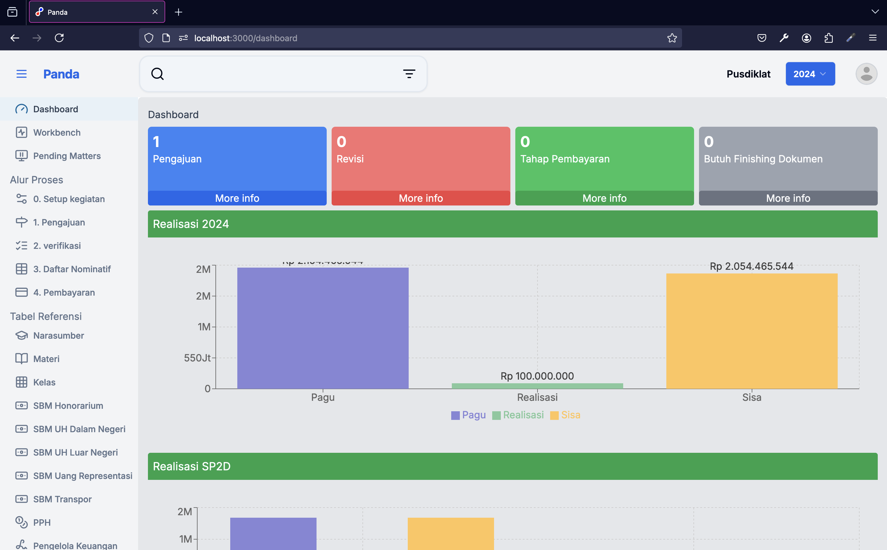

gambar 5.3 halaman dashboard


gambar 5.4 halaman dashboard dan file terkait

#### **5.3.4.3 file terkait dashboard**

1. **page** `src\app\(route)\(dashboard)\dashboard\page.tsx`
2. **layout** `src\app\(route)\layout.tsx`
3. **components layout:**

    - Top Bar `src\components\navigation\top-bar.tsx`
    - Collapse Button `src\components\navigation\topbar-collapse-button.tsx`
    - Navbar `src\components\navigation\navbar.tsx`
    - Sidebar `src\components\navigation\sidebar-container.tsx`
    - Group of item `src\components\navigation\sidebar-items.tsx`
    - Item `src\components\navigation\sidebar-item.tsx`
    - Pilihan Tahun `src\components\select-tahun-anggaran.tsx`
    - User Button `src\components\user\user-button.tsx`
  
4. **component content:**
    - Card Container `src\app\(route)\(dashboard)\dashboard\_components\cards-container.tsx`
    - Chart Container `src\app\(route)\(dashboard)\dashboard\_components\chart-container.tsx`

5. **library**
    - [Recharts](https://recharts.org/en-US/)

#### **5.3.4.4 Tabel dan data**

Untuk menampilkan pagu dan realisasi tabel yang digunakan adalah `organisasi`, `sp2d` dan `pagu`


Untuk memudahkan pemanggilan query maka di buat fungsi `get_pagu_realisasi`

```sql
-- DROP FUNCTION public.get_pagu_realisasi(int4, text);
-- USAGE EXAMPLE
-- select * from get_pagu_realisasi(2024,'cm2btc0ro0016cazwuqcaunam')

CREATE OR REPLACE FUNCTION public.get_pagu_realisasi(p_year integer, p_satker_id text)
 RETURNS TABLE(year integer, unit_kerja_id text, nama text, singkatan text, realisasi bigint, pagu bigint, sisa bigint)
 LANGUAGE plpgsql
AS $function$
BEGIN
    RETURN QUERY
    WITH sp2d_totals AS (
        SELECT
            sd.unit_kerja_id,
            EXTRACT(YEAR FROM sd.tanggal_sp2d) AS year,
            SUM(sd.jumlah_dibayar)::BIGINT AS total_dibayar
        FROM 
            sp2d sd
        GROUP BY 
            sd.unit_kerja_id, 
            EXTRACT(YEAR FROM sd.tanggal_sp2d)
    ),
    pagu_with_totals AS (
        SELECT
            pg.tahun AS year,
            pg.unit_kerja_id,
            pg.pagu,
            COALESCE(st.total_dibayar, 0)::BIGINT AS total_dibayar
        FROM 
            pagu pg
        LEFT JOIN 
            sp2d_totals st 
        ON 
            pg.unit_kerja_id = st.unit_kerja_id
            AND pg.tahun = st.year
    )
    SELECT
        pwt.year,
        pwt.unit_kerja_id,
        org.nama,
        org.singkatan,
        pwt.total_dibayar AS realisasi,
        pwt.pagu,
        (pwt.pagu - pwt.total_dibayar) AS sisa
    FROM 
        pagu_with_totals pwt
    JOIN 
        organisasi org
    ON 
        pwt.unit_kerja_id = org.id
    WHERE 
        pwt.year = p_year
        AND org.induk_organisasi_id = p_satker_id
    ORDER BY 
        pwt.year, 
        pwt.unit_kerja_id;
END;
$function$
;
```

fungsi ini akan dipanggil di `src\data\pagu\index.ts`

```ts
// src\data\pagu\index.ts
export const getPaguRealisasiUnitKerjaBySatker = async (
  tahun: number,
  satkerId: string
) => {
  // cast tahun to integer
  console.log("[getPaguRealisasiUnitKerjaBySatker]", tahun, satkerId);
  const result = await dbHonorarium.$queryRaw<ResultPaguRealisasi[]>`
    select * from get_pagu_realisasi(${tahun}::integer,${satkerId})
  `;
  return result;
};
```

### **5.3.5 Komponen Sidebar**

#### **5.3.5.1 Tampilan visual**


#### **5.3.5.2 file terkait sidebar**

1. komponen `src\components\navigation\sidebar-container.tsx`
2. sub komponen
    - `src\components\navigation\sidebar-items.tsx`
    - `src\components\navigation\sidebar-item.tsx`
3. lainnya
    - route `src\route.ts`

#### **5.3.5.4 Tabel dan Data**


pada komponen `src\components\navigation\sidebar-container.tsx`, sistem akan mengecek role pengguna dari session kemudian akan mengambil `Permissions` dari `Redis`

`Permissions` ini kemudian akan dibandingkan dengan masing-masing `RouteItem` di daftar route `src\route.ts`

```ts
// src\route.ts
// "use server";
export interface RouteItem {
  name: string;
  title: string;
  href: string;
  icon: string;
  order?: number;
  counter?: number;
  permissions?: string[];
  displayAsMenu?: boolean;
  cascadePermissions?: boolean; // cascade permissions to sub routes
  resources?: string[];
}
```

```ts

// src\components\navigation\sidebar-container.tsx

const getRoutesReferensiForRoles = async (): Promise<{
  filteredRouteDashboard: RouteItem[];
  filteredRouteReferensi: RouteItem[];
  filteredRoutesAlurProses: RouteItem[];
}> => {
  const permissions: Permissions | null = await getSessionPermissionsForRole();
// kode lainnya 
}
// kode lainnya 

```

Icon pada sidebar didefinisikan di konstanta `iconMap` di `src\components\navigation\sidebar-items.tsx`

```ts
//src\components\navigation\sidebar-items.tsx
const iconMap: { [key: string]: LucideIcon } = {

```

### **5.3.6 Komponen Pemilihan Tahun Anggaran**

#### **5.3.6.1 Tampilan visual**


#### **5.3.6.2 file terkait Tahun Anggaran**

- komponen `src\components\select-tahun-anggaran.tsx`
- hook `src\hooks\use-tahun-anggaran-store.ts`
- pustaka [zustand](https://github.com/pmndrs/zustand)
- data `src\actions\pengguna\preference.ts`

#### **5.3.6.4 Tabel dan Data**

Ketika sistem menampilkan komponen tahun anggaran, sistem akan melihat data di `hook` `useTahunAnggaranStore`, jika belum ada maka akan membuat satu entri baru di tabel `user_preferences`, kemudian menyimpannya di `useTahunAnggaranStore`.

pada saat pengguna memilih tahun anggaran, sistem akan memperbarui data di tabel `user_preferences` dan variabel `tahunAnggaran` di hook `useTahunAnggaranStore`.

`useTahunAnggaranStore` menggunakan `zustand` untuk state manajemen.

```ts
//src\hooks\use-tahun-anggaran-store.ts
// Define the Zustand state creator function
const createState: StateCreator<TahunAnggaranState> = (set) => ({
  tahunAnggaran: null,
  initialized: false,
  setTahunAnggaranYear: async (year) => {
    set({ tahunAnggaran: year });
    await setTahunAnggaran(year);
  },
  initializeTahunAnggaran: async () => {
    const tahunAnggaran = await getTahunAnggranPilihan();
    set({ tahunAnggaran, initialized: true });
  },
});
```

sistem akan menggunakan data tahun anggaran aktif dari hooks `useTahunAnggaranStore` jika komponen merupakan `client component` dan akan menggunakan `getTahunAnggranPilihan` jika komponen merupakan `server component` atau server side script

### **5.3.7 Komponen Pencarian**

#### **5.3.7.1 Tampilan visual**


#### **5.3.7.2 file terkait Pencarian**

- komponen `src\components\navigation\search-input.tsx`
- hooks `src\hooks\use-search-term.ts`

#### **5.3.7.5 Cara kerja**

komponen ini merupakan `child component` dari navigation bar `src\components\navigation\navbar.tsx`. ketika pengguna mengetikkan kata kunci pencarian, komponen ini akan menyimpannya sebagai state `searchTerm` yang ada di `useSearchTerm`.

`useSearchTerm` menggunakan `zustand` untuk `state` majemennya

```ts
// src\components\navigation\search-input.tsx
import { useSearchTerm } from "@/hooks/use-search-term";

const { setTerm } = useSearchTerm();
```

`searchTerm` ini kemudian akan digunakan di komponen lain, komponen lain dapat menggunakan `state` `searchTerm` tanpa harus meneruskan `props` dari `parent component` ke `child component`.

contoh penggunaan di `src\app\(route)\data-referensi\pagu\_components\tabel-pagu.tsx`

```ts

//src\app\(route)\data-referensi\pagu\_components\tabel-pagu.tsx

export const TabelPagu = ({
  data: initialData,
  optionsPagu,
  onEdit = () => {},
}: TabelPaguProps) => {
  const { searchTerm } = useSearchTerm();

  const filteredData = (data ?? []).filter((row) => {
    if (!searchTerm || searchTerm === "") return true;
    const lowercasedSearchTerm = searchTerm.toLowerCase();
    //const searchWords = lowercasedSearchTerm.split(" ").filter(Boolean);
    const searchWords =
      lowercasedSearchTerm
        .match(/"[^"]+"|\S+/g)
        ?.map((word) => word.replace(/"/g, "")) || [];

    return searchWords.every(
      (word) =>
        row.unitKerja.nama?.toLowerCase().includes(word) ||
        row.unitKerja.singkatan?.toLowerCase().includes(word) ||
        row.unitKerja.indukOrganisasi?.nama?.toLowerCase().includes(word)
    );
  });
// kode lainnya
}
```

Dengan cara ini, komponen `src\components\navigation\search-input.tsx` sangat mudah dipakai di berbagai halaman.

> perhatian
>
> kekurangan dari cara ini adalah bahwa komponen ini tidak bisa digunakan lebih dari 1(satu) komponen untuk setiap halaman

### **5.3.8 Komponen UserButton**

#### **5.3.8.1 Tampilan visual**


#### **5.3.8.2 file terkait UserButton**

- komponen `src\components\user\user-button.tsx`
- sub kompnen `src\components\user\user-button-dropdown.tsx`

### **5.3.9 Halaman Setup Kegiatan**

#### **5.3.9.1 Route**

<https://d01.pirsani.id/setup-kegiatan>

#### **5.3.9.2 Tampilan visual**


gambar 5.1 halaman Setup Kegiatan

#### **5.3.9.2 komponen setup kegiatan**


gambar 5.2 Formulir setup kegiatan dan file terkait

#### **5.3.9.3 file terkait setup kegiatan**

1. **page** `src\app\(route)\pengajuan\page.tsx`
2. **components:**
    - FormKegiatan `src\app\(route)\setup-kegiatan\_components\form-kegiatan.tsx`
    - BasicDatePicker `src\components\form\date-picker\basic-date-picker.tsx`
    - FormFileImmediateUpload `src\components\form\form-file-immediate-upload.tsx`
    - FormMultiFileUpload `src\components\form\form-multifile-upload.tsx`
    - SelectLokasi `src\components\form\select-lokasi.tsx`
    - PesertaContainer `src\app\(route)\setup-kegiatan\_components\peserta-container.tsx`
    - TabelPeserta `src\app\(route)\setup-kegiatan\_components\tabel-peserta.tsx`
    - SelectLokasi `src\components\form\select-lokasi.tsx`
    - ItineraryContainer `src\app\(route)\setup-kegiatan\_components\itinerary-container.tsx`
    - TabelItinerary `src\app\(route)\setup-kegiatan\_components\tabel-itinerary.tsx`
3. **hook:**
    - useFileStore `src\hooks\use-file-store.ts`
4. **schema:**
    - Kegiatan, kegiatanSchemaEditMode, kegiatanSchemaEditMode `src\zod\schemas\kegiatan.ts`
5. **utilities**
    - React Hook Form
    - Zod

#### **5.3.9.4 tabel dan data**

dalam proses setup kegiatan, tabel-tabel yang digunakan adalah `kegiatan`, `peserta_kegiata`, `uh_luar_negeri`, `uh_dalam_negeri`, `dokumen_kegiatan`, `itinerary` , `dokumen_surat_tugas`, `provinsi`


#### **5.3.9.5 Cara kerja formulir setup kegiatan**

Ketika pengguna memilih lokasi `dalam kota`, `luar kota`, `luar negeri` formulir akan menyesuaikan. Komponen SelectLokasi `src\components\form\select-lokasi.tsx` secara explisit diload di sisi client

```ts
// src\app\(route)\setup-kegiatan\_components\form-kegiatan.tsx
const SelectLokasi = dynamic(() => import("@/components/form/select-lokasi"), {
  ssr: false,
  loading: () => <p>Loading lokasi...</p>,
});
```

hal ini untuk memastikan tidak ada warning `Extra attributes from the server: aria-activedescendant` pada console;

Jika lokasi yang dipilih adalah **dalam kota** maka `provinsi` di set menjadi `31` untuk **Jakarta** secara default, sedangkan jika luar kota maka komponent `SelectProvinsi` akan tertrigger untuk mengambil dari dari server

```ts
// src\app\(route)\setup-kegiatan\_components\select-provinsi.tsx
  useEffect(() => {
    const fetchOptions = async () => {
      const optionProvinsi = await getOptionsProvinsiExcludeJakarta();
```


gambar 5.4 Pilihan Luar Kota

Jika lokasi yang dipilih adalah **luar negeri** maka akan ditampilkan komponen `ItineraryContainer`

```ts
// src\app\(route)\setup-kegiatan\_components\form-kegiatan.tsx
import ItineraryContainer from "./itinerary-container";

{lokasi == LOKASI.LUAR_NEGERI && (
    <>
        <ItineraryContainer onItineraryChange={handleItineraryChange} />
    </> ) 
}
```

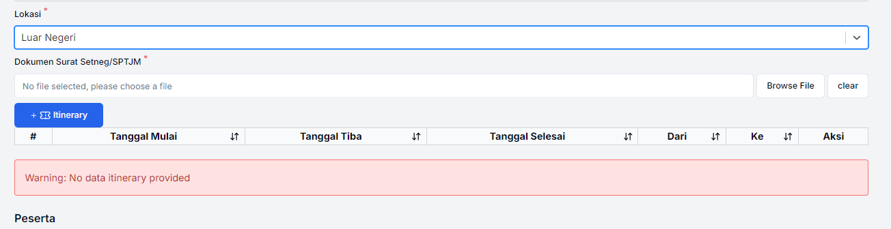

gambar 5.4 Pilihan Luar Negeri

komponen ItineraryContainer berisi `FormItinerary` `src\app\(route)\setup-kegiatan\_components\form-itinerary.tsx` dan `TabelItinerary` `src\app\(route)\setup-kegiatan\_components\tabel-itinerary.tsx`


dibagian akhir terdapat komponen `PesertaContainer`, ketika pengguna mengunggah file excel menggunakan komponen `InputFileXlsx`, sistem akan membaca excel, kemudian mengecek apakah ada kolom yang kosong, jika ada maka akan ditampilkan peringatan. kolom yang dibaca dan kolom yang diperbolehkan untuk kosong di set di `src\constants\excel\peserta.ts`

```ts
// src\constants\excel\peserta.ts
export const columns = []
export const emptyAllowed = [
  "NIP",
  "Golongan/Ruang",
  "Eselon",
  "ID",
  "Lainny",
  "Golongan UH LN",
];
```

setelah excel selesai diunggah, sistem akan mencoba untuk melakukan upload ke server menggunakan fungsi `exportPesertaXlsx` hanya jika tidak ada kolom yang kurang dan isian didalam kolom yang wajib semua terisi.

```ts
// src\app\(route)\setup-kegiatan\_components\peserta-container.tsx
const handleOnChange = async (parseExcelResult: ParseExcelResult) => {
    if (parseExcelResult.rows.length > 0) {
      setData(parseExcelResult.rows);
      setEmptyValues(parseExcelResult.emptyValues);
      setMissingColumns(parseExcelResult.missingColumns);
      //console.log(data);
      const filename = await exportPesertaXlsx(
        folder,
        fileCuid,
        parseExcelResult
      );
    } else {
      console.log("Data is empty");
      setData([]);
      setEmptyValues([]);
      setMissingColumns([]);
    }
  };

// kode lainnya 
  
export async function exportPesertaXlsx(
  folderCuid: string,
  fileCuid: string,
  parseResult: ParseExcelResult
) {
  const result = splitEmptyValues(parseResult.emptyValues, emptyAllowed);
  const { shouldNotEmpty, allowEmpty } = result;
  const hasMissingColumns = parseResult.missingColumns.length > 0;
  const rowsWithEmptyValues = Object.entries(shouldNotEmpty);
  const hasEmptyValues = rowsWithEmptyValues.length > 0;
  if (hasMissingColumns || hasEmptyValues) {
    return null;
  }
  // kode lainnya untuk upload ke /api/upload
}
```

#### **5.3.9.6 Cara kerja submit setup kegiatan**

Saat pengguna menakan tombol submit sistem akan menjalankan fungsi `setupKegiatan(dataWithoutFile as Kegiatan);`. Data yang dikirim ke server hanya berupa text saja, karena semua file telah dilakukan upload terlebih dahulu ketika pengguna memilih file menggunakan komponen `FormFileImmediateUpload` atau `FormMultiFileUpload`

```ts
// src\app\(route)\setup-kegiatan\_components\form-kegiatan.tsx
import setupKegiatan from "@/actions/kegiatan/setup-kegiatan";
// kode lainnya 
const onSubmit: SubmitHandler<FormValues<FormMode>> = async (data) => {
    console.log("[onSubmit]", data);
    // destructuring data to get the file object
    const {
      dokumenNodinMemoSk,
      dokumenJadwal,
      dokumenSuratTugas,
      dokumenSuratSetnegSptjm,
      pesertaXlsx,
      ...dataWithoutFile
    } = data;

    const kegiatanBaru = await setupKegiatan(dataWithoutFile as Kegiatan);
    if (kegiatanBaru.success) {
      toast.success("Kegiatan berhasil disimpan");      
    } else {
      toast.error(kegiatanBaru.error + " " + kegiatanBaru.message);
    }
  };
```

fungsi `setupKegiatan` merupakan `server action` yang ditandai dengan `"use server";` di baris pertama file `src\actions\kegiatan\setup-kegiatan.ts`

sistem akan melakukan parsing ulang excel yang diupload `parseDataPesertaDariExcel(pesertaXlsx);` untuk memastikan bahwa file yang diunggah valid. jika valid maka sistem akan melakukan transaksi untuk

1. membuat entri baru kegiatan,
2. menyimpan itinery jika kegiatan luar negeri,
3. menyimpan data peserta,
4. dan memindahkan file temporary ke final folder

```ts
//src\actions\kegiatan\setup-kegiatan.ts
export const setupKegiatan = async (
  kegiatan: ZKegiatan
): Promise<ActionResponse<Kegiatan>> => {
  // get satkerId and unitKerjaId from the user

  const pengguna = await getSessionPenggunaForAction();
  if (!pengguna.success) {
    return pengguna;
  }

  const satkerId = pengguna.data.satkerId;
  const unitKerjaId = pengguna.data.unitKerjaId;
  const penggunaId = pengguna.data.penggunaId;

  const cuid = kegiatan.cuid; // this is the cuid of the kegiatan yang akan digunakan untuk referensi file yang telah diupload

  // step 1: get the data from the excel file
  let dataPesertaDariExcel: ParseExcelResult;
  // step 2: parse the xlsx file
  try {
    // parse xlsx file yang berisi data peserta yang telah diupload oleh user
    // cuidFolder dan cuidFile akan digunakan untuk menyimpan file di server
    // get file from file in folder with cuid
    const pesertaXlsxCuid = kegiatan.pesertaXlsxCuid;

    // add the file extension
    const filePesertaXlsx = `${pesertaXlsxCuid}`;
    const excelFilePath = path.posix.join(
      BASE_PATH_UPLOAD,
      "temp",
      cuid,
      filePesertaXlsx
    );

    // check if the file exists
    logger.info("excelFilePath", filePesertaXlsx);

    const filePesertaXlsxPathResolvedPath = path.resolve(excelFilePath);

    if (!fs.existsSync(filePesertaXlsxPathResolvedPath)) {
      return {
        success: false,
        error: "E-KEG-02",
        message: "File peserta tidak ditemukan",
      };
    }

    // read file as File
    const pesertaXlsx = fs.readFileSync(filePesertaXlsxPathResolvedPath);

    dataPesertaDariExcel = await parseDataPesertaDariExcel(pesertaXlsx);
  } catch (error) {
    console.error("Error parsing xlsx file:", error);
    return {
      success: false,
      error: "Error parsing xlsx file",
      message: "Data peserta tidak valid",
    };
  }

  // step 3: save the data to the database
  // data ready to be saved
  try {
    const kegiatanBaru = await dbHonorarium.$transaction(async (prisma) => {
      // Create the main kegiatan entry
      const kegiatanBaru = await createKegiatan(
        prisma,
        kegiatan,
        satkerId,
        unitKerjaId,
        penggunaId
      );

      // if kegiatan.lokasi === "LUAR_NEGERI" then insert itinerary
      if (kegiatan.lokasi === "LUAR_NEGERI" && kegiatan.itinerary) {
        const insertedItinerary = await insertItinerary(
          prisma,
          kegiatan.itinerary as ZItinerary[],
          kegiatanBaru.id,
          penggunaId
        );
      }

      // insert peserta dari excel
      const peserta = await insertPesertaDariExcel(
        prisma,
        kegiatan,
        dataPesertaDariExcel.rows,
        penggunaId
      );

      return kegiatanBaru;
    });

    // move the file to the final folder
    const logUploadedFile = await saveDokumenKegiatanToFinalFolder(
      kegiatan,
      kegiatanBaru.id
    );

    if (logUploadedFile.length === 0) {
      return {
        success: false,
        error: "E-FSK01", // no file found in temp folder
        message: "No File Found",
      };
    }

    await copyLogUploadedFileToDokumenKegiatan(
      logUploadedFile,
      pengguna.data.penggunaId
    );

    return {
      success: true,
      data: kegiatanBaru,
    };
  } catch (error) {
    return ErrorResponseSwitcher(error);    
  }
};
```

### **5.3.10 Komponen FormFileImmediateUpload**

#### **5.3.10.1 Tampilan visual**


gambar komponen FormFileImmediateUpload sebelum upload


gambar komponen FormFileImmediateUpload setelah upload

#### **5.3.10.2 File terkait**

1. components
      - FormFileImmediateUpload `src\components\form\form-file-immediate-upload.tsx`
      - Progress `src\components\form\progress.tsx`
      - FormProvider dari [React Hook Form](https://react-hook-form.com/get-started)
2. API endpoint
      - /api/upload `src\app\api\upload\route.ts`
      - Konfigurasi upload  `src\app\api\upload\config.ts`
3. Library Eksternal
      - HTTP Client [axios](https://axios-http.com/docs/intro)
      - [React Hook Form](https://react-hook-form.com/get-started) untuk pengelolaan formulir
      - [Sonner](https://ui.shadcn.com/docs/components/sonner) untuk notifikasi
      - [@paralleldrive/cuid2](https://www.npmjs.com/package/@paralleldrive/cuid2) untuk pembuatan unique ID

#### **5.3.10.3 Cara kerja komponen FormFileImmediateUpload**

Komponen **FormFileImmediateUpload** dirancang untuk mengelola input file dengan unggahan langsung ke server menggunakan integrasi **React Hook Form**. Komponen ini memanfaatkan **Controller** untuk menyinkronkan nilai input file dengan state formulir, memastikan setiap perubahan pada file tercatat secara otomatis dalam konteks formulir. Untuk memastikan akses ke konteks ini, komponen harus ditempatkan di dalam **FormProvider**, yang berfungsi menyediakan state formulir global.

Ketika pengguna memilih file, proses berikut terjadi:  

1. **File Selection**: File yang dipilih akan ditangkap melalui elemen `<input>` yang tersembunyi.  
2. **Immediate Upload**: File langsung diunggah ke server menggunakan **axios** melalui fungsi `handleImmediateUpload`. Selama proses unggahan, progres diperbarui secara real-time dan ditampilkan menggunakan komponen **Progress**.  
3. **Error Handling**: Jika terjadi kegagalan saat unggah, input file akan direset, dan pesan kesalahan akan ditampilkan menggunakan **toast**.  
4. **File Management**: Tombol "Clear" memungkinkan pengguna untuk menghapus file yang telah dipilih, sedangkan tombol "Change" membuka dialog untuk memilih file baru.

Komponen ini juga mendukung validasi jenis file yang diizinkan melalui properti `allowedTypes`, memberikan kontrol tambahan terhadap input file. Secara keseluruhan, **FormFileImmediateUpload** menyediakan fitur unggah file yang dinamis dan terintegrasi dengan formulir berbasis React Hook Form.

#### **5.3.10.4 Cara kerja API end poin /api/upload**

Endpoint **/api/upload** menerima file yang diunggah oleh client dalam hal ini dari `FormFileImmediateUpload`, memprosesnya, dan menyimpan informasi terkait di sistem penyimpanan dan database. Berikut adalah alur kerja endpoint ini:

1. **Penerimaan Data**: Endpoint menerima permintaan POST dengan data berupa file dan metadata lainnya, seperti `filename` dan `folder`, yang diambil menggunakan `req.formData()`.

2. **Validasi dan Pemrosesan Nama File**:  
      - Nama file (`filename`) diperiksa untuk memastikan memiliki ekstensi yang valid. Jika ekstensi tidak ada atau tidak cocok dengan file asli, ekstensi ditambahkan secara otomatis.
      - Nama file asli (`originalFilename`) juga disanitasi dengan mengganti karakter non-alfanumerik dengan underscore (`_`) untuk mencegah masalah pada sistem file.

3. **Penyimpanan File**:  
      - File disimpan dalam direktori yang ditentukan (`temp/<folder>`), di mana `<folder>` adalah nilai dari parameter `folder`.  
      - Fungsi `saveFile` `src\utils\file-operations\save.ts` menangani penyimpanan file, validasi MIME type, dan pengembalian informasi file seperti hash, path relatif, dan tipe file.
      - fungsi ini akan mengambil konfigurasi **BASE_PATH_UPLOAD** dari `.env`
      - Validasi Tipe File: Memastikan file memiliki tipe MIME yang diizinkan, seperti PDF, gambar, atau file zip.
      - Pembuatan Folder: Jika folder tujuan belum ada, sistem akan membuatnya.
      - Hashing File: Sistem menghasilkan hash SHA-256 untuk file yang diunggah sebagai identifikasi unik.
      - return : Mengembalikan path penyimpanan absolut, path relatif, tipe file, dan hash file.
4. **Logging dan Penyimpanan Metadata**:  
      - Metadata file, seperti nama unik, nama asli, path relatif, hash file, dan tipe MIME, dicatat menggunakan fungsi `logUploadedFile`.
      - Data ini juga disimpan di database untuk pencatatan lebih lanjut.

5. **Respon Ke Klien**:  
      - Jika proses berhasil, endpoint mengembalikan respons JSON dengan pesan "Upload complete".  
      - Jika terjadi kesalahan selama proses, seperti format file tidak didukung atau kesalahan server, endpoint mengembalikan pesan kesalahan dengan status kode 500.

6. **Logger dan Debugging**:  
      - Endpoint menggunakan library **tslog** untuk mencatat log proses unggah di lingkungan non-produksi. Log membantu dalam melacak jalannya unggahan dan mendeteksi potensi kesalahan.

```ts
const fallbackPath = path.posix.join(cwdPosix, "BASE_PATH_UPLOAD");
export const BASE_PATH_UPLOAD = process.env.BASE_PATH_UPLOAD || fallbackPath;
if (!process.env.BASE_PATH_UPLOAD) {
  console.warn(
    `BASE_PATH_UPLOAD is not defined in the .env file. Using default value: ${fallbackPath}`
  );
}
```

Secara keseluruhan, endpoint ini memastikan file yang diunggah aman, tervalidasi, dan disimpan dengan baik, sekaligus mencatat metadata file untuk referensi di masa mendatang.

### **5.3.11 Komponen FormMultiFileUpload**

#### **5.3.11.2 File Terkait**

1. **Komponen**
      - `FormMultiFileUpload` `src/components/form/form-multi-file-upload.tsx`
2. **API Endpoint**
      - `/api/upload` `src/app/api/upload/route.ts`
      - Delete file `/api/upload/delete` `src/app/api/upload/route.ts`
3. **Library Eksternal**
      - [Axios](https://axios-http.com/docs/intro) untuk komunikasi HTTP
      - [React Hook Form](https://react-hook-form.com/get-started) untuk pengelolaan formulir
      - [Sonner](https://sonner.vercel.app) untuk notifikasi
      - [lucide-react](https://lucide.dev) untuk ikon
      - [@paralleldrive/cuid2](https://www.npmjs.com/package/@paralleldrive/cuid2) untuk pembuatan unique ID

---

#### **5.3.11.3 Cara Kerja Komponen FormMultiFileUpload**

`FormMultiFileUpload` adalah komponen React untuk unggah multi-file dengan progress bar dan fitur hapus file. Berikut adalah cara kerjanya:

1. **Inisialisasi**:
      - Menerima properti seperti `name` (nama field), `filePrefix` (prefix file), `folder` (lokasi penyimpanan), dan `onFileChange` (callback perubahan file).
      - Dukungan tambahan untuk kustomisasi kelas CSS (`className`) dan teks tombol (`text`).

2. **Fungsi Utama**:
      - **Pemilihan File**: Input file di-trigger tombol. File diverifikasi untuk menghindari duplikasi berdasarkan nama dan ukuran.
      - **Upload File**: File diunggah ke `/api/upload` dengan `Axios`. Progres dipantau menggunakan progress bar. Nama file disanitasi, digabungkan dengan `filePrefix`, dan ID unik dari `@paralleldrive/cuid2`.
      - **Penyimpanan File**: File yang berhasil diunggah disimpan dalam `state` lokal dan diperbarui di formulir (`setValue`) melalui `React Hook Form`.
      - **Hapus File**: File dihapus dari daftar lokal dan server melalui `/api/upload/delete`. Notifikasi ditampilkan dengan `Sonner`.

3. **Antarmuka**:
      - File diunggah ditampilkan dengan opsi hapus. Ikon dari `lucide-react` mempercantik UI, seperti ceklis untuk file selesai diunggah dan hapus untuk penghapusan file.

4. **Notifikasi & Validasi**:
      - Kesalahan ditampilkan menggunakan `Sonner`. Validasi formulir dilakukan dengan `trigger` dari `React Hook Form`.

5. **Optimisasi**:
      - Duplikasi dicegah dengan membandingkan nama dan ukuran file.
      - Input file direset setiap kali unggahan berhasil untuk mempermudah pemilihan file baru.

Komponen ini dirancang untuk memberikan pengalaman unggah file yang responsif, fleksibel, dan terkontrol.

### **5.3.12 Halaman Pengajuan**

#### **5.3.12.1 Route**

<https://d01.pirsani.id/pengajuan>

#### **5.3.12.2 Tampilan visual**


#### **5.3.12.3 Komponen**


#### **5.3.12.4 File terkait pengajuan**

1. **page** `src\app\(route)\pengajuan\page.tsx`
2. **components**
    - SelectKegiatan: Dropdown untuk memilih kegiatan. `src\components\form\select-kegiatan.tsx`
    - PreviewKegiatan: Menampilkan preview detail kegiatan. `src\components\kegiatan\index.tsx`
    - TextDokumenWithPreviewButton `src\components\kegiatan\text-dokumen-with-preview-button.tsx`
    - TextDokumenMultiFile `src\components\kegiatan\text-dokumen-multi-file.tsx`
    - ButtonsPengajuan: Tombol untuk memilih jenis pengajuan.
    - DisplayFormPengajuanGenerateRampungan: Form untuk pengajuan rampungan.
    - HonorariumContainer, UhDalamNegeriContainer, UhLuarNegeriContainer, untuk berbagai jenis pengajuan berdasarkan jenis pengajuan yang dipilih.
    - FloatingComponent: Komponen untuk menampilkan preview PDF. `src\components\floating-component.tsx`
    - PdfPreviewContainer `PdfPreviewContainer`
    - PdfPreview `src\components\pdf-preview.tsx`

#### **5.3.12.5 Cara kerja**

Komponen `PengajuanContainer` adalah komponen React untuk mengelola proses pengajuan pada kegiatan tertentu. Komponen ini menggunakan `useState` dan `useEffect` untuk menangani state dan side effect, serta mengandalkan hooks, komponen dinamis, dan interaksi dengan API untuk mengambil data kegiatan dan log proses. Komponen ini juga memanfaatkan fitur render conditional untuk menampilkan formulir pengajuan sesuai jenis pengajuan yang dipilih.

##### **State dan Hooks**

- `kegiatanId`: State untuk menyimpan ID kegiatan yang dipilih.
- `kegiatan`: State untuk menyimpan data detail kegiatan yang dipilih.
- `logProses`: State untuk menyimpan log proses pengajuan.
- `jenisPengajuan`: State untuk menyimpan jenis pengajuan yang sedang diproses.
- `fileUrl` dan `isPreviewHidden`: State dari custom hook `useFileStore` untuk mengelola preview dokumen PDF.

##### **Pemilihan dan Perubahan Kegiatan**

- Komponen `SelectKegiatan` digunakan untuk memilih kegiatan. Ketika kegiatan berubah, event handler `handleKegiatanChange` dipanggil untuk mengatur ID kegiatan dan mereset `jenisPengajuan`.
- Setelah ID kegiatan diatur, efek samping di `useEffect` akan memanggil fungsi asinkron `getKegiatanById` dan `getLogProses` untuk mengambil detail kegiatan dan log prosesnya, lalu menyimpan hasilnya ke dalam state.

##### **Jenis Pengajuan**

- Komponen `ButtonsPengajuan` menyediakan tombol untuk memilih jenis pengajuan seperti `HONORARIUM`, `UH_DALAM_NEGERI`, atau `UH_LUAR_NEGERI`. Pilihan jenis pengajuan akan diatur melalui event handler `handleSelection`.
- Berdasarkan jenis pengajuan yang dipilih, komponen berikut ditampilkan:
- `HonorariumContainer` untuk pengajuan honorarium.
- `UhDalamNegeriContainer` untuk pengajuan uang harian dalam negeri.
- `UhLuarNegeriContainer` untuk pengajuan uang harian luar negeri.

##### **Formulir dan Logika Pengajuan**

- Komponen `DisplayFormPengajuanGenerateRampungan` digunakan untuk pengajuan rampungan.
- State `kegiatan` diperbarui melalui fungsi `handleSuccessPengajuanRampungan` setelah pengajuan rampungan berhasil.

##### **Preview Dokumen PDF**

- Komponen `FloatingComponent` digunakan untuk menampilkan preview dokumen PDF.
- State `isPreviewHidden` diatur untuk menyembunyikan atau menampilkan preview berdasarkan interaksi pengguna.

##### **Penggunaan Komponen Dinamis**

- `SelectKegiatan` diimpor secara dinamis menggunakan fungsi `dynamic` dari Next.js untuk menghindari warning rendering di server dan di client yang berbeda

##### **Rendering Kondisional**

- Komponen-komponen pengajuan dirender secara kondisional berdasarkan nilai `jenisPengajuan` dan `kegiatan`.
- Jika pengajuan tertentu sudah ada dalam riwayat kegiatan, maka data tersebut akan ditampilkan dengan opsi terbatas (hanya view).
- Preview dokumen dapat dilihat di `PdfPreviewContainer`, dengan opsi untuk menyembunyikan preview jika tidak diperlukan.

### **5.3.13 Komponen DisplayFormPengajuanGenerateRampungan**

#### **5.3.13.1 Tampilan visual**


#### **5.3.13.2 File terkait**

1. **Komponen**
      - `DisplayFormPengajuanGenerateRampungan` `src\app\(route)\pengajuan\_components\honorarium\display-form-pengajuan-generate-rampungan.tsx`
      - `FormPengajuanGenerateRampungan` `src\app\(route)\pengajuan\_components\form-pengajuan-generate-rampungan.tsx`
2. **server action**
      - `pengajuanGenerateRampungan` `src\actions\kegiatan\proses.ts`

#### **5.3.13.3 Cara kerja DisplayFormPengajuanGenerateRampungan**

menampilkan formulir atau status pengajuan rampungan berdasarkan data kegiatan yang diterima. Komponen ini bekerja bersama dengan `FormPengajuanGenerateRampungan`, yang menangani pengiriman data pengajuan rampungan ke server.

1. **Props**

    - `jenisPengajuan`: Jenis pengajuan yang dipilih.
    - `kegiatan`: Data detail kegiatan, termasuk riwayat pengajuan.
    - `handleSuccess`: Callback untuk memperbarui state di komponen induk jika pengajuan berhasil.

2. **Logika Awal**

    - Jika `kegiatan` tidak tersedia, komponen mengembalikan `null` tanpa merender apa pun.

3. **Pemeriksaan Riwayat Pengajuan**

    - Komponen memeriksa apakah ada pengajuan rampungan (`jenis === "GENERATE_RAMPUNGAN"`) dalam `riwayatPengajuan`.

4. **Rendering Formulir atau Pesan**

    - Jika `jenisPengajuan` adalah `GENERATE_RAMPUNGAN` dan belum ada pengajuan rampungan, komponen merender `FormPengajuanGenerateRampungan` dengan properti berikut:
    - `kegiatanId`: ID kegiatan yang sedang diproses.
    - `handleSuccess`: Callback untuk menangani keberhasilan pengajuan.
    - Jika pengajuan rampungan sudah ada dengan status `SUBMITTED`, menampilkan:
    - Pesan status hijau yang menunjukkan pengajuan berhasil.
    - Informasi status pengajuan dan lokasi kegiatan.

5. **Fallback Default**

    - Jika tidak ada kondisi yang terpenuhi, komponen tidak merender apa pun.

### **5.3.14 Komponen `FormPengajuanGenerateRampungan`**

1. **FormPengajuanGenerateRampungan Props**

    - `kegiatanId`: ID kegiatan yang diajukan rampungannya.
    - `className`: (Opsional) Untuk styling tambahan.
    - `handleSuccess`: Callback untuk pembaruan data setelah pengajuan berhasil.

2. **Validasi Formulir**

    - Menggunakan `react-hook-form` dengan validasi berbasis skema `zod`.
    - Validasi memastikan pengguna mencentang checkbox menyetujui bahwa data yang diinputkan benar sebelum melanjutkan.

3. **Pengiriman Data**

    Saat formulir disubmit:

    - Memastikan `kegiatanId` tersedia.
    - Memanggil fungsi `pengajuanGenerateRampungan` untuk mengirim data ke server.
    - Jika berhasil, memanggil `handleSuccess` untuk memperbarui data di komponen induk.

4. **Rendering Formulir**

    - Formulir terdiri atas:
        - Checkbox untuk konfirmasi data.
        - Tombol "Submit" untuk mengirim pengajuan.
    - Pesan kesalahan muncul jika validasi gagal.

#### **5.3.13.4 cara kerja fungsi `pengajuanGenerateRampungan`**

Fungsi ini bertanggung jawab untuk mengelola proses pengajuan rampungan untuk kegiatan tertentu. Fungsi ini melakukan beberapa tahap verifikasi dan update pada database, serta mengembalikan data kegiatan setelah proses pengajuan rampungan berhasil dilakukan.

##### **5.3.13.4.1 Parameter Input**
  
- `kegiatanId` (string): ID dari kegiatan yang terkait dengan pengajuan rampungan.

##### **5.3.13.4.2 Langkah-langkah Eksekusi**

1. **Verifikasi Pengguna**

    - Fungsi memanggil `getSessionPenggunaForAction()` untuk memverifikasi apakah pengguna yang membuat permintaan memiliki sesi yang valid. Jika pengguna tidak ditemukan, fungsi akan mengembalikan respons kesalahan.
    - Data pengguna (`penggunaId` dan `satkerId`) disimpan untuk keperluan update di database.

2. **Cek Pengajuan yang Sudah Ada**
    - Fungsi mencari apakah sudah ada pengajuan dengan `jenis` `GENERATE_RAMPUNGAN` untuk `kegiatanId` yang memiliki status `SUBMITTED` atau `REVISE` menggunakan `dbHonorarium.riwayatPengajuan.findFirst()`.
    - Jika pengajuan ditemukan, fungsi memperbarui status pengajuan yang ada dengan `dbHonorarium.riwayatPengajuan.update()`, menandai bahwa pengajuan tersebut diajukan oleh pengguna dengan `penggunaId`, dan memperbarui `diajukanTanggal` dan `updatedBy`.

3. **Buat Pengajuan Baru (Jika Belum Ada)**
    - Jika tidak ada pengajuan yang ditemukan, fungsi membuat entri baru di `dbHonorarium.riwayatPengajuan` dengan `dbHonorarium.riwayatPengajuan.create()`.
    - Data yang disimpan termasuk `jenis` pengajuan, `kegiatanId`, `diajukanOlehId`, `diajukanTanggal`, dan `status` diatur sebagai `SUBMITTED`.

4. **Buat Log Proses**
    - Fungsi membuat log proses baru di `dbHonorarium.logProses` untuk mencatat bahwa pengajuan rampungan telah dibuat. Log ini berisi informasi tentang `kegiatanId`, `jenis` pengajuan, `keterangan`, `status`, serta `createdBy` (dalam hal ini `admin`), dan `tglStatus` diatur ke tanggal saat ini.

5. **Ambil Data Kegiatan**
    - Fungsi memanggil `getKegiatan(kegiatanId)` untuk mengambil data kegiatan yang terkait dengan `kegiatanId`. Data ini termasuk rincian terkait seperti itinerary, provinsi, dokumen kegiatan, dan riwayat pengajuan.
    - Jika data kegiatan tidak ditemukan, fungsi mengembalikan respons kesalahan dengan kode `E-KUSLN01`.

6. **Revalidasi Path**
    - Fungsi memanggil `revalidatePath("/pengajuan")` untuk memastikan bahwa path halaman terkait diperbarui (misalnya, jika fungsi ini dipanggil dalam konteks Next.js).

7. **Hasil Akhir**
    - Fungsi mengembalikan objek `ActionResponse` yang menunjukkan keberhasilan atau kegagalan pengajuan. Jika berhasil, data kegiatan yang diperbarui dikembalikan sebagai bagian dari respons.

#### **5.3.13.5 Hubungan Antara Komponen**

1. `DisplayFormPengajuanGenerateRampungan`

    - Menentukan kapan `FormPengajuanGenerateRampungan` dirender.
    - Mengelola status berdasarkan data `kegiatan` dan `jenisPengajuan`.

2. `FormPengajuanGenerateRampungan`

    - Mengelola pengiriman data dan validasi input pengguna.
    - Hanya dirender jika kondisi tertentu terpenuhi.

### **5.3.15 Komponen TambahJadwalContainer**

#### **5.3.15.1 Tampilan Visual**


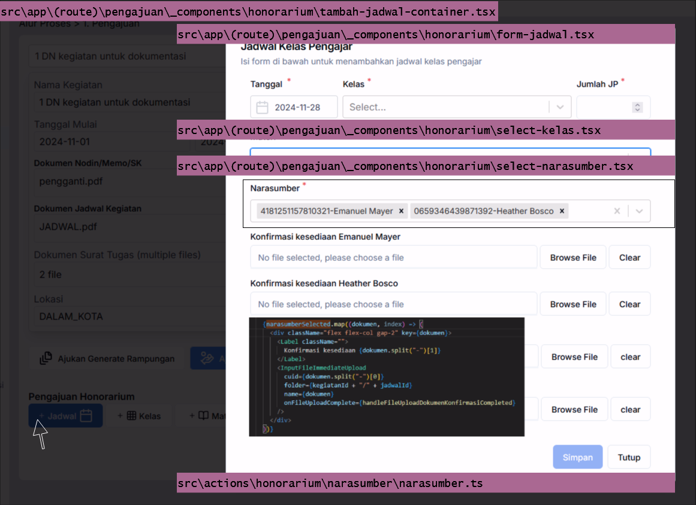

#### **5.3.15.2 File terkait**

1. Komponen

    - TambahJadwalContainer `src\app\(route)\pengajuan\_components\honorarium\tambah-jadwal-container.tsx`
    - FormJadwal `src\app\(route)\pengajuan\_components\honorarium\form-jadwal.tsx`
    - SelectKelas `src\app\(route)\pengajuan\_components\honorarium\select-kelas.tsx`
    - SelectNarasumber `src\app\(route)\pengajuan\_components\honorarium\select-narasumber.tsx`
    - DaftarJadwal `src\components\kegiatan\honorarium\daftar-jadwal.tsx`

2. Zod Schema

    - Jadwal, jadwalSchema `src\zod\schemas\jadwal.ts`

3. Server Action

    - SimpanJadwalKelasNarasumber `src\actions\honorarium\narasumber\narasumber.ts`

#### **5.3.15.3 Cara kerja komponen TambahJadwalContainer**

Saat tombol jadwal ditekan, akan ditampilkan dialog `TambahJadwalContainer` yang berisi formulir `FormJadwal`. ketika pengguna memilih narasumber sistem akan otomatis menampilkan komponent [`InputFileImmediateUpload`](#5310-komponen-formfileimmediateupload) sejumlah narasumber yang dipilih

```ts
// src\app\(route)\pengajuan\_components\honorarium\form-jadwal.tsx
import { Jadwal, jadwalSchema } from "@/zod/schemas/jadwal";
//kode lainnya

        {narasumberSelected.map((dokumen, index) => (
          <div className="flex flex-col gap-2" key={dokumen}>
            <Label className="">
              Konfirmasi kesediaan {dokumen.split("-")[1]}
            </Label>
            <InputFileImmediateUpload
              cuid={dokumen.split("-")[0]}
              folder={kegiatanId + "/" + jadwalId}
              name={dokumen}
              onFileUploadComplete={handleFileUploadDokumenKonfirmasiCompleted}
            />
          </div>
        ))}
```

#### **5.3.15.4 Tabel dan data**

Tabel-tabel yang digunakan untuk proses tambah jadwal adalah: `jadwal`, `jadwal_narasumber`, `narasumber`, `materi`, `kelas`, `kegiatan`

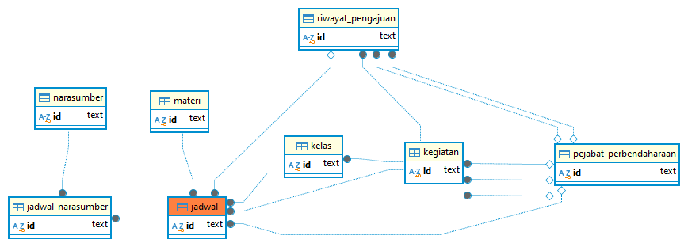

#### **5.3.15.5 Cara kerja fungsi SimpanJadwalKelasNarasumber**

proses yang dilakukan saat pengguna menekan tombol Simpan diantaranya adalah

1. sistem akan mencoba menyimpan dokumen yang telah diupload menggunakan komponen `InputFileImmediateUpload` ke folder final pada fungsi `saveFileToFinalFolder`
2. membuat transaksi database, melakukan `upsert` update/insert ke tabel `jadwal`
3. untuk setiap narasumber yang dipilih akan dientri ke tabel `jadwal_narasumber`
4. untuk setiap jadwal yang dientri akan mentrigger `DaftarJadwal` untuk memperbarui daftarnya

code snippet `src\app\(route)\pengajuan\_components\honorarium\honorarium-container.tsx`

```ts
// src\app\(route)\pengajuan\_components\honorarium\honorarium-container.tsx
  const [jadwalUpdatedAt, setJadwalUpdatedAt] = useState<number>(0);
  const handleOnSuccess = () => {
    setJadwalUpdatedAt(jadwalUpdatedAt + 1);
  };

// kode lainnya
    <TambahJadwalContainer
      kegiatanId={kegiatan.id}
      onSuccess={handleOnSuccess}
    />
// kode lainnya
    <DaftarJadwal
    triggerUpdate={jadwalUpdatedAt}
    kegiatanId={kegiatan.id}
    proses={"PENGAJUAN"}
  />
// kode lainnya
```

code snippet `src\components\kegiatan\honorarium\daftar-jadwal.tsx`

```ts
//src\components\kegiatan\honorarium\daftar-jadwal.tsx
const DaftarJadwal = ({
  kegiatanId,
  proses,
  triggerUpdate, // hanya simple trigger untuk re-render
}: DaftarJadwalProps) => {
    useEffect(() => {
    const getJadwal = async () => {
      const dataJadwal = await getObPlainJadwalByKegiatanId(kegiatanId);
      //const dataJadwal = await getJadwalByKegiatanId(kegiatanId);
      setDataJadwal(dataJadwal);
    };
    getJadwal();
  }, [kegiatanId, triggerUpdate, selfTrigger]);
}
```

### **5.3.16 Komponen DaftarJadwal**

#### **5.3.16.1 Tampilan visual**

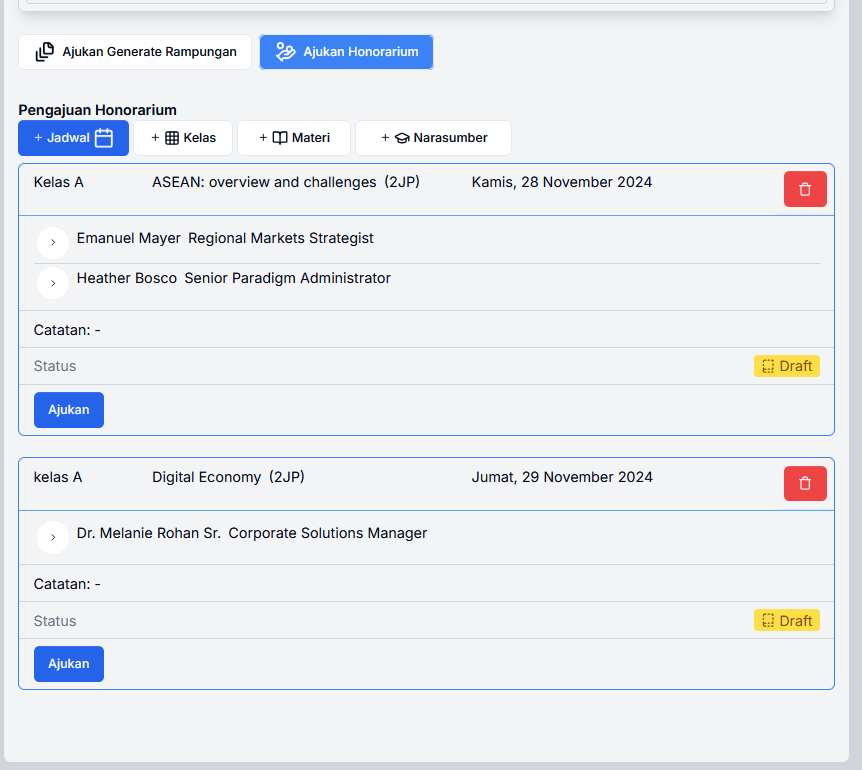


#### **5.3.16.2 File terkait**

1. Komponen
    - DaftarJadwal `src\components\kegiatan\honorarium\daftar-jadwal.tsx`
    - NarasumberListItem `src\components\kegiatan\honorarium\narasumber-list-item.tsx`
    - NarasumberDetail `src\components\kegiatan\honorarium\narusumber-detail.tsx`

2. Server action
    - updateJumlahJpJadwalNarasumber `src\actions\honorarium\narasumber\proses-pengajuan-pembayaran.ts`

#### **5.3.16.5 Cara kerja**

saat komponen `DaftarJadwal` ditrigger oleh fungsi `handleOnSuccess` di `src\app\(route)\pengajuan\_components\honorarium\honorarium-container.tsx`. `DaftarJadwal` akan menjalankan effect dan mengambil data ke server melalui fungsi `getObPlainJadwalByKegiatanId` dan di set ke state `dataJadwal`

data jadwal bisa di filter menggunakan [pencarian](#537-komponen-pencarian)

```ts
// src\components\kegiatan\honorarium\daftar-jadwal.tsx
  const [dataJadwal, setDataJadwal] = useState<ObjPlainJadwalKelasNarasumber[]>(
    []
  );
//kode lainnya

const sortedDataJadwal = dataJadwal.sort((obj1, obj2) => {
    const date1 = new Date(obj1.tanggal);
    const date2 = new Date(obj2.tanggal);
    return date1.getTime() - date2.getTime();
  });
  const filteredData = sortedDataJadwal.filter((row) => {
    if (!searchTerm || searchTerm === "") return true;
    const lowercasedSearchTerm = searchTerm.toLowerCase();
    //const searchWords = lowercasedSearchTerm.split(" ").filter(Boolean);
    const searchWords =
      lowercasedSearchTerm
        .match(/"[^"]+"|\S+/g)
        ?.map((word) => word.replace(/"/g, "")) || [];

    return searchWords.every(
      (word) =>
        row.materi.nama?.toLowerCase().includes(word) ||
        row.jadwalNarasumber.some((narsum) =>
          narsum.narasumber.nama?.toLowerCase().includes(word)
        )
    );
  });
```

`filteredData` ini yang kemudian di-looping untuk menampilkan jadwal.

```ts
// src\components\kegiatan\honorarium\daftar-jadwal.tsx
  return (
    <div className="flex flex-col gap-6">
      {filteredData &&
        filteredData.map((jadwal: ObjPlainJadwalKelasNarasumber, index) => {}}
// kode lainnya
    </div>
```

untuk setiap jadwal kemudian ditampilkan daftar narasumbernya

```ts
// src\components\kegiatan\honorarium\daftar-jadwal.tsx

              <div className="flex flex-col w-full px-4 py-2">
                {jadwal.jadwalNarasumber.map((jadwalNarasumber, index) => {
                  const jumlahNarsum = jadwal.jadwalNarasumber.length;
                  return (
                    <NarasumberListItem
                      key={jadwalNarasumber.id}
                      optionsSbmHonorarium={optionsSbmHonorarium}
                      index={index}
                      jadwalNarasumber={jadwalNarasumber}
                      totalNarsum={jumlahNarsum}
                      proses={proses}
                      statusPengajuanHonorarium={
                        jadwal.riwayatPengajuan?.status as STATUS_PENGAJUAN
                      }
                    />
                  );
                })}
              </div>
```

tombol `Update Jenis dan JP` didefinisikan di komponen `NarasumberDetail`

```ts
// src\components\kegiatan\honorarium\narusumber-detail.tsx
import { updateJumlahJpJadwalNarasumber } from "@/actions/honorarium/narasumber/proses-pengajuan-pembayaran";

const handleUpdateJp = async () => {
// kode lainnya 
if (proses === "PENGAJUAN" || proses === "VERIFIKASI") {
      // update JP dan update jenis honorarium
      setIsUpdatingJp(true);
      const jenisHonorariumId = selectedSbmHonorarium?.value || null;
      const jumlahJamPelajaran = JumlahJP.toNumber();
      const updatedJadwalNarasumber = await updateJumlahJpJadwalNarasumber(
        jadwalNarasumber.id,
        jumlahJamPelajaran,
        jenisHonorariumId
      );
// kode lainnya 
}
// kode lainnya 
}

// kode lainnya 

      <RowNarasumberWithInput text="Jumlah JP">
        <input
          disabled={!isAllowEditJp}
          value={Number(JumlahJP)}
          className="px-2 py-1 w-16"
          min={0.0}
          type="number"
          step={0.1}
          onChange={handleJpChange}
        />
        {isAllowEditJp && isChanged && (
          <Button
            className="ml-2"
            variant={"default"}
            onClick={handleUpdateJp}
            disabled={isUpdatingJp}
          >
            Update Jenis dan JP{" "}
            {isUpdatingJp ? <LoaderPinwheel className="animate-spin" /> : ""}
          </Button>
        )}
      </RowNarasumberWithInput>
```

fungsi `updateJumlahJpJadwalNarasumber` pada `src\actions\honorarium\narasumber\proses-pengajuan-pembayaran.ts` akan menghitung besaran pajak dan mengupdate tabel `jadwal_narasumber`

```ts
// src\actions\honorarium\narasumber\proses-pengajuan-pembayaran.ts
  const pangkatGolonganId = jadwalNarasumber.narasumber.pangkatGolonganId;
  const npwp = jadwalNarasumber.narasumber.NPWP;
  const tarifPajak = getBesaranPajakHonorarium(pangkatGolonganId, npwp);
  const pajakDPP = getDpp(jumlahBruto, pangkatGolonganId);
  const pph21 = pajakDPP.times(tarifPajak.besaranPajak);
  const jumlahDiterima = jumlahBruto.minus(pph21);

  try {
    const updateStatus = await dbHonorarium.jadwalNarasumber.update({
      where: {
        id: jadwalNarasumberId,
      },
      data: {
        jumlahJamPelajaran: jumlahJp,
        jenisHonorariumId: jenisHonorariumId,
        besaranHonorarium: sbmHonorarium.besaran,
        pajakTarif: tarifPajak.besaranPajak,
        pajakDPP: pajakDPP,
        pph21: pph21,
        jumlahDiterima: jumlahDiterima,
      },
    });
  }
```

### **5.3.17 Halaman Verifikasi Generate Rampungan**

#### **5.3.17.1 Route**

<https://d01.pirsani.id/verifikasi>

#### **5.3.17.2 Tampilan visual**

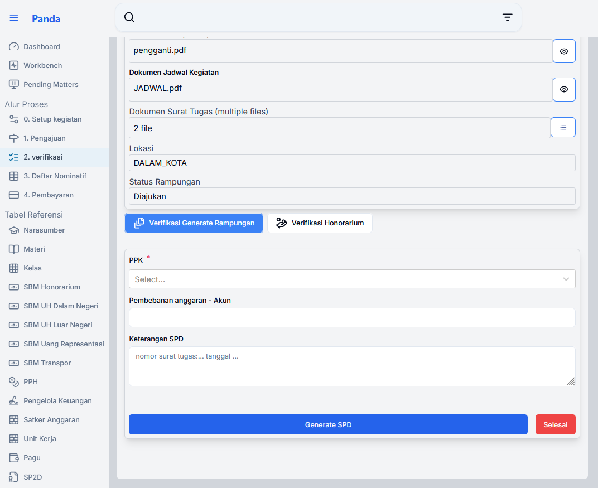

#### **5.3.17.4 Tabel dan Data**

pada proses verifikasi generate rampungan ini tabel-tabel yang berkaitan adalah `riwayat_pengajuan`, `kegiatan`, `spd`, `peserta_kegiatan`, `uh_dalam_negeri`, `uh_luar_negeri`, `itinerary`

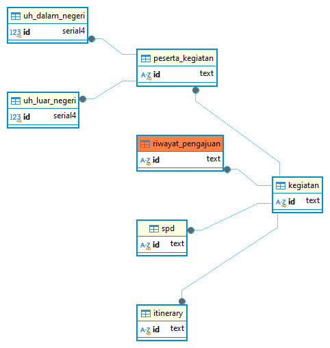

#### **5.3.17.4 File terkait**

1. **page** `src\app\(route)\verifikasi\page.tsx`
2. **components**
    - SelectKegiatan
    - PreviewKegiatan
    - VerfikasiSelectionContainer `src\app\(route)\verifikasi\_components\verifikasi-selection-container.tsx`
    - FormGenerateRampungan `src\app\(route)\verifikasi\_components\rampungan\form-generate-rampungan.tsx`
    - DaftarJadwal `src\components\kegiatan\honorarium\daftar-jadwal.tsx`
    - UangHarianDalamNegeriContainer `src\app\(route)\verifikasi\_components\uang-harian\dalam-negeri-container.tsx`
    - UangHarianLuarNegeriContainer `src\app\(route)\verifikasi\_components\uang-harian\luar-negeri-container.tsx`
3. API endpont
    - /download `src\app\(route)\download\[...slug]\route.ts`

#### **5.3.17.5 Cara kerja**

pada saat pengguna memilih `Verifikasi Generate Rambpungan` dan menekan tombol `Generate SPD` pada `FormGenerateRampungan`, sistem akan melakukan generate spd melaui fungsi `generateSpd`. jika proses ini berhasil sistem akan membuka halaman baru hasil pdf spd `/download/dokumen-rampungan/${kegiatanId}`

```ts
// src\app\(route)\verifikasi\_components\rampungan\form-generate-rampungan.tsx
import { generateSpd, updateStatusRampungan } from "@/actions/kegiatan/proses";

const onSubmit = async (data: Spd) => {
    console.log("[data]", data);
    //update existing kegiatan
    const updateStatus = await generateSpd(data);
    if (updateStatus.success) {
      handleGenerate();
      window.open(`/download/dokumen-rampungan/${kegiatanId}`, "_blank"); // Open new window
    }
  };
```

#### **5.3.17.5 Cara kerja API endpoint /download**

API endpoint `/download` merupakan API yang berfungsi untuk menangani proses download dokumen baik yang merupakan hasil generate maupun download dokumen yang sebelumnya diunggah. routing pada endpoint ini menggunakan routing [dinamis](https://nextjs.org/docs/14/app/building-your-application/routing/dynamic-routes#catch-all-segments)

sebagai contoh `/download/dokumen-rampungan/1234567` akan terbaca sebagai `{ slug: ['dokumen-rampungan', '1234567'] }`, api ini kemudian menjalankan fungsi sesuai jenis jenisDokumen `jenisDokumen = slug[0]`

snippet code `src\app\(route)\download\[...slug]\route.ts`

```ts
// src\app\(route)\download\[...slug]\route.ts
import { downloadDokumenRampungan } from "./generator-rampungan";
// kode lainnya
const jenisDokumen = slug[0];
console.log(jenisDokumen);
try {
  switch (jenisDokumen) {
    case "dokumen-pengadaan":
      return downloadDokumenPengadaan(req, slug);
    case "dokumen-spd":
      return downloadDokumenSpd(req, slug);
    case "dokumen-rampungan":
      return downloadDokumenRampungan(req, slug);
    case "template-excel":
      return downloadTemplateExcel(req, slug);
    case "dokumen-kegiatan":
      return downloadDokumenKegiatan(req, slug);
    case "narasumber":
      return downloadDokumenNarasumber(req, slug);
    case "test":
      return downloadTest(req, slug);
    case "nominatif-honorarium":
      return downloadNominatifHonorarium(req, slug);
    case "nominatif-uh-dalam-negeri":
      return downloadNominatifUhDalamNegeri(req, slug);
    case "nominatif-uh-luar-negeri":
      return downloadNominatifUhLuarNegeri(req, slug);
    case "spd-peserta":
      return downloadSpdDaftarPeserta(req, slug);
    case "konfirmasi-kesediaan-mengajar":
      return downloadDokumenKonfirmasiKesediaanMengajar(req, slug);
    case "bukti-pembayaran":
      return downloadDokumenBuktiPembayaran(req, slug);
    case "bukti-pembayaran-narasumber":
      return downloadDokumenBuktiPembayaranNarasumber(req, slug);
    case "dokumen-akhir":
      return downloadDokumenAkhir(req, slug);
    default:
      return new NextResponse(`Download ${params.slug.join("/")}`);
  }
} catch (error) {
console.error(error);
const customError = error as Error;
return new NextResponse(`Download error: ${customError.message}`);
  }
}
```

#### **5.3.17.6 Cara kerja fungsi downloadDokumenRampungan**

fungsi `downloadDokumenRampungan` akan melakukan merge 3(tiga) pdf

```ts
// src\app\(route)\download\[...slug]\generator-rampungan.ts
export async function downloadDokumenRampungan(req: Request, slug: string[]) {

    const spdHalaman1 = await generateSpdHalaman1(kegiatan);
    const spdHalaman2 = await generateSpdHalaman2(kegiatan);
    const spdDaftarPeserta = await generateSpdDaftarPeserta(kegiatan);

    const satuplusdua = await mergePdfs(spdHalaman1, spdHalaman2);

}
```

fungsi `generatorSpdHalaman1` pada `src\app\(route)\download\[...slug]\generator-spd.ts` pada intinya mengisi form template yang sudah ada. Lokasi template dihardcode di `src/templates/pdf/spd-1.pdf`

```ts
// src\app\(route)\download\[...slug]\generator-spd.ts
const fillFormSpd = async (spdData: SpdTextfield) => {
  const pdfTemplateLocation = "src/templates/pdf/spd-1.pdf";
}
```

sedangkan fungsi `generateSpdHalaman2` menggunakan template `src/templates/pdf/rampungan.pdf`. pada fungsi `generateSpdHalaman2` untuk setiap peserta akan digenerate 1 halaman pdf rampungan yang merupakan copy pdf yang telah diisi.

```ts
// src\app\(route)\download\[...slug]\generator-rampungan.ts
export const generateSpdHalaman2 = async (kegiatan: KegiatanIncludeSpd) => {
// kode lainnya 
  const pdfTemplateLocation = "src/templates/pdf/rampungan.pdf";
  const templatePath = path.resolve(process.cwd(), pdfTemplateLocation);
  await fs.access(templatePath, fs.constants.R_OK);

  const pdfBytes = await fillFormRampungan(templatePath, dataRampunganArray);
// kode lainnya 
}
```

#### **5.3.17.7 Verifikasi Generate Rampungan Selesai**

Setelah dilakukan proses `Generate SPD` makan proses dapat diselesaikan dengan menekan tombol `selesai`.

```ts
// src\app\(route)\verifikasi\_components\rampungan\form-generate-rampungan.tsx
import { generateSpd, updateStatusRampungan } from "@/actions/kegiatan/proses";
// kode lainnya
  const handleClickSelesai = async () => {
    const updateStatus = await updateStatusRampungan(kegiatanId, "END");
    if (updateStatus.success) {
      handleSelesai(updateStatus.data);
      console.log("[updateStatus]", updateStatus);
    }
  };
// kode lainnya  
              <Button
                type="button"
                variant={"destructive"}
                onClick={handleClickSelesai}
              >
                Selesai
              </Button>
```

fungsi `updateStatusRampungan` melakukan `upsertRiwayatPengajuan` dengan status baru `statusRampunganBaru: STATUS_PENGAJUAN`

### **5.3.18 Halaman Pengajuan UH Dalam Negeri**

#### **5.3.18.1 Route**

<https://d01.pirsani.id/pengajuan>

#### **5.3.18.2 komponen**

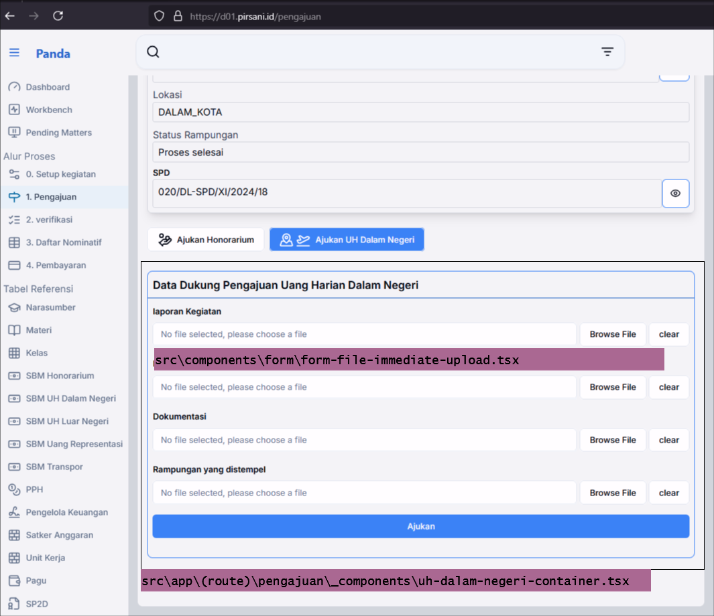

#### **5.3.18.3 File terkait**

1. **page** src\app\(route)\pengajuan\page.tsx
2. **components**
    - uhDalamNegeriContainer `src\app\(route)\pengajuan\_components\uh-dalam-negeri-container.tsx`
    - FormFileImmediateUpload
3. **server action**
    - ajukanUhDalamNegeri `src\actions\kegiatan\uang-harian\dalam-negeri.ts`
    - upsertRiwayatPengajuan `src\actions\kegiatan\proses.ts`
  
#### **5.3.18.4 Tabel dan data**

#### **5.3.18.5 Cara kerja**

Pengguna mengunggah dokumen data dukung menggunakan komponen [FormFileImmediateUpload](#5310-komponen-formfileimmediateupload)

untuk mengenali setiap dokumen yang diunggah digunakan `createId()`, id ini kemudian digunakan sebagai props `cuid` pada komponen `FormFileImmediateUpload`

```ts
// src\app\(route)\pengajuan\_components\uh-dalam-negeri-container.tsx
const form = useForm<FormValues<FormMode>>({
    resolver: zodResolver(
      isEditMode
        ? dokumenUhDalamNegeriSchemaEditMode
        : dokumenUhDalamNegeriSchema
    ),
    defaultValues: {
      kegiatanId,
      laporanKegiatanCuid: "laporanKegiatan" + createId() + ".pdf",
      daftarHadirCuid: "daftarHadir" + createId() + ".pdf",
      dokumentasiKegiatanCuid: "dokumentasi" + createId() + ".pdf",
      rampunganTerstempelCuid: "rampungan" + createId() + ".pdf",
    },
  });

   <FormFileImmediateUpload
    cuid={laporanKegiatanCuid}
    name={field.name}
    folder={kegiatanId}
    onFileChange={handleFileChange}
    className="bg-white w-full border-2"
  />
```

proses pengajuan dilakukan ketika pengguna menekan tombol `Ajukan`, sistem akan menjalankan fungsi `ajukanUhDalamNegeri`

```ts
// src\app\(route)\pengajuan\_components\uh-dalam-negeri-container.tsx
import ajukanUhDalamNegeri from "@/actions/kegiatan/uang-harian/dalam-negeri";

    const ajukan = await ajukanUhDalamNegeri(dataparsedWithoutFile);
```

fungsi `ajukanUhDalamNegeri` pada `src\actions\kegiatan\uang-harian\dalam-negeri.ts` akan memindahkan dokumen dari folder temporary ke folder akhir kemudian akan melakukan `upsert` di tabel `riwayat_pengajuan` dengan menjalankan fungsi `upsertRiwayatPengajuan` yang ada di `src\actions\kegiatan\proses.ts`

```ts
// src\actions\kegiatan\uang-harian\dalam-negeri.ts
export const ajukanUhDalamNegeri = async (
  dokumenUhDalamNegeri: DokumenUhDalamNegeri
): Promise<ActionResponse<Kegiatan | null>> => {
  try {
    // step 1. try to move file to final folder
    logUploadedFile = await saveFileToFinalFolder(dokumenUhDalamNegeri);
    // kode lainnya
    // step 3. update kegiatan status Uh Luar Negeri
    const kegiatanUpdated = await updateStatusUhDalamNegeri(
      dokumenUhDalamNegeri.kegiatanId,
      "SUBMITTED"
    );
    return kegiatanUpdated;
  } catch (error) {
    return ErrorResponseSwitcher(error);
  }
}
```

```ts
// src\actions\kegiatan\proses.ts
export const updateStatusUhDalamNegeri = async (
  kegiatanId: string,
  statusUhDalamNegeriBaru: STATUS_PENGAJUAN,
  catatan?: string | null
): Promise<ActionResponse<Kegiatan>> => {
  const updated = await upsertRiwayatPengajuan(
    kegiatanId,
    statusUhDalamNegeriBaru,
    "UH_DALAM_NEGERI",
    catatan
  );

  return updated;
};
```

### **5.3.19 Halaman Pengajuan UH Luar Negeri**

untuk pengajuan UH luar negeri komponen dan cara kerjanya mirip dengan pengajuan UH dalam negeri. hanya formulir isiannya untuk upload dokumen lebh banyak

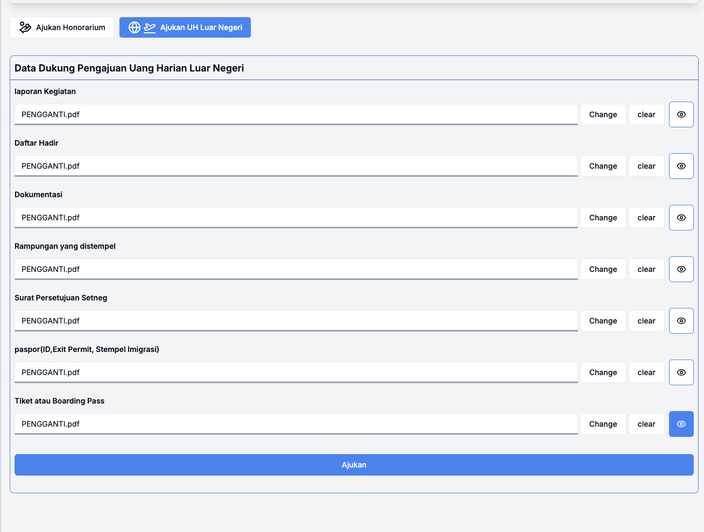

### **5.3.20 Halaman Verifikasi UH Dalam Negeri**

#### **5.3.20.1 Route**

<https://d01.pirsani.id/verifikasi>

### **5.3.21 Halaman Verifikasi UH Luar Negeri**

#### **5.3.21.1 Route**

<https://d01.pirsani.id/verifikasi>

#### **5.3.21.2 Tampilan visual**

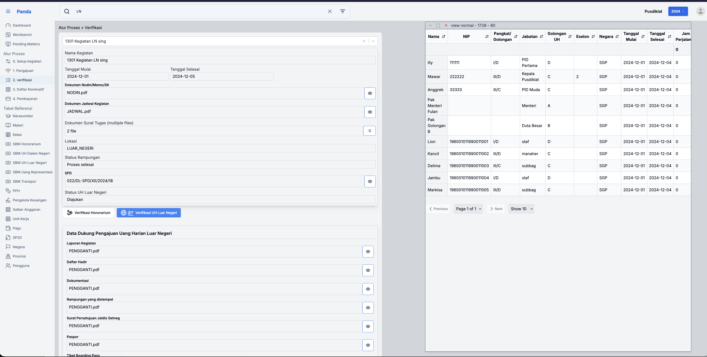

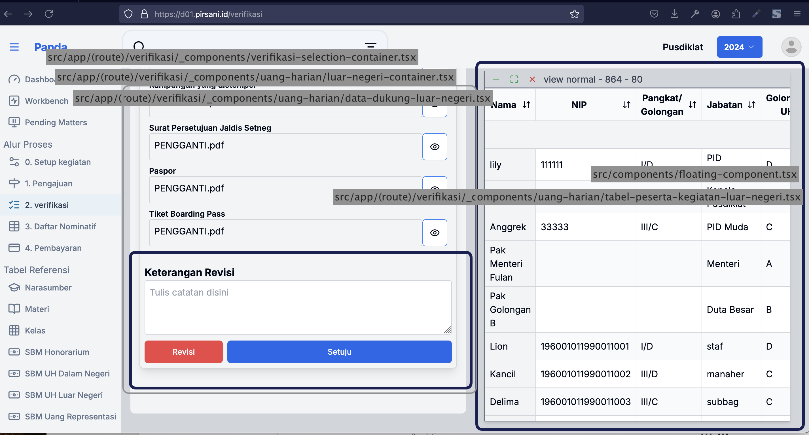

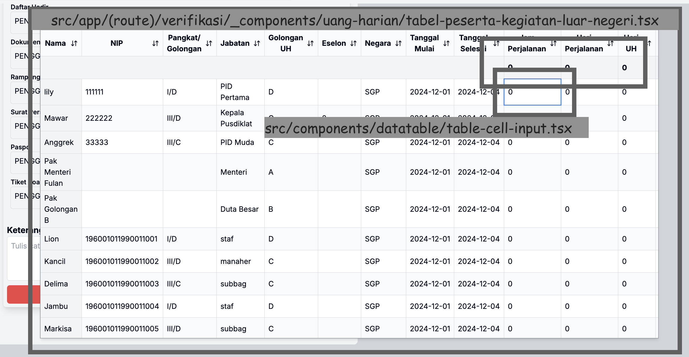

#### **5.3.21.3 File terkait**

1. **page** `src/app/(route)/verifikasi/page.tsx`

2. **components**
    - VerfikasiSelectionContainer `src/app/(route)/verifikasi/_components/verifikasi-selection-container.tsx`
    - UangHarianLuarNegeriContainer `src/app/(route)/verifikasi/_components/uang-harian/luar-negeri-container.tsx`
    - VerifikasiDataDukungUangHarianLuarNegeri `src/app/(route)/verifikasi/_components/uang-harian/data-dukung-luar-negeri.tsx`
    - FloatingComponent: ResizableDraggable `src/components/floating-component.tsx`
    - TabelHariPesertaKegiatan: TabelHariPesertaKegiatan `src/app/(route)/verifikasi/_components/uang-harian/tabel-peserta-kegiatan-luar-negeri.tsx`
    - TableCellInput `src/components/datatable/table-cell-input.tsx`
3. **server action**
    - setujuiPengajuanUhLuarNegeri 

#### **5.3.21.4 Tabel dan Data**

#### **5.3.21.5 Cara kerja**

Ketika pengguna mengubah cell pada kolom Hari Perjalanan, UH dan Diklat, saat event `onBlur` akan mentrigger fungsi `updateData` yang didefinisikan di komponen `TabelHariPesertaKegiatan` dan mengembalikan nilai `detailUhLuarNegeriPeserta:DetailUhLuarNegeriPeserta[]` yang telah diperbarui

sedangkan jika pengguna menggubah pada cell header maka akan mentrigger `changeAllRowsColumnUhLuarNegeri` kemudian akan memperbarui state `detailUhLuarNegeriPeserta` menggunakan `setDetailUhLuarNegeriPeserta`

```ts
//src/components/datatable/table-cell-input.tsx

export const TableCellInput = <T,>({
  getValue,
  row,
  column,
  table,
  handleOnBlur = () => {},
  className,
  type = "number",
}: ITableCellProps<T>) => {
  const onBlur = () => {
    if (
      table.options.meta &&
      typeof table.options.meta.updateData === "function"
    ) {
      console.log("row.index", row);
      (table.options.meta.updateData as Function)(row.index, column.id, value);
      handleOnBlur(value);
      console.log("column.id", column.id);
    } else {
      console.error("updateData method is not available");
    }
  };
}
```

```ts
// src/app/(route)/verifikasi/_components/uang-harian/tabel-peserta-kegiatan-luar-negeri.tsx

import { TableCellInput } from "@/components/datatable/table-cell-input";

// Define column structure
  const columns: ColumnDef<DetailUhLuarNegeriPeserta>[] = [
// kode lainnya
    {
    accessorKey: "hPerjalanan",
    header: "Hari Perjalanan",
    cell: ({ getValue, row, column, table }) =>
      TableCellInput({
        getValue,
        row,
        column,
        table,
        className: "h-18 items-center justify-center p-2 ",
      }),
    meta: {
      className: "items-center justify-center p-0 max-w-18",
    },
  },
// kode lainnya
  ]
//kode lainnya
  const table = useReactTable<DetailUhLuarNegeriPeserta>({
// kode lainnya
      meta: {
      updateData: (rowIndex: number, columnId: string, value: string) => {
        setDetailUhLuarNegeriPeserta((old) =>
          old.map((row, index) => {
            if (index === rowIndex) {
              // kode lainnya
              // update sesuai harinya
              return updatedRow;
            }
            return row;
          }))
        }
      }
  })
```

rangkaian perubahan ini kemudian juga diteruskan ke komponen induknya `UangHarianLuarNegeriContainer` dan mentrigger `handleDetailUhLuarNegeriPesertaChange`

```ts
// src/app/(route)/verifikasi/_components/uang-harian/luar-negeri-container.tsx
const handleDetailUhLuarNegeriPesertaChange = (
    data: DetailUhLuarNegeriPeserta[]
  ) => {
    setDetailUhLuarNegeriPeserta(data);
  };

            <FloatingComponent hide={isPreviewHidden} onHide={handleOnHide}>
            <TabelHariPesertaKegiatan
              data={peserta}
              onDataChange={handleDataChange}
              onDetailUhLuarNegeriChange={handleDetailUhLuarNegeriPesertaChange}
            />
          </FloatingComponent>
```

data `detailUhLuarNegeriPeserta` pada `src/app/(route)/verifikasi/_components/uang-harian/luar-negeri-container.tsx` inilah yang kemudian akan dikirim ke server ketika pengguna menekan tombol `Setuju`

```ts
  const handleSetujuVerifikasiUhLuarNegeri = async () => {
    if (!kegiatan || !pesertaUpdated) {
      toast.error("Silakan periksa kembali data peserta");
      return;
    }
    const updated = await setujuiPengajuanUhLuarNegeri(
      kegiatan?.id,
      pesertaUpdated,
      detailUhLuarNegeriPeserta
    );
    if (updated.success) {
      toast.success(
        "Berhasil menverifikasi data peserta dan menyetujui pengajuan"
      );
    } else {
      toast.error(`Terjadi kesalahan ${updated.error} ${updated.message}`);
    }
  };
```

fungsi `setujuiPengajuanUhLuarNegeri` akan melakukan pembaruan data di tabel `uhLuarNegeri` 

### **5.3.22 Halaman Daftar Nominatif Honorarium**

#### **5.3.22.1 Route**

<https://d01.pirsani.id/daftar-nominatif>

#### **5.3.22.2 Tampilan visual**

#### **5.3.22.3 File terkait**

#### **5.3.22.4 Tabel dan Data**

#### **5.3.22.5 Cara kerja**

### **5.3.23 Halaman Daftar Nominatif UH Dalam Negeri**

#### **5.3.23.1 Route**

<https://d01.pirsani.id/daftar-nominatif>

#### **5.3.23.2 Tampilan visual**

#### **5.3.23.3 File terkait**

#### **5.3.23.4 Tabel dan Data**

#### **5.3.23.5 Cara kerja**

### **5.3.24 Halaman Daftar Nominatif UH Luar Negeri**

#### **5.3.24.1 Route**

<https://d01.pirsani.id/daftar-nominatif>

#### **5.3.24.2 Tampilan visual**

#### **5.3.24.3 File terkait**

#### **5.3.24.4 Tabel dan Data**

#### **5.3.24.5 Cara kerja**

### **5.3.25 Halaman Pembayaran**

#### **5.3.25.1 Route**

<https://d01.pirsani.id/daftar-nominatif>

#### **5.3.25.2 Tampilan visual**

#### **5.3.25.3 File terkait**

#### **5.3.25.4 Tabel dan Data**

#### **5.3.25.5 Cara kerja**

### **5.3.26 Halaman Pembayaran Honorarium**

#### **5.3.26.1 Route**

<https://d01.pirsani.id/daftar-nominatif>

#### **5.3.26.2 Tampilan visual**

#### **5.3.26.3 File terkait**

#### **5.3.26.4 Tabel dan Data**

#### **5.3.26.5 Cara kerja**

### **5.3.27 Halaman Pembayaran UH Dalam Negeri**

#### **5.3.27.1 Route**

<https://d01.pirsani.id/daftar-nominatif>

#### **5.3.27.2 Tampilan visual**

#### **5.3.27.3 File terkait**

#### **5.3.27.4 Tabel dan Data**

#### **5.3.27.5 Cara kerja**

### **5.3.28 Halaman Pembayaran UH Dalam Negeri**

#### **5.3.28.1 Route**

<https://d01.pirsani.id/daftar-nominatif>

#### **5.3.28.2 Tampilan visual**

#### **5.3.28.3 File terkait**

#### **5.3.28.4 Tabel dan Data**

#### **5.3.28.5 Cara kerja**


### **5.3.29 Halaman Data Referensi**

#### **5.3.29.1 Route**

<https://d01.pirsani.id/daftar-nominatif>

#### **5.3.29.2 Tampilan visual**

#### **5.3.29.3 File terkait**

#### **5.3.29.4 Tabel dan Data**

#### **5.3.29.5 Cara kerja**