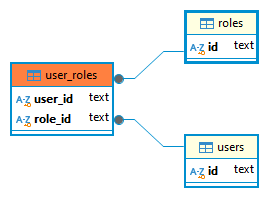
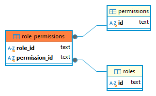
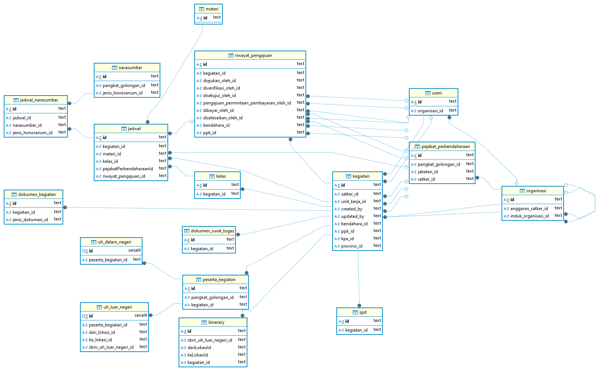

# **4. Database**

## **4.1 Ringkasan**

Dengan menggabungkan PostgreSQL sebagai basis data dan Prisma sebagai ORM, Pengembang tidak perlu menulis query SQL manual untuk sebagian besar operasi CRUD. Prisma mempermudah interaksi dengan PostgreSQL melalui API modern. Untuk query yang lebih kompleks Prisma menyediakan API untuk menjalankan raw query.

Untuk mengelola database PostgreSQL dapat menggunakan Database Tools seperti [pgAdmin](https://www.pgadmin.org/) atau [DBeaver](https://dbeaver.io/)

## **4.2 Skema Database**

Secara umum, skema database dapat dikelompokkan ke dalam 3(tiga) kelompok besar

1. kelompok otentikasi dan otorisasi
2. kelompok inti proses bisnis
3. kelompok referensi

### **4.2.1 Skema Database untuk otentikasi dan otorisasi**

skema database yang digunakan untuk otentikasi dan otorisasi adalah `user`,`organisasi`, `user_preferences` , `user_roles`,  `roles`, `role_extension`, `role_permissions`, dan `permissions`


gambar 4.1 Relasi tabel user



gambar 4.2 Relasi tabel user_roles


gambar 4.3 Relasi tabel roles



gambar 4.3 Relasi tabel role_permissions

secara lengkap skema yang digunakan untuk otentikasi dan otorisasi adalah sebagai berikut


gambar 4.4 Relasi tabel yang digunakan untuk otentikasi dan otorisasi

### **4.2.3 Skema Database untuk proses bisnis**

untuk proses pengajuan hingga pembayaran tabel-tabel yang digunakan adalah `kegiatan`, `peserta_kegiatan`, `riwayat_pengajuan`, `pejabat_perbendharaan`, `dokumen_surat_tugas`, `dokumen_kegiatan`, `spd`, `uh_dalam_negeri`, `uh_luar_negeri`, `itinerary`, `kelas`, `jadwal`, `jadwal_narasumber`, `narasumber`, `materi`, `users`, `organisasi`.



gambar 4.4 Relasi tabel untuk proses bisnis

#### **4.2.3.1 Skema Database untuk proses pengajuan Uang Harian**

untuk proses pengajuan Uang Harian, tabel-tabel yang digunakan adalah `kegiatan`, `peserta_kegiatan`, `riwayat_pengajuan`,`pejabat_perbendharaan`,  `spd`, `uh_dalam_negeri`, `uh_luar_negeri`, `itinerary`


#### **4.2.3.2 Skema Database untuk proses pengajuan Honorarium**

Untuk proses pengajuan Honorarium, tabel-tabel yang digunakan adalah `kegiatan`, `riwayat_pengajuan`, `pejabat_perbendharaan`,`kelas`, `jadwal`, `jadwal_narasumber`, `narasumber`, `materi`, `users`, `organisasi`.


## **4.3 Prisma Skema Database**

Prisma ORM dipilih sebagai ORM yang digunakan karena kemudahan dan mendukung Typescript. Skema database secara keseluruhan ditulis dengan `schema.prisma` yang ada di `rootproject/prisma/db-honorarium/schema.prisma`

```prisma
// This is your Prisma schema dokumen,
// learn more about it in the docs: https://pris.ly/d/prisma-schema

// Looking for ways to speed up your queries, or scale easily with your serverless or edge functions?
// Try Prisma Accelerate: https://pris.ly/cli/accelerate-init

generator client {
  provider        = "prisma-client-js"
  output          = "../../node_modules/@prisma-honorarium/client"
  previewFeatures = ["typedSql"]
}

datasource db {
  provider = "postgresql"
  url      = env("DATABASE_URL_HONORARIUM")
}

// Model for Users, Accounts, Sessions, and Verification Tokens
model Permission {
  id          String           @id @default(cuid())
  name        String //@unique
  resource    String // e.g., "post", "dashboard"
  action      String // e.g., "create:any", "read:any", "update:any", "delete:any", "create:own", "read:own", "update:own", "delete:own"
  description String?
  createdBy   String           @map("created_by")
  createdAt   DateTime         @default(now()) @map("created_at")
  updatedBy   String?          @map("updated_by")
  updatedAt   DateTime?        @updatedAt @map("updated_at")
  roles       RolePermission[]

  @@unique([resource, action])
  @@map("permissions")
}

model Role {
  id          String           @id @default(cuid())
  name        String           @unique
  description String?
  createdBy   String           @map("created_by")
  createdAt   DateTime         @default(now()) @map("created_at")
  updatedBy   String?          @map("updated_by")
  updatedAt   DateTime?        @updatedAt @map("updated_at")
  extendedBy  RoleExtension[]  @relation("RoleExtender") // Roles that extend this role
  extends     RoleExtension[]  @relation("RoleExtendee") // Roles this role extends
  users       UserRole[]
  permissions RolePermission[]

  @@map("roles")
}

model RoleExtension {
  id             String @id @default(cuid())
  baseRoleId     String @map("base_role_id") // The role being extended 
  extendedRoleId String @map("extended_role_id") // The role that extends it
  baseRole       Role   @relation("RoleExtendee", fields: [baseRoleId], references: [id], onDelete: Cascade)
  extendedRole   Role   @relation("RoleExtender", fields: [extendedRoleId], references: [id], onDelete: Cascade)

  @@map("role_extensions")
}

model RolePermission {
  roleId       String     @map("role_id")
  permissionId String     @map("permission_id")
  role         Role       @relation(fields: [roleId], references: [id])
  permission   Permission @relation(fields: [permissionId], references: [id])

  @@id([roleId, permissionId])
  @@map("role_permissions")
}

model UserRole {
  userId String @map("user_id")
  roleId String @map("role_id")
  user   User   @relation(fields: [userId], references: [id], onDelete: Cascade)
  role   Role   @relation(fields: [roleId], references: [id], onDelete: Cascade)

  @@id([userId, roleId])
  @@map("user_roles")
}

model User {
  id                           String             @id @default(cuid())
  name                         String
  email                        String             @unique
  password                     String?
  emailVerified                DateTime?          @map("email_verified")
  image                        String?
  sessions                     Session[]
  NIP                          String?            @unique @map("nip")
  organisasiId                 String?            @map("organisasi_id")
  organisasi                   Organisasi?        @relation(fields: [organisasiId], references: [id])
  createdBy                    String             @default("init") @map("created_by")
  createdAt                    DateTime           @default(now()) @map("created_at")
  updatedBy                    String?            @map("updated_by")
  updatedAt                    DateTime?          @updatedAt @map("updated_at")
  logProsesCreator             LogProses[]        @relation("log_proses_creator")
  logProsesUpdater             LogProses[]        @relation("log_proses_updater")
  kegiatanCreator              Kegiatan[]         @relation("kegiatan_creator")
  kegiatanUpdater              Kegiatan[]         @relation("kegiatan_updater")
  userRole                     UserRole[]
  userPreference               UserPreference? // 1-to-1 relation with UserPreference
  pengajuanDiajukan            RiwayatPengajuan[] @relation("pengajuan_diajukan_oleh")
  pengajuanDiverifikasi        RiwayatPengajuan[] @relation("pengajuan_diverifikasi_oleh")
  pengajuanDisetujui           RiwayatPengajuan[] @relation("pengajuan_disetujui_oleh")
  pengajuanPermintanPembayaran RiwayatPengajuan[] @relation("pengajuan_permintaan_pembayaran_oleh")
  pengajuanDibayar             RiwayatPengajuan[] @relation("pengajuan_dibayar_oleh")
  pengajuanDiselesaikan        RiwayatPengajuan[] @relation("pengajuan_diselesaikan_oleh")

  @@map("users")
}

model UserPreference {
  id              String    @id @map("user_id") // this will be the user id (foreign key)
  theme           String?
  language        String?
  tahunAnggaran   Int       @default(2025) @map("tahun_anggaran")
  extraPreference Json?
  createdAt       DateTime  @default(now())
  updatedAt       DateTime? @updatedAt

  // Relation to User
  user User @relation(fields: [id], references: [id])

  @@map("user_preferences")
}

model Session {
  sessionToken String   @unique
  userId       String
  expires      DateTime
  user         User     @relation(fields: [userId], references: [id], onDelete: Cascade)

  createdAt DateTime @default(now())
  updatedAt DateTime @updatedAt

  @@map("sessions")
}

model PangkatGolongan {
  id                    String                  @id
  pangkat               String
  golongan              String
  ruang                 String
  deskripsi             String?
  pesertaKegiatan       PesertaKegiatan[]
  narasumber            Narasumber[]
  createdBy             String                  @map("created_by")
  createdAt             DateTime                @default(now()) @map("created_at")
  updatedBy             String?                 @map("updated_by")
  updatedAt             DateTime?               @updatedAt @map("updated_at")
  PejabatPerbendaharaan PejabatPerbendaharaan[]

  @@unique([golongan, ruang])
  @@map("pangkat_golongan")
}

model Narasumber {
  id                              String             @id // id narasumber adalah NIK
  nama                            String
  NIP                             String             @default("-") @map("nip")
  NPWP                            String             @default("-") @map("npwp")
  jabatan                         String             @default("-")
  eselon                          Int?
  pangkatGolonganId               String?            @map("pangkat_golongan_id")
  pangkatGolongan                 PangkatGolongan?   @relation(fields: [pangkatGolonganId], references: [id])
  jenisHonorariumId               String?            @map("jenis_honorarium_id") // ini hanya jadi catatan jenis yang sekarang saat pengajuan,bisa saja berubah krn kenaikan pangkat dll,  sehingga ketika pencatatan transaksi honorarium harus diacu ke jenis honorarium yg ada di sbm_honorarium dan dicatat di tabel jadwal_narasumber
  jenisHonorarium                 SbmHonorarium?     @relation(fields: [jenisHonorariumId], references: [id])
  email                           String?
  nomorTelepon                    String?            @map("nomor_telepon")
  bank                            String
  namaRekening                    String             @map("nama_rekening")
  nomorRekening                   String             @map("nomor_rekening")
  dokumenPeryataanRekeningBerbeda String?            @map("dokumen_peryataan_rekening_berbeda")
  createdBy                       String             @map("created_by")
  createdAt                       DateTime           @default(now()) @map("created_at")
  updatedBy                       String?            @map("updated_by")
  updatedAt                       DateTime?          @updatedAt @map("updated_at")
  JadwalNarasumber                JadwalNarasumber[]

  @@map("narasumber")
}

model PmkAcuan {
  id        String    @id
  nomorPMK  String    @unique @map("nomor_pmk")
  tmtAwal   DateTime? @map("tmt_awal")
  tmtAkhir  DateTime? @map("tmt_akhir")
  tahun     Int
  aktif     Boolean
  createdBy String    @map("created_by")
  createdAt DateTime  @default(now()) @map("created_at")
  updatedBy String?   @map("updated_by")
  updatedAt DateTime? @updatedAt @map("updated_at")

  @@map("pmk_acuan")
}

// referensi halaman 29 PMK 49/2023
// 9. Honorarium Narasumber/Moderator/Pembawa Acara/Panitia
model SbmHonorarium {
  id               String             @id @default(cuid())
  kode             String?
  jenis            String
  satuan           String
  besaran          Decimal            @db.Decimal(10, 0)
  uraian           String?
  tahun            Int
  createdBy        String             @map("created_by")
  createdAt        DateTime           @default(now()) @map("created_at")
  updatedBy        String?            @map("updated_by")
  updatedAt        DateTime?          @updatedAt @map("updated_at")
  JadwalNarasumber JadwalNarasumber[]
  Narasumber       Narasumber[]

  @@unique([kode, tahun])
  @@map("sbm_honorarium")
}

model SbmUhDalamNegeri {
  id             String   @id @default(cuid()) // format id: tahun nomor urut pada sbm contoh untuk aceh tahun 2024 nomor urut 1 maka id: 01-2024
  provinsiId     String   @map("provinsi_id")
  provinsi       Provinsi @relation(fields: [provinsiId], references: [id])
  satuan         String
  fullboard      Decimal  @db.Decimal(10, 0)
  fulldayHalfday Decimal  @map("fullday_halfday") @db.Decimal(10, 0) // fullday/halfday dijadikan satu
  luarKota       Decimal  @map("luar_kota") @db.Decimal(10, 0)
  dalamKota      Decimal  @map("dalam_kota") @db.Decimal(10, 0)
  diklat         Decimal  @db.Decimal(10, 0)
  tahun          Int

  createdBy String    @map("created_by")
  createdAt DateTime  @default(now()) @map("created_at")
  updatedBy String?   @map("updated_by")
  updatedAt DateTime? @updatedAt @map("updated_at")

  @@unique([provinsiId, tahun])
  @@map("sbm_uh_dalam_negeri")
}

// referensi halaman 23 PMK 49/2023
// 31 Satuan Biaya Rapat/ Pertemuan di Luar Kantor
// 31.1 Paket Kegiatan Rapat/Pertemuan di Luar Kantor
// tingkat [a,b,c] [menteri dan setingkat menteri; eselon I, eselon II; eselon III kebawah]
// Define the enum
enum TingkatPaketRapat {
  a
  b
  c
}

model SbmPaketRapat {
  id         String            @id @default(cuid())
  provinsiId String            @map("provinsi_id")
  provinsi   Provinsi          @relation(fields: [provinsiId], references: [id])
  tingkat    TingkatPaketRapat // enum a, b, c
  halfday    Decimal           @db.Decimal(10, 0)
  fullday    Decimal           @db.Decimal(10, 0)
  fullboard  Decimal           @db.Decimal(10, 0)
  tahun      Int
  createdBy  String            @map("created_by")
  createdAt  DateTime          @default(now()) @map("created_at")
  updatedBy  String?           @map("updated_by")
  updatedAt  DateTime?         @updatedAt @map("updated_at")

  @@unique([provinsiId, tingkat, tahun])
  @@map("sbm_rapat")
}

// referensi halaman 26 PMK 49/2023
// 31.2 Uang Harian Kegiatan Rapat/Pertemuan di Luar Kantor
model SbmUhRapat {
  id             String   @id @default(cuid())
  provinsiId     String   @map("provinsi_id")
  provinsi       Provinsi @relation(fields: [provinsiId], references: [id])
  satuan         String
  fullboard      Decimal  @db.Decimal(10, 0)
  fulldayHalfday Decimal  @map("fullday_halfday") @db.Decimal(10, 0)
  tahun          Int

  createdBy String    @map("created_by")
  createdAt DateTime  @default(now()) @map("created_at")
  updatedBy String?   @map("updated_by")
  updatedAt DateTime? @updatedAt @map("updated_at")

  @@map("sbm_uh_rapat")
}

model SbmTaksi {
  id         String    @id @default(cuid()) // format id: tahun nomor urut pada sbm contoh untuk aceh tahun 2024 nomor urut 1 maka id: 01-2024
  provinsiId String    @map("provinsi_id")
  provinsi   Provinsi  @relation(fields: [provinsiId], references: [id])
  satuan     String
  besaran    Decimal   @db.Decimal(10, 0)
  tahun      Int
  createdBy  String    @map("created_by")
  createdAt  DateTime  @default(now()) @map("created_at")
  updatedBy  String?   @map("updated_by")
  updatedAt  DateTime? @updatedAt @map("updated_at")

  @@unique([provinsiId, tahun])
  @@map("sbm_taksi")
}

model SbmTransporDalamKotaPulangPergi {
  id        String    @id @default(cuid())
  besaran   Decimal   @db.Decimal(10, 0)
  tahun     Int       @unique
  createdBy String    @map("created_by")
  createdAt DateTime  @default(now()) @map("created_at")
  updatedBy String?   @map("updated_by")
  updatedAt DateTime? @updatedAt @map("updated_at")

  @@map("sbm_transpor_dalam_kota_pulang_pergi")
}

model SbmTransporJakartaKeKotaKabSekitar {
  id        String    @id @default(cuid())
  kotaId    String    @map("kota_id")
  kota      Kota      @relation(fields: [kotaId], references: [id], name: "jakarta_ke_kota_kab_sekitar")
  besaran   Decimal   @db.Decimal(10, 0)
  tahun     Int
  createdBy String    @map("created_by")
  createdAt DateTime  @default(now()) @map("created_at")
  updatedBy String?   @map("updated_by")
  updatedAt DateTime? @updatedAt @map("updated_at")

  @@unique([kotaId, tahun])
  @@map("sbm_transpor_jakarta_ke_kota_kab_sekitar")
}

model SbmTransporIbukotaKeKotaKab {
  id        String    @id @default(cuid())
  ibukotaId String    @map("ibukota_id")
  ibukota   Kota      @relation(fields: [ibukotaId], references: [id], name: "ibukota")
  kotaId    String    @map("kota_id")
  kota      Kota      @relation(fields: [kotaId], references: [id], name: "kota_kab_tujuan")
  besaran   Decimal   @db.Decimal(10, 0)
  tahun     Int
  createdBy String    @map("created_by")
  createdAt DateTime  @default(now()) @map("created_at")
  updatedBy String?   @map("updated_by")
  updatedAt DateTime? @updatedAt @map("updated_at")

  @@unique([ibukotaId, kotaId, tahun])
  @@map("sbm_transpor_ibukota_ke_kota_kab")
}

model Kota {
  id                                 String                               @id @default(cuid())
  provinsiId                         String                               @map("provinsi_id")
  provinsi                           Provinsi                             @relation(fields: [provinsiId], references: [id])
  nama                               String
  aktif                              Boolean                              @default(true) // bisa saja nama kota berubah, maka aktif di nonaktifkan
  createdBy                          String                               @map("created_by")
  createdAt                          DateTime                             @default(now()) @map("created_at")
  updatedBy                          String?                              @map("updated_by")
  updatedAt                          DateTime?                            @updatedAt @map("updated_at")
  sbmTiketAsal                       SbmTiketPesawat[]                    @relation("kota_asal")
  SbmTiketTujuan                     SbmTiketPesawat[]                    @relation("kota_tujuan")
  SbmTransporJakartaKeKotaKabSekitar SbmTransporJakartaKeKotaKabSekitar[] @relation("jakarta_ke_kota_kab_sekitar")
  SbmTransporIbukotaKeKotaKabAsal    SbmTransporIbukotaKeKotaKab[]        @relation("ibukota")
  SbmTransporIbukotaKeKotaKabTujuan  SbmTransporIbukotaKeKotaKab[]        @relation("kota_kab_tujuan")

  @@map("kota")
}

model SbmTiketPesawat {
  id           String  @id @default(cuid())
  kotaAsalId   String  @map("kota_asal_id")
  kotaAsal     Kota    @relation("kota_asal", fields: [kotaAsalId], references: [id])
  kotaTujuanId String  @map("kota_tujuan_id")
  kotaTujuan   Kota    @relation("kota_tujuan", fields: [kotaTujuanId], references: [id])
  tiketBisnis  Decimal @map("tiket_bisnis") @db.Decimal(10, 0)
  tiketEkonomi Decimal @map("tiket_ekonomi") @db.Decimal(10, 0)
  tahun        Int

  createdBy String    @map("created_by")
  createdAt DateTime  @default(now()) @map("created_at")
  updatedBy String?   @map("updated_by")
  updatedAt DateTime? @updatedAt @map("updated_at")

  @@unique([kotaAsalId, kotaTujuanId, tahun])
  @@map("sbm_tiket_pesawat")
}

model SbmTiketPesawatLuarNegeri {
  id             String  @id @default(cuid())
  kotaAsalId     Int     @map("kota_asal_id")
  negaraId       String  @map("negara_id")
  negara         Negara  @relation(fields: [negaraId], references: [id])
  tiketEksekutif Decimal @map("tiket_eksekutif") @db.Decimal(5, 0)
  tiketBisnis    Decimal @map("tiket_bisnis") @db.Decimal(5, 0)
  tiketEkonomi   Decimal @map("tiket_ekonomi") @db.Decimal(5, 0)
  tahun          Int

  createdBy String    @map("created_by")
  createdAt DateTime  @default(now()) @map("created_at")
  updatedBy String?   @map("updated_by")
  updatedAt DateTime? @updatedAt @map("updated_at")

  @@map("sbm_tiket_pesawat_luar_negeri")
}

model SbmUhLuarNegeri {
  id           String         @id @default(cuid())
  negaraId     String         @map("negara_id")
  negara       Negara         @relation(fields: [negaraId], references: [id])
  satuan       String
  golonganA    Decimal        @map("golongan_a") @db.Decimal(4, 0)
  golonganB    Decimal        @map("golongan_b") @db.Decimal(4, 0)
  golonganC    Decimal        @map("golongan_c") @db.Decimal(4, 0)
  golonganD    Decimal        @map("golongan_d") @db.Decimal(4, 0)
  tahun        Int
  createdBy    String         @map("created_by")
  createdAt    DateTime       @default(now()) @map("created_at")
  updatedBy    String?        @map("updated_by")
  updatedAt    DateTime?      @updatedAt @map("updated_at")
  itinerary    Itinerary[]
  uhLuarNegeri UhLuarNegeri[]

  @@unique([negaraId, tahun])
  @@map("sbm_uh_luar_negeri")
}

model SbmUangRepresentasi {
  id        String    @id @default(cuid())
  pejabatId Int       @map("pejabat_id")
  pejabat   Pejabat   @relation(fields: [pejabatId], references: [id])
  satuan    String
  luarKota  Int       @map("luar_kota")
  dalamKota Int       @map("dalam_kota")
  tahun     Int       @map("tahun")
  createdBy String    @map("created_by")
  createdAt DateTime  @default(now()) @map("created_at")
  updatedBy String?   @map("updated_by")
  updatedAt DateTime? @updatedAt @map("updated_at")

  @@unique([pejabatId, tahun])
  @@map("sbm_uang_representasi")
}

model Pejabat {
  id                  Int                   @id @default(autoincrement())
  nama                String
  eselon              Int                   @default(0)
  SbmUangRepresentasi SbmUangRepresentasi[]
  createdBy           String                @default("init") @map("created_by")
  createdAt           DateTime              @default(now()) @map("created_at")

  @@map("pejabat")
}

// enum 0, 1, 2 as DALAM_KOTA, LUAR_KOTA, LUAR_NEGERI
enum LOKASI {
  DALAM_KOTA
  LUAR_KOTA
  LUAR_NEGERI
}

model Kegiatan {
  id                 String                 @id @default(cuid())
  nama               String
  tanggalMulai       DateTime               @map("tanggal_mulai")
  tanggalSelesai     DateTime               @map("tanggal_selesai")
  dokumenNodinMemoSk String                 @map("dokumen_nodin_memo_sk")
  dokumenJadwal      String                 @map("dokumen_jadwal")
  lokasi             LOKASI // enum 0, 1, 2
  provinsiId         String?                @map("provinsi_id")
  provinsi           Provinsi?              @relation(fields: [provinsiId], references: [id])
  kota               String?
  keterangan         String?
  status             String
  satkerId           String                 @map("satker_id")
  satker             Organisasi             @relation(fields: [satkerId], references: [id], name: "satker_kegiatan")
  unitKerjaId        String                 @map("unit_kerja_id")
  unitKerja          Organisasi             @relation(fields: [unitKerjaId], references: [id], name: "unit_kerja_kegiatan")
  createdBy          String                 @map("created_by")
  creator            User                   @relation(fields: [createdBy], references: [id], name: "kegiatan_creator")
  createdAt          DateTime               @default(now()) @map("created_at")
  updatedBy          String?                @map("updated_by")
  updater            User?                  @relation(fields: [updatedBy], references: [id], name: "kegiatan_updater")
  updatedAt          DateTime?              @updatedAt @map("updated_at")
  bendaharaId        String?                @map("bendahara_id")
  bendahara          PejabatPerbendaharaan? @relation(fields: [bendaharaId], references: [id], name: "bendahara_kegiatan")
  ppkId              String?                @map("ppk_id")
  ppk                PejabatPerbendaharaan? @relation(fields: [ppkId], references: [id], name: "ppk_kegiatan")
  kpaId              String?                @map("kpa_id")
  kpa                PejabatPerbendaharaan? @relation(fields: [kpaId], references: [id], name: "kpa_kegiatan")
  dokumenSuratTugas  DokumenSuratTugas[]
  pesertaKegiatan    PesertaKegiatan[]
  itinerary          Itinerary[]
  logProses          LogProses[]
  kelas              Kelas[]
  dokumenKegiatan    DokumenKegiatan[]
  Jadwal             Jadwal[]
  pembayaran         Pembayaran[]           @relation("pembayaran_kegiatan")
  riwayatPengajuan   RiwayatPengajuan[]     @relation("riwayat_pengajuan_kegiatan")
  // spdId              String?                @map("spd_id")
  spd                Spd?

  @@map("kegiatan")
}

model DokumenSuratTugas {
  id         String    @id @default(cuid())
  nama       String
  dokumen    String
  kegiatanId String    @map("kegiatan_id")
  kegiatan   Kegiatan  @relation(fields: [kegiatanId], references: [id])
  createdBy  String    @map("created_by")
  createdAt  DateTime  @default(now()) @map("created_at")
  updatedBy  String?   @map("updated_by")
  updatedAt  DateTime? @updatedAt @map("updated_at")

  @@map("dokumen_surat_tugas")
}

model PesertaKegiatan {
  id                              String           @id @default(cuid())
  nama                            String
  NIP                             String?          @map("nip")
  NIK                             String           @map("nik")
  NPWP                            String?          @map("npwp")
  pangkatGolonganId               String?          @map("pangkat_golongan_id")
  pangkatGolongan                 PangkatGolongan? @relation(fields: [pangkatGolonganId], references: [id])
  jabatan                         String?
  eselon                          String?
  golonganUhLuarNegeri            String?          @map("golongan_uh_luar_negeri")
  tanggalBerangkat                DateTime?        @map("tanggal_berangkat")
  tanggalKembali                  DateTime?        @map("tanggal_kembali")
  email                           String?
  telp                            String?
  rekeningSendiri                 Boolean          @default(true) @map("rekening_sendiri")
  dokumenPeryataanRekeningBerbeda String?          @map("dokumen_peryataan_rekening_berbeda")
  bank                            String
  namaRekening                    String           @map("nama_rekening")
  nomorRekening                   String           @map("nomor_rekening")
  kegiatanId                      String           @map("kegiatan_id")
  kegiatan                        Kegiatan         @relation(fields: [kegiatanId], references: [id])
  jumlahHari                      Int?             @default(0) @map("jumlah_hari")
  createdBy                       String           @map("created_by")
  createdAt                       DateTime         @default(now()) @map("created_at")
  updatedBy                       String?          @map("updated_by")
  updatedAt                       DateTime?        @updatedAt @map("updated_at")
  //uhDalamNegeriId                 String?          @map("uh_dalam_negeri_id")
  uhDalamNegeri                   UhDalamNegeri? // dalam negeri juga nantinya ada itinerari yang menyebakkan menjadi 1 to n relasi
  //uhLuarNegeriId                  String?          @map("uh_luar_negeri_id")
  uhLuarNegeri                    UhLuarNegeri[]

  @@unique([kegiatanId, NIK])
  @@map("peserta_kegiatan")
}

model UhDalamNegeri {
  id                     Int             @id @default(autoincrement())
  pesertaKegiatanId      String          @unique @map("peserta_kegiatan_id")
  pesertaKegiatan        PesertaKegiatan @relation(fields: [pesertaKegiatanId], references: [id], onDelete: Cascade, onUpdate: Cascade)
  jumlahHari             Int             @default(0) @map("jumlah_hari")
  hFullboard             Int             @default(0) @map("h_fullboard")
  hFulldayHalfday        Int             @default(0) @map("h_fullday_halfday")
  hLuarKota              Int             @default(0) @map("h_luar_kota")
  hDalamKota             Int             @default(0) @map("h_dalam_kota")
  hDiklat                Int             @default(0) @map("h_diklat")
  hTransport             Int             @default(0) @map("h_transport")
  uhFullboard            Int             @default(0) @map("uh_fullboard")
  uhFulldayHalfday       Int             @default(0) @map("uh_fullday_halfday")
  uhLuarKota             Int             @default(0) @map("uh_luar_kota")
  uhDalamKota            Int             @default(0) @map("uh_dalam_kota")
  uhDiklat               Int             @default(0) @map("uh_diklat")
  uhTransport            Int             @default(0) @map("uh_transport")
  dokumenBuktiPembayaran String?         @map("dokumen_bukti_pembayaran")
  createdBy              String          @map("created_by")
  createdAt              DateTime        @default(now()) @map("created_at")
  updatedBy              String?         @map("updated_by")
  updatedAt              DateTime?       @updatedAt @map("updated_at")
  verifiedBy             String?         @map("verified_by")
  verifiedAt             DateTime?       @map("verified_at")

  @@map("uh_dalam_negeri")
}

model UhLuarNegeri {
  id                     Int              @id @default(autoincrement())
  pesertaKegiatanId      String           @map("peserta_kegiatan_id")
  pesertaKegiatan        PesertaKegiatan  @relation(fields: [pesertaKegiatanId], references: [id], onDelete: Cascade, onUpdate: Cascade)
  dariLokasiId           String           @map("dari_lokasi_id")
  dariLokasi             Negara           @relation(fields: [dariLokasiId], references: [id], name: "dari_lokasi_uh_luar_negeri")
  keLokasiId             String           @map("ke_lokasi_id")
  keLokasi               Negara           @relation(fields: [keLokasiId], references: [id], name: "ke_lokasi_uh_luar_negeri")
  tanggalMulai           DateTime         @map("tanggal_mulai")
  tanggalTiba            DateTime         @map("tanggal_tiba")
  tanggalSelesai         DateTime         @map("tanggal_selesai")
  jumlahHari             Int              @default(0) @map("jumlah_hari") // harus di kasih trigger biar otomatis dihitung dari tanggal mulai dan selesai
  sbmUhLuarNegeriId      String?          @map("sbm_uh_luar_negeri_id") // akan mengacu ke id yg pencariannya berdasarkan negara dan golongan
  sbmUhLuarNegeri        SbmUhLuarNegeri? @relation(fields: [sbmUhLuarNegeriId], references: [id])
  golonganUh             String?          @map("golongan_uh") // enum A, B, C, D
  nominalGolonganUh      Int?             @default(0) @map("nominal_golongan_uh") // sesuai dengan golongan yg ada di SbmUhLuarNegeri, karena bersifat historis maka diambil dari SbmUhLuarNegeri, resiko perubahan nilai nominal golongan di SbmUhLuarNegeri harus dihandle di aplikasi
  jamPerjalanan          Float            @default(0) @map("jam_perjalanan") // tidak perlu decimal karena tidak akan dikalikan dengan nominal sehingga presisi tidak terlalu penting karena hanya akan di mode 24 jam
  hPerjalanan            Int              @default(0) @map("h_perjalanan")
  uhPerjalanan           Decimal          @default(0) @map("uh_perjalanan")
  hUangHarian            Int              @default(0) @map("h_uang_harian")
  uhUangHarian           Decimal          @default(0) @map("uh_uang_harian")
  hDiklat                Int              @default(0) @map("h_diklat")
  uhDiklat               Decimal          @default(0) @map("uh_diklat")
  kurs                   Int?             @default(0)
  dokumenBuktiPembayaran String?          @map("dokumen_bukti_pembayaran")
  createdBy              String           @map("created_by")
  createdAt              DateTime         @default(now()) @map("created_at")
  updatedBy              String?          @map("updated_by")
  updatedAt              DateTime?        @updatedAt @map("updated_at")
  verifiedBy             String?          @map("verified_by")
  verifiedAt             DateTime?        @map("verified_at")

  @@unique([pesertaKegiatanId, dariLokasiId, keLokasiId, tanggalMulai, tanggalSelesai])
  @@map("uh_luar_negeri")
}

model Itinerary {
  id                String           @id @default(cuid())
  sbmUhLuarNegeriId String?          @map("sbm_uh_luar_negeri_id")
  lokasi            SbmUhLuarNegeri? @relation(fields: [sbmUhLuarNegeriId], references: [id])
  dariLokasiId      String
  dariLokasi        Negara           @relation(fields: [dariLokasiId], references: [id], name: "dari_lokasi")
  keLokasiId        String
  keLokasi          Negara           @relation(fields: [keLokasiId], references: [id], name: "ke_lokasi")
  tanggalMulai      DateTime         @map("tanggal_mulai")
  tanggalTiba       DateTime         @map("tanggal_tiba")
  tanggalSelesai    DateTime         @map("tanggal_selesai")
  kegiatanId        String           @map("kegiatan_id")
  kegiatan          Kegiatan         @relation(fields: [kegiatanId], references: [id])
  createdBy         String           @map("created_by")
  createdAt         DateTime?        @default(now()) @map("created_at")
  updatedBy         String?          @map("updated_by")
  updatedAt         DateTime?        @updatedAt @map("updated_at")

  @@map("itinerary")
}

enum ALUR_PROSES {
  SETUP
  PENGAJUAN
  VERIFIKASI
  NOMINATIF
  PEMBAYARAN
  SELESAI
}

enum JENIS_PENGAJUAN {
  GENERATE_RAMPUNGAN
  HONORARIUM
  UH
  UH_DALAM_NEGERI
  UH_LUAR_NEGERI
  PENGGANTIAN_REINBURSEMENT
  PEMBAYARAN_PIHAK_KETIGA
}

enum STATUS_PENGAJUAN {
  DRAFT
  SUBMITTED
  REVISE
  REVISED
  VERIFIED
  APPROVED
  REQUEST_TO_PAY
  PAID
  DONE
  END
}

model Spd {
  id         String    @id @default(cuid())
  nomorSPD   String    @unique @map("nomor_spd")
  tanggalSPD DateTime  @map("tanggal_spd")
  asWas      Json?     @map("as_was")
  dokumen    String?   @map("dokumen") // dokumen SPD yang telah di ttd
  createdBy  String    @map("created_by")
  createdAt  DateTime  @default(now()) @map("created_at")
  updatedBy  String?   @map("updated_by")
  updatedAt  DateTime? @updatedAt @map("updated_at")
  kegiatanId String    @unique @map("kegiatan_id")
  kegiatan   Kegiatan  @relation(fields: [kegiatanId], references: [id])

  @@map("spd")
}

model RiwayatPengajuan {
  id                       String           @id @default(cuid())
  jenis                    JENIS_PENGAJUAN // enum GenerateRampungan, Honorarium, UhDalamNegeri, UhLuarNegeri, Reimbursement, PihakKetiga
  kegiatanId               String           @map("kegiatan_id")
  kegiatan                 Kegiatan         @relation(fields: [kegiatanId], references: [id], name: "riwayat_pengajuan_kegiatan")
  status                   STATUS_PENGAJUAN
  diajukanTanggal          DateTime         @map("diajukan_tanggal")
  diverifikasiTanggal      DateTime?        @map("diverifikasi_tanggal")
  disetujuiTanggal         DateTime?        @map("disetujui_tanggal")
  dimintaPembayaranTanggal DateTime?        @map("diminta_pembayaran_tanggal")
  dibayarTanggal           DateTime?        @map("dibayar_tanggal")
  diselesaikanTanggal      DateTime?        @map("diselesaikan_tanggal")

  diajukanOlehId             String  @map("diajukan_oleh_id")
  diajukanOleh               User    @relation(fields: [diajukanOlehId], references: [id], name: "pengajuan_diajukan_oleh")
  diverifikasiOlehId         String? @map("diverifikasi_oleh_id")
  diverifikasiOleh           User?   @relation(fields: [diverifikasiOlehId], references: [id], name: "pengajuan_diverifikasi_oleh")
  disetujuiOlehId            String? @map("disetujui_oleh_id")
  disetujuiOleh              User?   @relation(fields: [disetujuiOlehId], references: [id], name: "pengajuan_disetujui_oleh")
  dimintaPembayaranOlehId    String? @map("pengajuan_permintaan_pembayaran_oleh_id")
  dimintaPembayaranOleh      User?   @relation(fields: [dimintaPembayaranOlehId], references: [id], name: "pengajuan_permintaan_pembayaran_oleh")
  dibayarOlehId              String? @map("dibayar_oleh_id")
  dibayarOleh                User?   @relation(fields: [dibayarOlehId], references: [id], name: "pengajuan_dibayar_oleh")
  diselesaikanOlehId         String? @map("diselesaikan_oleh_id")
  diselesaikanOleh           User?   @relation(fields: [diselesaikanOlehId], references: [id], name: "pengajuan_diselesaikan_oleh")
  catatanRevisi              String? @map("catatan_revisi")
  catatanPermintaaPembayaran String? @map("catatan_permintaan_pembayaran")

  ppkId       String?                @map("ppk_id")
  ppk         PejabatPerbendaharaan? @relation(fields: [ppkId], references: [id], name: "pengajuan_ppk")
  bendaharaId String?                @map("bendahara_id")
  bendahara   PejabatPerbendaharaan? @relation(fields: [bendaharaId], references: [id], name: "pengajuan_bendahara")

  dokumenNominatif       String? @map("dokumen_nominatif")
  dokumenBuktiPajak      String? @map("dokumen_bukti_pajak")
  dokumenBuktiPembayaran String? @map("dokumen_bukti_pembayaran")
  dokumentasi            String? @map("dokumentasi")
  dokumenLaporanKegiatan String? @map("dokumen_laporan_kegiatan")

  jumlahPerkiraanPembayaran  Int? @default(0) @map("jumlah_perkiraan_pembayaran")
  jumlahPermintaanPembayaran Int? @default(0) @map("jumlah_permintaan_pembayaran")
  jumlahPembayaran           Int? @default(0) @map("jumlah_pembayaran") // jumlah yang dibayar
  jumlahPembulatan           Int? @default(0) @map("jumlah_pembulatan") // pembulatan untuk menghindari koma info awal pembulatan adalah per seribu

  extraInfo Json? @map("extra_info")

  createdBy String    @map("created_by")
  createdAt DateTime  @default(now()) @map("created_at")
  updatedBy String?   @map("updated_by")
  updatedAt DateTime? @updatedAt @map("updated_at")
  jadwal    Jadwal[]  @relation("riwayat_pengajuan_jadwal")

  @@map("riwayat_pengajuan")
}

model LogProses {
  id         String          @id @default(cuid())
  proses     ALUR_PROSES? // enum SETUP, PENGAJUAN, VERIFIKASI, NOMINATIF, PEMBAYARAN, SELESAI
  jenis      JENIS_PENGAJUAN // enum GenerateRampunga, Honorarium, UhDalamNegeri, UhLuarNegeri, Reimbursement, PihakKetiga
  status     String
  keterangan String
  tglStatus  DateTime        @map("tgl_status")
  kegiatanId String          @map("kegiatan_id")
  kegiatan   Kegiatan        @relation(fields: [kegiatanId], references: [id])
  createdBy  String          @map("created_by")
  createdAt  DateTime        @default(now()) @map("created_at")
  updatedBy  String?         @map("updated_by")
  updatedAt  DateTime?       @updatedAt @map("updated_at")
  creator    User?           @relation(fields: [createdBy], references: [id], name: "log_proses_creator")
  updater    User?           @relation(fields: [updatedBy], references: [id], name: "log_proses_updater")

  @@map("log_proses")
}

model Kelas {
  id         String    @id @default(cuid())
  nama       String
  kode       String?   @unique
  kegiatanId String    @map("kegiatan_id")
  kegiatan   Kegiatan  @relation(fields: [kegiatanId], references: [id])
  createdBy  String    @map("created_by")
  createdAt  DateTime  @default(now()) @map("created_at")
  updatedBy  String?   @map("updated_by")
  updatedAt  DateTime? @updatedAt @map("updated_at")
  jadwal     Jadwal[]

  @@map("kelas")
}

model Materi {
  id        String    @id @default(cuid())
  kode      String?
  nama      String
  createdBy String    @map("created_by")
  createdAt DateTime  @default(now()) @map("created_at")
  updatedBy String?   @map("updated_by")
  updatedAt DateTime? @updatedAt @map("updated_at")
  jadwal    Jadwal[]

  @@map("materi")
}

model Jadwal {
  id         String   @id @default(cuid())
  kegiatanId String   @map("kegiatan_id")
  kegiatan   Kegiatan @relation(fields: [kegiatanId], references: [id])
  materiId   String   @map("materi_id")
  materi     Materi   @relation(fields: [materiId], references: [id])
  kelasId    String   @map("kelas_id")
  kelas      Kelas    @relation(fields: [kelasId], references: [id])

  tanggal                            DateTime
  jamMulai                           DateTime?              @map("jam_mulai")
  jamSelesai                         DateTime?              @map("jam_selesai")
  ruang                              String?
  jumlahJamPelajaran                 Decimal?               @map("jumlah_jam_pelajaran") @db.Decimal(5, 2)
  dokumenUndanganNarasumber          String?                @map("dokumen_undangan_narasumber")
  dokumenKonfirmasiKesediaanMengajar String?                @map("dokumen_konfirmasi_kesediaan_mengajar")
  dokumenDaftarHadir                 String?                @map("dokumen_daftar_hadir")
  dokumenJadwalKegiatan              String?                @map("dokumen_jadwal_kegiatan")
  tautanMaterial                     String?                @map("tautan_material")
  riwayatPengajuanId                 String?                @map("riwayat_pengajuan_id")
  riwayatPengajuan                   RiwayatPengajuan?      @relation(fields: [riwayatPengajuanId], references: [id], name: "riwayat_pengajuan_jadwal")
  createdBy                          String                 @map("created_by")
  createdAt                          DateTime               @default(now()) @map("created_at")
  updatedBy                          String?                @map("updated_by")
  updatedAt                          DateTime?              @updatedAt @map("updated_at")
  //nominatifHonorarium                NominatifHonorarium[]
  jadwalNarasumber                   JadwalNarasumber[]
  PejabatPerbendaharaan              PejabatPerbendaharaan? @relation(fields: [pejabatPerbendaharaanId], references: [id])
  pejabatPerbendaharaanId            String?

  @@map("jadwal")
}

model JadwalNarasumber {
  id                                 String         @id @default(cuid())
  jadwalId                           String         @map("jadwal_id")
  jadwal                             Jadwal         @relation(fields: [jadwalId], references: [id])
  narasumberId                       String         @map("narasumber_id")
  narasumber                         Narasumber     @relation(fields: [narasumberId], references: [id])
  asWas                              Json?          @map("as_was") // ini akan menyimpan data "as was" dari narasumber yang bersangkutan karena bisa saja berubah seiring waktu sehingga akan tetap dapat ditelusuri as was nya
  jenisHonorariumId                  String?        @map("jenis_honorarium_id") // ini bisa saja berbeda dengan jenis narasumber yang ada di tabel narasumber
  jenisHonorarium                    SbmHonorarium? @relation(fields: [jenisHonorariumId], references: [id])
  besaranHonorarium                  Decimal?       @map("besaran_honorarium") @db.Decimal(10, 0) // bersifat historis, karena bisa saja berubah sesuai dengan jenis honorarium yang ada di sbm_honorarium
  jumlahJamPelajaran                 Decimal?       @map("jumlah_jam_pelajaran") @db.Decimal(5, 2) // bisa saja berbeda dengan jumlah jam pelajaran yang ada di tabel jadwal
  dokumenKonfirmasiKesediaanMengajar String?        @map("dokumen_konfirmasi_kesediaan_mengajar")
  pajakDPP                           Decimal?       @map("pajak_dpp") @db.Decimal(10, 0)
  pajakTarif                         Decimal?       @map("pajak_tarif") @db.Decimal(5, 2)
  pph21                              Decimal?       @map("pph_21") @db.Decimal(10, 2)
  jumlahDiterima                     Decimal?       @map("jumlah_diterima") @db.Decimal(10, 2)
  dokumenBuktiPajak                  String?        @map("dokumen_bukti_pajak")
  dokumenBuktiPembayaran             String?        @map("dokumen_bukti_pembayaran")
  createdBy                          String         @map("created_by")
  createdAt                          DateTime       @default(now()) @map("created_at")
  updatedBy                          String?        @map("updated_by")
  updatedAt                          DateTime?      @updatedAt @map("updated_at")

  @@unique([jadwalId, narasumberId])
  @@map("jadwal_narasumber")
}

model JenisDokumenKegiatan {
  id              String            @id @default(cuid())
  nama            String
  deskripsi       String?
  untukLangkahKe  Int               @default(0) @map("untuk_langkah_ke") // enum 0, 1, 2, 4 as setup, pengajuan, daftar nominatif, pembayaran
  untukLokasiDi   String            @default("0;1") @map("untuk_lokasi_di") // enum 0, 1, 2 as Dalam Kota, Luar Kota, Luar Negeri
  isMultiple      Boolean           @default(false) @map("is_multiple")
  createdBy       String            @map("created_by")
  createdAt       DateTime          @default(now()) @map("created_at")
  updatedBy       String?           @map("updated_by")
  updatedAt       DateTime?         @updatedAt @map("updated_at")
  dokumenKegiatan DokumenKegiatan[]

  @@map("jenis_dokumen_kegiatan")
}

model DokumenKegiatan {
  id               String                @id @default(cuid())
  dokumen          String
  kegiatanId       String                @map("kegiatan_id")
  kegiatan         Kegiatan              @relation(fields: [kegiatanId], references: [id])
  nama             String?
  jenisDokumenId   String?               @map("jenis_dokumen_id")
  jenisDokumen     JenisDokumenKegiatan? @relation(fields: [jenisDokumenId], references: [id])
  originalFilename String?               @map("original_filename")
  filePath         String?               @map("file_path")
  mimeType         String?               @map("mime_type")
  encoding         String?
  notes            String?
  hash             String?
  createdBy        String                @map("created_by")
  createdAt        DateTime              @default(now()) @map("created_at")
  verifiedBy       String?               @map("verified_by")
  verifiedAt       DateTime?             @map("verified_at")
  updatedBy        String?               @map("updated_by")
  updatedAt        DateTime              @updatedAt @map("updated_at")

  @@map("dokumen_kegiatan")
}


model Pembayaran {
  id                      String                @id @default(cuid())
  kegiatanId              String                @map("kegiatan_id")
  kegiatan                Kegiatan              @relation(fields: [kegiatanId], references: [id], name: "pembayaran_kegiatan")
  satkerId                String                @map("satker_id")
  satker                  Organisasi            @relation(fields: [satkerId], references: [id], name: "satker_pembayaran")
  mapTo                   String                @map("map_to")
  mappedId                String                @map("mapped_id")
  dokumenBuktiPajak       String                @map("dokumen_bukti_pajak")
  bendaharaId             String                @map("bendahara_id")
  bendahara               PejabatPerbendaharaan @relation(fields: [bendaharaId], references: [id], name: "bendahara_pembayaran")
  jenisPengajuan          JENIS_PENGAJUAN
  status                  String                @map("status") // [RequestToPay, Paid, Rejected]
  ppkId                   String                @map("ppk_id")
  ppk                     PejabatPerbendaharaan @relation(fields: [ppkId], references: [id], name: "ppk_pembayaran")
  pejabatPerbendaharaanId String?
  catatan                 String?
  dibayarOlehId           String?               @map("dibayar_oleh_id") // harusnya ini akan berisi id user yang melakukan pembayaran
  tanggalPembayaran       DateTime?             @map("tanggal_pembayaran")
  asWas                   Json?
  createdBy               String                @map("created_by")
  createdAt               DateTime              @default(now()) @map("created_at")
  updatedBy               String?               @map("updated_by")
  updatedAt               DateTime?             @updatedAt @map("updated_at")

  @@map("pembayaran")
}

// berdasarkan data dari https://e-database.kemendagri.go.id/kemendagri/dataset/1121/tabel-data
model Provinsi {
  id               String             @id @default(cuid())
  tahun            Int?
  kode             String
  nama             String
  urutan           Int?               @default(autoincrement()) // menurut SBM
  singkatan        String?            @map("singkatan")
  aktif            Boolean            @default(true)
  createdBy        String             @default("init") @map("created_by")
  createdAt        DateTime           @default(now()) @map("created_at")
  updatedBy        String?            @map("updated_by")
  updatedAt        DateTime?          @updatedAt @map("updated_at")
  SbmUhDalamNegeri SbmUhDalamNegeri[]
  kegiatan         Kegiatan[]
  SbmPaketRapat    SbmPaketRapat[]
  SbmUhRapat       SbmUhRapat[]
  SbmTaksi         SbmTaksi[]
  Kota             Kota[]

  @@map("provinsi")
}

model Negara {
  id          String @id // ISO 3166-1 alpha-3 code
  urutan      Int? // menurut SBM
  nama        String @map("nama")
  namaInggris String @map("nama_inggris")
  kodeAlpha2  String @unique @map("kode_alpha_2") // ISO 3166-1 alpha-2 code
  kodeAlpha3  String @unique @map("kode_alpha_3") // ISO 3166-1 alpha-3 code
  kodeNumeric String @unique @map("kode_numeric") // ISO 3166-1 numeric code

  createdBy                 String                      @default("init") @map("created_by")
  createdAt                 DateTime                    @default(now()) @map("created_at")
  updatedBy                 String?                     @map("updated_by")
  updatedAt                 DateTime?                   @updatedAt @map("updated_at")
  sbmUhLuarNegeri           SbmUhLuarNegeri[]
  sbmTiketPesawatLuarNegeri SbmTiketPesawatLuarNegeri[]
  dariLokasi                Itinerary[]                 @relation("dari_lokasi")
  keLokasi                  Itinerary[]                 @relation("ke_lokasi")
  dariLokasiUhLuarNegeri    UhLuarNegeri[]              @relation("dari_lokasi_uh_luar_negeri")
  keLokasiUhLuarNegeri      UhLuarNegeri[]              @relation("ke_lokasi_uh_luar_negeri")

  @@map("negara")
}

// https://jdih.kemenkeu.go.id/download/f0614335-ba08-4b1d-b925-08e710c3cc76/2023pmkeuangan062.pdf
// halaman 5 definisi satker anggaran 
// Satuan Kerja yang selanjutnya disebut Satker adalah
// unit organisasi lini Kementerian/Lembaga atau unit
// organisasi Pemerintah Daerah yang melaksanakan
// kegiatan Kementerian/Lembaga dan memiliki
// kewenangan dan tanggung jawab penggunaan
// anggaran. 
// halaman 196 membedakan antara satker anggaran dan satker struktural
// sehingga satker anggaran bisa mengelola anggaran lebih dari satu satker struktural

// permenlu no 6 tahun 2021
// pasal 626 ayat (2) Pusat berada di bawah dan bertanggung jawab kepada 
// Menteri melalui Sekretaris Jenderal. 
// hubungan ini digambarkan sebagai garis-garis putus putus dengan sekretariat jenderal dan garis tanpa putus ke atas dengan menteri

enum StatusAktif {
  AKTIF
  NON_AKTIF
  DIBUBARKAN
}

model Organisasi {
  id                     String                  @id @default(cuid())
  nama                   String
  singkatan              String?
  status                 StatusAktif             @default(AKTIF) // Mengganti aktif dengan enum status
  eselon                 Int? //@default(-1)
  isSatkerAnggaran       Boolean?                @default(false) @map("is_satker_anggaran")
  satkerAnggaranId       String?                 @map("anggaran_satker_id")
  satkerAnggaran         Organisasi?             @relation("satkerAnggaran", fields: [satkerAnggaranId], references: [id])
  indukOrganisasiId      String?                 @map("induk_organisasi_id")
  indukOrganisasi        Organisasi?             @relation("pohonOrganisasi", fields: [indukOrganisasiId], references: [id])
  createdBy              String                  @map("created_by")
  createdAt              DateTime                @default(now()) @map("created_at")
  updatedBy              String?                 @map("updated_by")
  updatedAt              DateTime?               @map("updated_at")
  subOrganisasi          Organisasi[]            @relation("pohonOrganisasi")
  unitOrganisasiKelolaan Organisasi[]            @relation("satkerAnggaran")
  pejabatPerbendaharaan  PejabatPerbendaharaan[]
  user                   User[]
  kegiatanSatker         Kegiatan[]              @relation("satker_kegiatan")
  kegiatanUnitKerja      Kegiatan[]              @relation("unit_kerja_kegiatan")
  satkerPembayaran       Pembayaran[]            @relation("satker_pembayaran")
  pagu                   Pagu[]                  @relation("pagu_unit_kerja")
  sp2d                   Sp2d[]                  @relation("sp2d_unit_kerja")

  @@map("organisasi")
}

model JenisJabatanPerbendaharaan {
  id                    String                  @id
  nama                  String
  singkatan             String?
  createdBy             String                  @map("created_by")
  createdAt             DateTime                @default(now()) @map("created_at")
  updatedBy             String?                 @map("updated_by")
  updatedAt             DateTime?               @map("updated_at")
  PejabatPerbendaharaan PejabatPerbendaharaan[]

  @@map("jenis_jabatan_perbendaharaan")
}

model PejabatPerbendaharaan {
  id                        String                     @id @default(cuid())
  NIK                       String?                    @map("nik")
  nama                      String
  NIP                       String?                    @map("nip")
  pangkatGolonganId         String?                    @map("pangkat_golongan_id")
  pangkatGolongan           PangkatGolongan?           @relation(fields: [pangkatGolonganId], references: [id])
  jabatanId                 String                     @map("jabatan_id")
  jabatan                   JenisJabatanPerbendaharaan @relation(fields: [jabatanId], references: [id])
  satkerId                  String                     @map("satker_id")
  satker                    Organisasi                 @relation(fields: [satkerId], references: [id])
  tmtMulai                  DateTime                   @map("tmt_mulai")
  tmtSelesai                DateTime?                  @map("tmt_selesai")
  aktif                     Boolean                    @default(true) // ini harusnya bs dilihat dari tmt mulai dan tmt selesai
  createdBy                 String                     @map("created_by")
  createdAt                 DateTime                   @default(now()) @map("created_at")
  updatedBy                 String?                    @map("updated_by")
  updatedAt                 DateTime?                  @map("updated_at")
  kegiatanPpk               Kegiatan[]                 @relation("ppk_kegiatan")
  kegiatanBendahara         Kegiatan[]                 @relation("bendahara_kegiatan")
  kegiatanKpa               Kegiatan[]                 @relation("kpa_kegiatan")
  bendaharaPembayaran       Pembayaran[]               @relation("bendahara_pembayaran")
  ppkPembayaran             Pembayaran[]               @relation("ppk_pembayaran")
  jadwal                    Jadwal[]
  bendaharaRiwayatPengajuan RiwayatPengajuan[]         @relation("pengajuan_bendahara")
  ppkRiwayatPengajuan       RiwayatPengajuan[]         @relation("pengajuan_ppk")

  @@map("pejabat_perbendaharaan")
}

model UploadedFile {
  id               String   @id @default(cuid())
  rereferensiId    String?  @map("rereferensi_id")
  rereferensiTable String?  @map("rereferensi_table")
  keterangan       String?
  originalFilename String   @map("original_filename")
  filePath         String   @map("file_path")
  mimeType         String?  @map("mime_type")
  encoding         String?
  notes            String?
  hash             String?
  createdBy        String   @map("created_by")
  createdAt        DateTime @default(now()) @map("created_at")

  @@map("uploaded_file")
}

model Pagu {
  id          String     @id @default(cuid())
  tahun       Int
  unitKerjaId String     @map("unit_kerja_id")
  unitKerja   Organisasi @relation(fields: [unitKerjaId], references: [id], name: "pagu_unit_kerja")
  pagu        BigInt
  createdBy   String     @map("created_by")
  createdAt   DateTime   @default(now()) @map("created_at")
  updatedBy   String?    @map("updated_by")
  updatedAt   DateTime?  @updatedAt @map("updated_at")

  @@unique([tahun, unitKerjaId])
  @@map("pagu")
}

model Sp2d {
  id             String     @id @default(cuid())
  nomor          String     @unique @map("nomor_sp2d")
  tanggal        DateTime   @map("tanggal_sp2d")
  jumlahDiminta  BigInt     @default(0) @map("jumlah_diminta")
  jumlahPotongan BigInt     @default(0) @map("jumlah_potongan")
  jumlahDibayar  BigInt     @default(0) @map("jumlah_dibayar")
  dokumen        String?    @map("dokumen") // dokumen Sp2d yang telah di ttd
  createdBy      String     @map("created_by")
  createdAt      DateTime   @default(now()) @map("created_at")
  updatedBy      String?    @map("updated_by")
  updatedAt      DateTime?  @updatedAt @map("updated_at")
  unitKerjaId    String     @map("unit_kerja_id")
  unitKerja      Organisasi @relation(fields: [unitKerjaId], references: [id], name: "sp2d_unit_kerja")

  @@map("sp2d")
}

```
