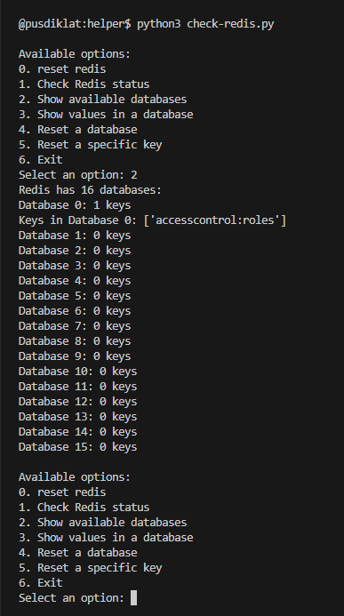

# **6. Panduan Pemeliharaan**

## **6.1 pembaruan pustaka/library**

untuk melakukan update, pastikan untuk mengikuti petunjuk yang terdapat pada masing-masing libray `Prisma`, `Next.js` maupun yang lainnya

## **6.2 Troubleshooting**

- masalah yang umum muncul.

### **6.2.1 Redis**

untuk memudahkan mengelola redis terdapat script python

```ts
cd /home/pusdiklat/panda-app/helper/
```



## **6.3 Backup dan Pemulihan**  

### **Langkah-Langkah Backup Database PostgreSQL**  

1. **Gunakan Perintah `pg_dump`**  
   - Perintah ini digunakan untuk melakukan backup data dari database PostgreSQL. Contoh:  

     ```bash
     pg_dump -U <username> -h <hostname> -d <database_name> -F c -f <path_to_backup_file>
     ```  

     Keterangan:  
     - `-U`: Username untuk autentikasi.  
     - `-h`: Host tempat database berada (default: `localhost`).  
     - `-d`: Nama database yang akan di-backup.  
     - `-F c`: Format backup (direkomendasikan `custom`).  
     - `-f`: Lokasi file hasil backup.  

2. **Backup Semua Database**  
   - Gunakan perintah `pg_dumpall` jika ingin membackup seluruh database:  

     ```bash
     pg_dumpall -U <username> -h <hostname> -f <path_to_backup_file>
     ```  

3. **Penjadwalan Backup Otomatis**  
   - Tambahkan perintah backup ke dalam *cron job* (Linux) atau *Task Scheduler* (Windows) untuk menjalankan backup secara otomatis.  

4. **Verifikasi Backup**  
   - Pastikan file backup dapat dibuka atau diverifikasi menggunakan perintah seperti:  

     ```bash
     pg_restore -l <path_to_backup_file>
     ```  

---

### **Prosedur Pemulihan dari Backup**  

1. **Hentikan Aplikasi yang Terhubung**  
   - Sebelum melakukan pemulihan, hentikan aplikasi yang menggunakan database untuk menghindari konflik.  

2. **Restore dari Backup dengan Format `Custom` atau `Directory`**  
   - Gunakan perintah `pg_restore`:  

     ```bash
     pg_restore -U <username> -h <hostname> -d <database_name> <path_to_backup_file>
     ```  

     Keterangan:  
     - Pastikan database tujuan telah dibuat sebelumnya.  

3. **Restore dari Backup `pg_dumpall`**  
   - Jika backup dilakukan dengan `pg_dumpall`, gunakan perintah berikut:  

     ```bash
     psql -U <username> -h <hostname> -f <path_to_backup_file>
     ```  

4. **Pemulihan Spesifik**  
   - Untuk memulihkan tabel atau data tertentu, gunakan opsi seperti `--table` atau `--data-only` dengan `pg_restore`.  
     Contoh:  

     ```bash
     pg_restore -U <username> -h <hostname> -d <database_name> --table=<table_name> <path_to_backup_file>
     ```  

5. **Verifikasi Data**  
   - Setelah proses pemulihan selesai, verifikasi bahwa semua data telah dipulihkan dengan benar. Gunakan perintah SQL atau aplikasi untuk memeriksa integritas data.  

6. **Nyalakan Kembali Aplikasi**  
   - Setelah pemulihan selesai, aktifkan kembali aplikasi yang terhubung dengan database.  

---

Dokumentasikan proses backup dan pemulihan secara rinci agar tim dapat menjalankan langkah-langkah ini dengan mudah.

## **6.4 pembaruan aplikasi**

### **pembaruan schema prisma**

jika schema diperbarui pada saat dev pastikan untuk membuat script untuk migrasi

di mesin dev

```sh
pnpm prisma migrate dev --create-only --name nama-migrasinya --schema=./prisma/db-honorarium/schema.prisma
pnpm prisma migrate deploy --schema=./prisma/db-honorarium/schema.prisma
pnpm run prisma:generate
```

pastikan untuk melakukan build di dev untuk memastikan tidak build error, kemudian push ke git

```sh
git add .
git commit -am"update per tanggal ... tentang apa "
git push
```

### **pembaruan aplikasi dari git**

sebelum melakukan pembaruan aplikasi di server production, pastikan untuk melakukan backup database. Jika memungkinkan lakukan juga backup file-file yang telah diunggah

stop aplikasi yang sedang berjalan

```sh
cd ~/www/panda-app
pm2 status
pm2 stop d01
```

pull dari git

```sh
git pull origin main
```

lakukan prisma migrate deploy jika ada perubahan schema database

```sh
pnpm prisma migrate deploy --schema=./prisma/db-honorarium/schema.prisma
pnpm run prisma:generate
```

build ulang aplikasi di server

```sh
pnpm build
```

jalankan kembali aplikasi

```sh
pm2 start d01
```
