# **2. Panduan Pengguna**

  Untuk menjalankan fitur pada aplikasi terdapat 3(tiga) kelompok besar menu yaitu: `Dashboad, Alur Proses, Tabel Referensi`

- **Akses ke Aplikasi**:
  - Buka peramban, kemudian ketikkan alamat <https://panda.kemlu.go.id>
  - Daftar peramban yang didukung adalah sebagai berikut.

      | **Browser**       | **Versi yang didukung**  |
      |-------------------|---------------------------------|
      | **Google Chrome**  | Versi 80 dan lebih baru         |
      | **Mozilla Firefox**| Versi 74 dan lebih baru         |
      | **Microsoft Edge** | Versi 80 dan lebih baru         |
      | **Safari**         | Versi 13.1 dan lebih baru       |
      | **Opera**          | Versi 67 dan lebih baru         |

- **Antarmuka**:
  - Gambaran umum komponen utama.
        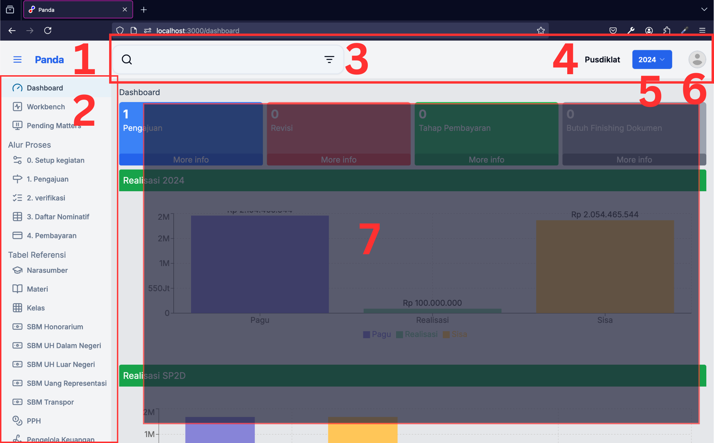
        gambar 2.1. antarmuka

    - keterangan

        | **Nomor**               | **nama**  | **keterangan** |
        |-------------------------|-----------|----------------|
        | **1**| Nama Aplikasi    | disebelah nama terdapat icon burger untuk minimize menu |
        | **2**| Menu             | Menu yang dapat diakses oleh pengguna sesuai role       |
        | **3**| Input Pencarian  |                                                         |
        | **4**| Satker Aktif     | Menunjukkan satker anggaran                             |
        | **5**| Tahun Anggaran   | Pilihan tahun anggaran yang dipilih dan aktif           |
        | **6**| Icon Pengguna    | Ikon Pengguna, jika diklik akan menampilkan profil pengguna dan tombol signout           |
        | **7**| Konten           | akan berisi halaman/tabel/form sesuai menu yang sedang aktif |

## **2.1 Login**

- langkah

    1. buka peramban dan ketikkan alamat <https://panda.kemlu.go.id>
    2. masukkan email pada kolom username
    3. masukkan password pada kolom password
    4. klik Sign in
    5. jika username dan password benar, anda akan masuk ke halaman [dashboard](https://panda.kemlu.go.id)

  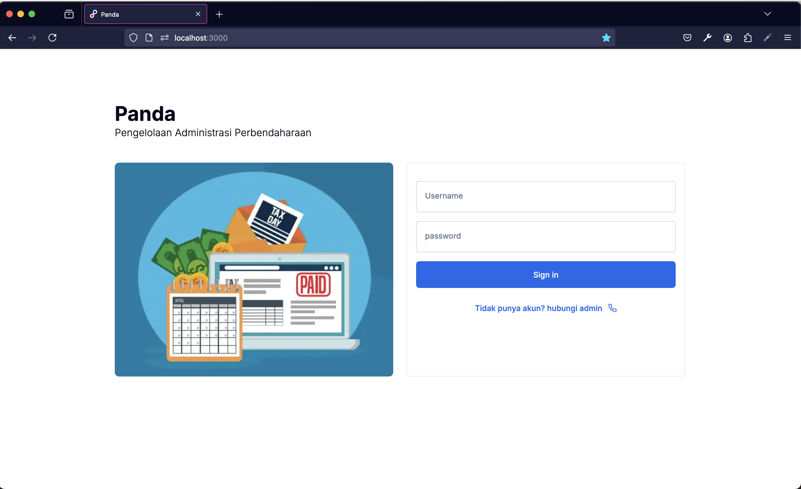
  gambar 2.2. login

## **2.2 Dashboard**

  Halaman Dashboard terdiri atas 3(tiga) bagian:

- Bagian kartu menampilkan berupa jumlah pengajuan, jumlah pengajuan yang direvisi, pengajuan dalam tahap pembayaran dan pengajuan yang membutuhkan dokumen akhir.
- Bagian `Realisasi {tahun}` menampilkan pagu dan realisasi satker anggaran
- Bagian `Realisasi SP2D` menampilkan pagu dan realisasi pada unit organisasi yang ada di satker

  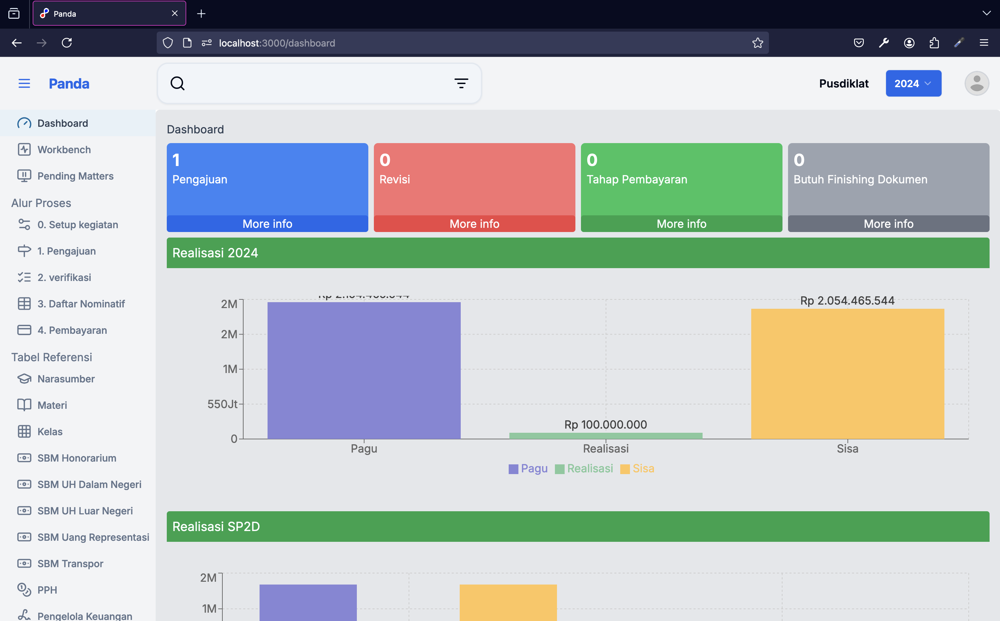
  gambar 2.3. Dashboard

## **2.3 Alur Proses**

  Alur proses terbagi dalam 5(lima) tahap yaitu:

  0. Setup kegiatan
  1. Pengajuan
  2. Verifikasi
  3. Nominatif
  4. Pembayaran
  dan
  5. Unggah dokumen akhir yang terdapat di menu `Pending`

### **2.3.1 Setup Kegiatan**

  Setup Kegiatan terdiri atas 3(tiga) yaitu: Kegiatan Dalam Kota, Kegiatan Luar Kota, dan Kegiatan Luar Negeri.

#### **2.3.1.1 Kegiatan Dalam Kota**

- langkah

    1. Pilih menu `0. Setup Kegiatan`
    2. akan ditampilkan form dengan isian, isi semua isian yang bertanda bintang `*` dan unggah dokumen
    3. Isi Nama Kegiatan, Tanggal Mulai, Tanggal Selesai
    4. Unggah dokumen pendukung `Nota Dinas/Memorandum/SK Tim` dan `Dokumen Jadwal kegiatan`, klik tombol `browse`, pilih dokumen yang akan diuanggah.
    5. Unggah dokumen `Surat Tugas`, klik tombol `Pilih dokumen Surat Tugas`. Anda dapat memilih 1(satu) atau lebih dokumen.
    6. pilih lokasi `Dalam Kota`
    7. Unggah file excel Peserta sesuai dengan template yand disediakan. (klik tombol `Unduh template xls peserta` untuk mengunduh template)
    8. klik tombol `Submit`

    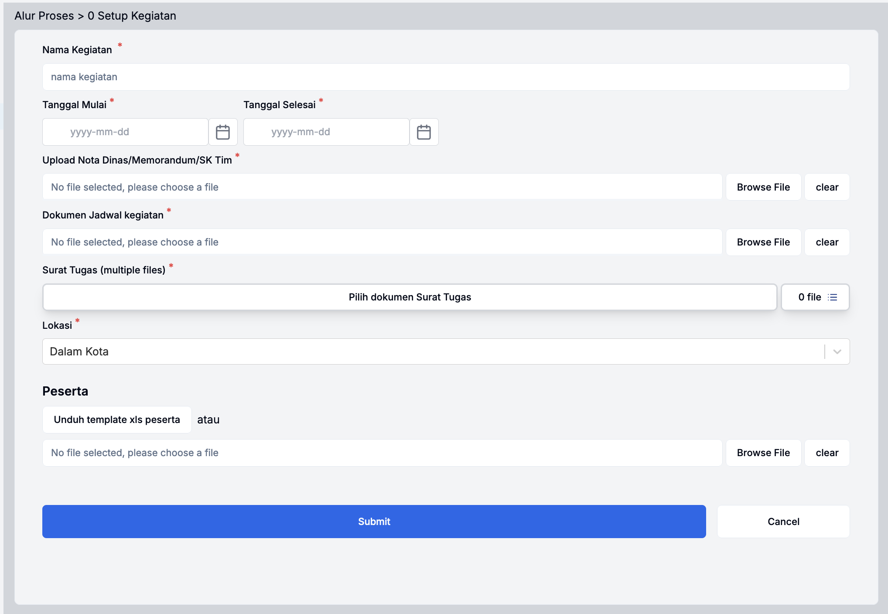
    gambar 2.3. Formulir Setup Kegiatan Dalam Kota

    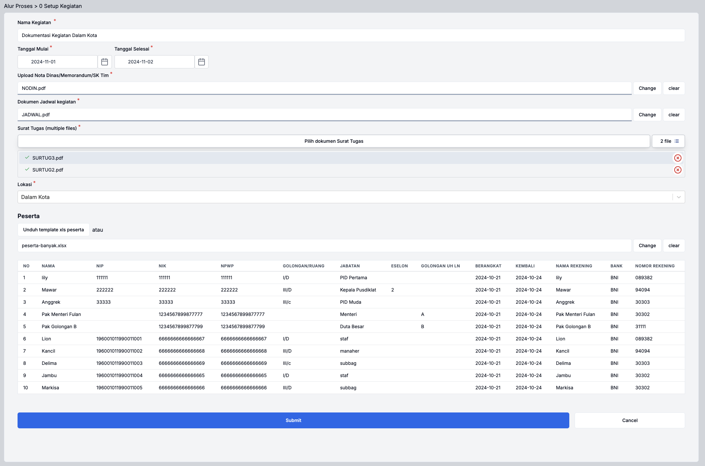
    gambar 2.4. Formulir Setup Kegiatan Dalam Kota yang telah diisi

#### **2.3.1.2 Kegiatan Luar Kota**

- langkah

    1. Pilih menu `0. Setup Kegiatan`
    2. akan ditampilkan form dengan isian, isi semua isian yang bertanda bintang `*` dan unggah dokumen
    3. Isi Nama Kegiatan, Tanggal Mulai, Tanggal Selesai
    4. Unggah dokumen pendukung `Nota Dinas/Memorandum/SK Tim` dan `Dokumen Jadwal kegiatan`, klik tombol `browse`, pilih dokumen yang akan diuanggah.
    5. Unggah dokumen `Surat Tugas`, klik tombol `Pilih dokumen Surat Tugas`. Anda dapat memilih 1(satu) atau lebih dokumen.
    6. pilih lokasi `Luar Kota`
    7. pilih `Provinsi` dan `kota`
    8. Unggah file excel Peserta sesuai dengan template yand disediakan. (klik tombol `Unduh template xls peserta` untuk mengunduh template)
    9. klik tombol `Submit`

    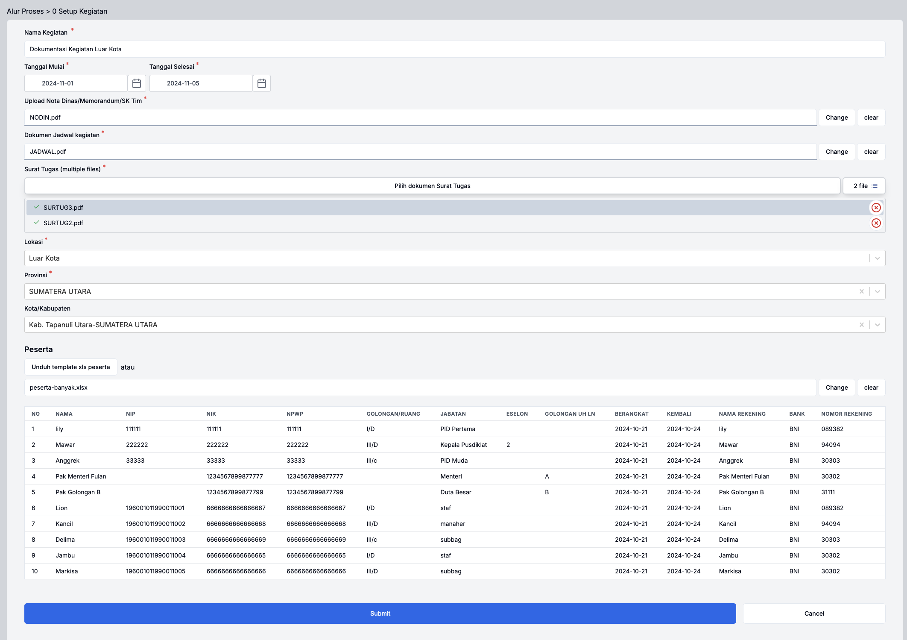
    gambar 2.4. Formulir Setup Kegiatan Luar Kota yang telah diisi

#### **2.3.1.3 Kegiatan Luar Negeri**

  untuk kegiatan luar negeri langkah 1-5 sama dengan kegiatan di dalam negeri. perbedaannya terletak pada langkah selanjutnya yang harus mengisi itinerary

- langkah

    1. Pilih menu `0. Setup Kegiatan`
    2. akan ditampilkan form dengan isian, isi semua isian yang bertanda bintang `*` dan unggah dokumen
    3. Isi Nama Kegiatan, Tanggal Mulai, Tanggal Selesai
    4. Unggah dokumen pendukung `Nota Dinas/Memorandum/SK Tim` dan `Dokumen Jadwal kegiatan`, klik tombol `browse`, pilih dokumen yang akan diuanggah.
    5. Unggah dokumen `Surat Tugas`, klik tombol `Pilih dokumen Surat Tugas`. Anda dapat memilih 1(satu) atau lebih dokumen.
    6. pilih lokasi `Luar Negeri`
    7. Unggah dokumen `Surat Setneg\SPTJM`. klik tombol browse, pilih dokumen yang akan diunggah
    8. klik tombol `itinerary`
    9. Isi data itinerary, tanggal berangkat dan tanggal tiba, pastikan bahwa itinerary pertama dimulai dari IDN-Indonesia, klik tombol `Simpan`
    10. Isi data itinerary untuk perjalanan berikutnya, klik tombol `Simpan`
    11. Isi data itineray kepulangan dari lokasi terakhir ke IDN-Indonesia, klik tombol `Simpan`, dan klik tombol `Tutup` untuk kembalik ke formulir isian kegiatan

    
    gambar 2.5. Tombol itinerary pada Formulir Setup Kegiatan Luar Negeri

    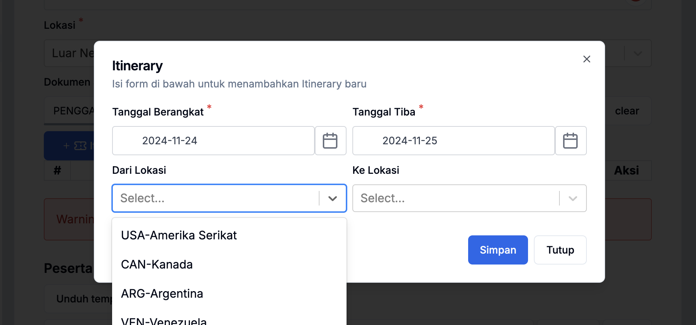
    gambar 2.6. Isian itinerary pada Formulir Setup Kegiatan Luar Negeri

    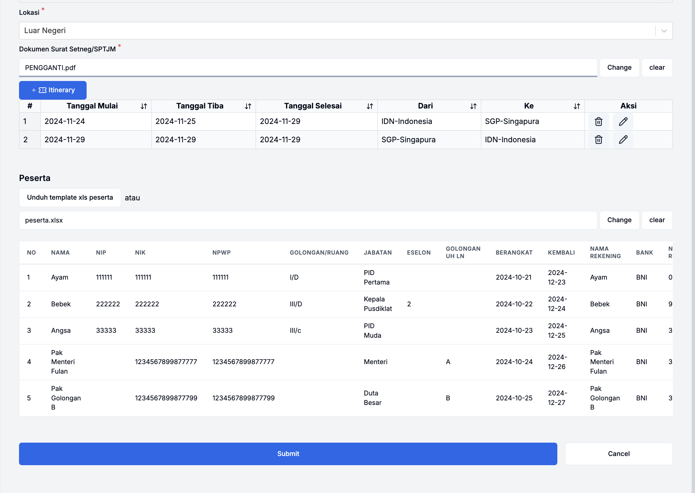
    gambar 2.7. Formulir Setup Kegiatan Luar Negeri dengan Itinerary yang telah diisi

### **2.2.4 Pengajuan**

  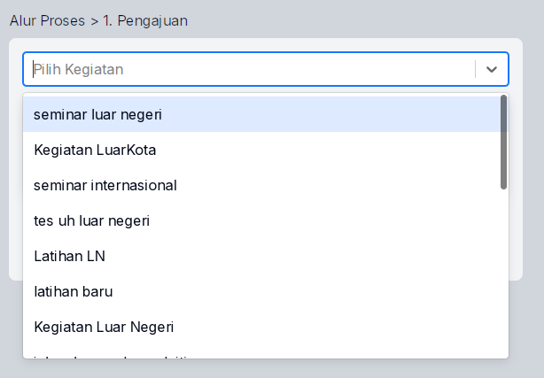

  gambar 2.8. Formulir Setup Pengajuan Kegiatan

#### **2.2.4.1 Pengajuan Kegiatan Dalam Kota**

  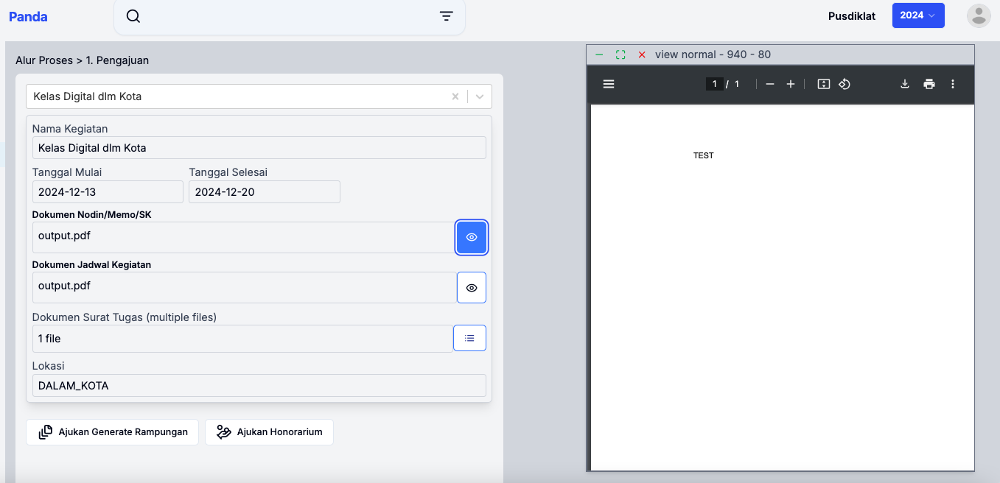

  gambar 2.9. Setup Pengajuan Dalam Kota

  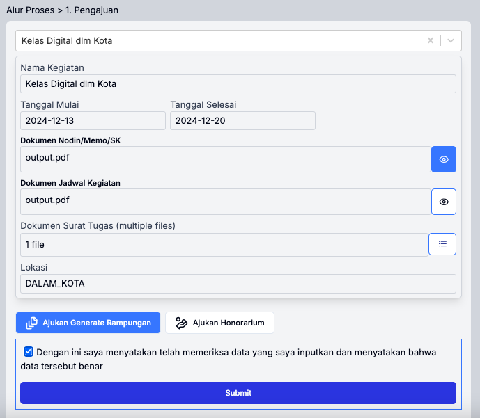

  gambar 2.10. Ajukan Generate Rampungan

  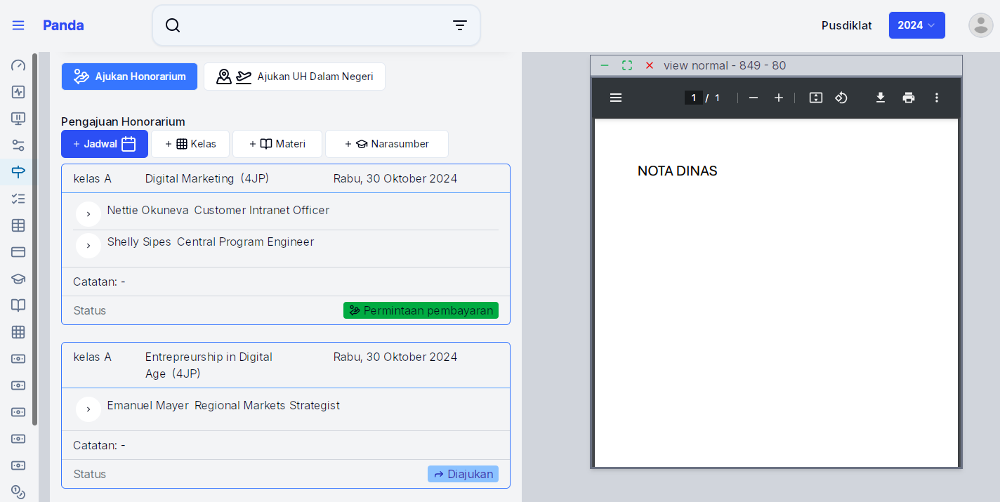

  gambar 2.11. Ajukan Honorarium

  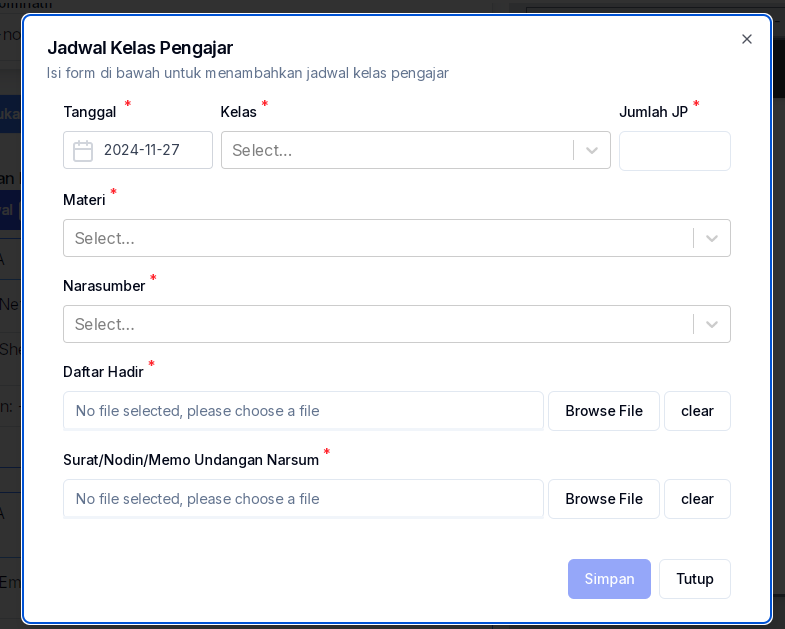

  gambar 2.12. Pilih Jadwal Kelas Pengajar

  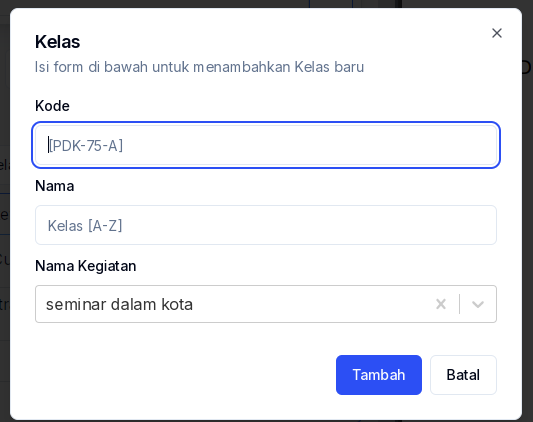

  gambar 2.13. Pilih Kelas

  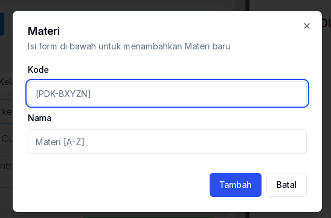

  gambar 2.14. Pilih Materi

  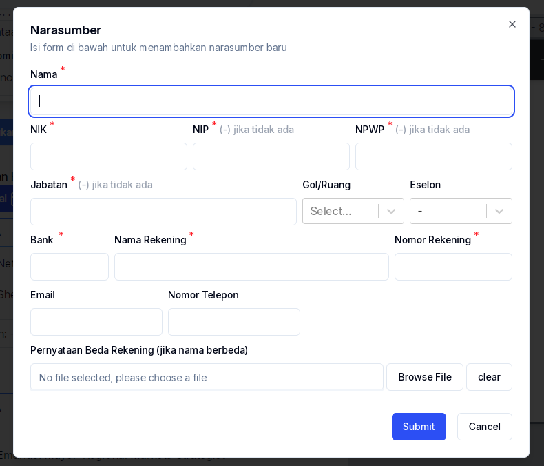

  gambar 2.15. Pilih Narasumber

  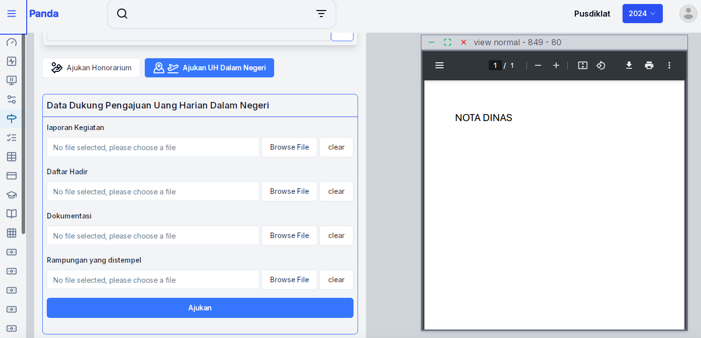

  gambar 2.16. Setup Pengajuan UH Dalam Negeri

#### **2.2.4.2 Pengajuan Kegiatan Luar Kota**

  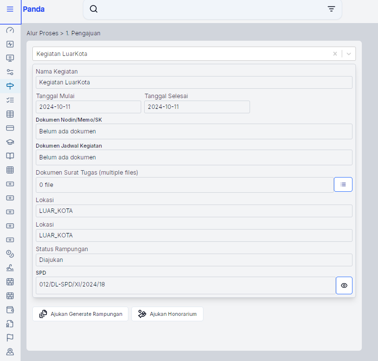
  
  gambar 2.17. Setup Pengajuan Luar Kota

### **2.2.5 Verifikasi**

### **2.2.6 Daftar Nominatif**

### **2.2.7 Pembayaran**

### **2.2.8 Pembayaran**

## **Tabel Referensi**

### **2.2.9 Narasumber**

### **2.2.10 Materi**

### **2.2.11 Kelas**

### **2.2.12 SBM Honorarium**

### **2.2.13 SBM UH Dalam Negeri**

### **2.2.14 SBM UH Luar Negeri**

### **2.2.15 SBM Transpor**

### **2.2.16 Pengelola Keuangan**

### **2.2.17 Satker Anggaran**

### **2.2.18 Unit Kerja**

### **2.2.19 Pagu**

### **2.2.20 SP2D**

### **2.2.21 Negara**

### **2.2.22 Provinsi**

### **2.2.23 Role**

### **2.2.24 Pengguna**
