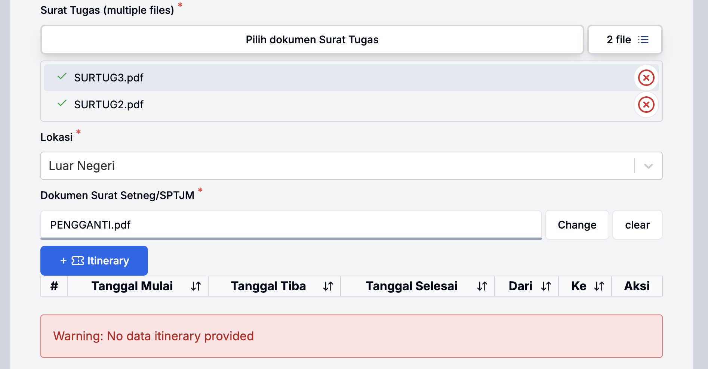
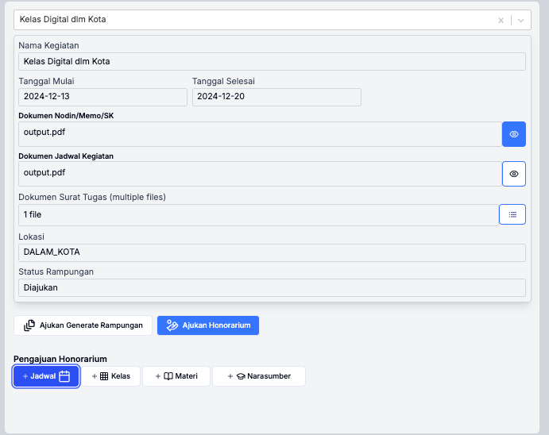
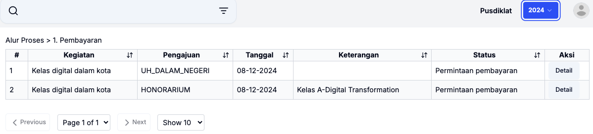
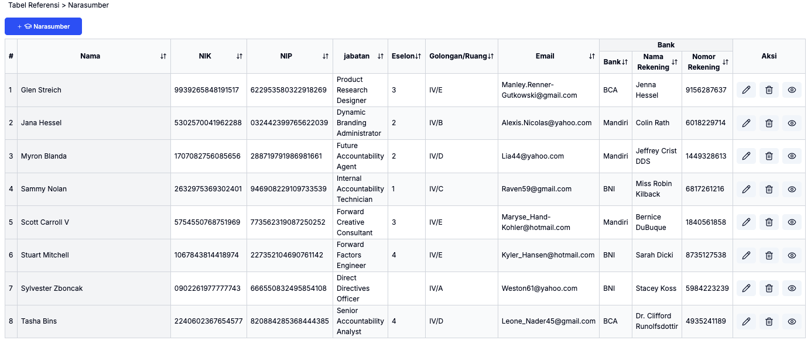
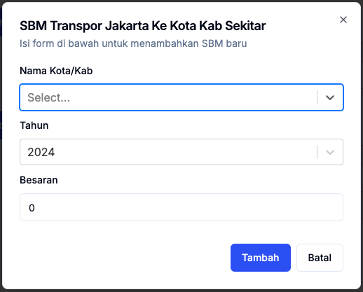

# **2. Panduan Pengguna**

  Untuk menjalankan fitur pada aplikasi terdapat 3(tiga) kelompok besar menu yaitu: `Dashboad, Alur Proses, Tabel Referensi`

- **Akses ke Aplikasi**:
  - Buka peramban, kemudian ketikkan alamat <https://panda.kemlu.go.id>
  - Daftar peramban yang didukung adalah sebagai berikut.

      | **Browser**       | **Versi yang didukung**  |
      |-------------------|---------------------------------|
      | **Google Chrome**  | Versi 80 dan lebih baru         |
      | **Mozilla Firefox**| Versi 74 dan lebih baru         |
      | **Microsoft Edge** | Versi 80 dan lebih baru         |
      | **Safari**         | Versi 13.1 dan lebih baru       |
      | **Opera**          | Versi 67 dan lebih baru         |

- **Antarmuka**:
  - Gambaran umum komponen utama.
        
        
 Gambar 2.1. antarmuka 

    - keterangan

        | **Nomor**               | **nama**  | **keterangan** |
        |-------------------------|-----------|----------------|
        | **1**| Nama Aplikasi    | disebelah nama terdapat icon burger untuk minimize menu |
        | **2**| Menu             | Menu yang dapat diakses oleh pengguna sesuai role       |
        | **3**| Input Pencarian  |                                                         |
        | **4**| Satker Aktif     | Menunjukkan satker anggaran                             |
        | **5**| Tahun Anggaran   | Pilihan tahun anggaran yang dipilih dan aktif           |
        | **6**| Icon Pengguna    | Ikon Pengguna, jika diklik akan menampilkan profil pengguna dan tombol signout           |
        | **7**| Konten           | akan berisi halaman/tabel/form sesuai menu yang sedang aktif |

## **2.1 Login**

- langkah

  1. buka peramban dan ketikkan alamat <https://panda.kemlu.go.id>
  2. masukkan email pada kolom username
  3. masukkan password pada kolom password
  4. klik Sign in
  5. jika username dan password benar, anda akan masuk ke halaman [dashboard](https://panda.kemlu.go.id)
  
  
 Gambar 2.2. login 

## **2.2 Dashboard**

  Halaman Dashboard terdiri atas 3(tiga) bagian:

- Bagian kartu menampilkan berupa jumlah pengajuan, jumlah pengajuan yang direvisi, pengajuan dalam tahap pembayaran dan pengajuan yang membutuhkan dokumen akhir.
- Bagian `Realisasi {tahun}` menampilkan pagu dan realisasi satker anggaran
- Bagian `Realisasi SP2D` menampilkan pagu dan realisasi pada unit organisasi yang ada di satker

  
  
  
 Gambar 2.3. Dashboard 

## **2.3 Alur Proses**

  Alur proses terbagi dalam 5(lima) tahap yaitu:

  0. Setup kegiatan
  1. Pengajuan
  2. Verifikasi
  3. Nominatif
  4. Pembayaran
  dan
  5. Unggah dokumen akhir yang terdapat di menu `Pending`

### **2.3.1 Setup Kegiatan**

  Setup Kegiatan terdiri atas 3(tiga) yaitu: Kegiatan Dalam Kota, Kegiatan Luar Kota, dan Kegiatan Luar Negeri.

#### **2.3.1.1 Kegiatan Dalam Kota**

- langkah

    1. Pilih menu `0. Setup Kegiatan`
    2. akan ditampilkan form dengan isian, isi semua isian yang bertanda bintang `*` dan unggah dokumen
    3. Isi Nama Kegiatan, Tanggal Mulai, Tanggal Selesai
    4. Unggah dokumen pendukung `Nota Dinas/Memorandum/SK Tim` dan `Dokumen Jadwal kegiatan`, klik tombol `browse`, pilih dokumen yang akan diuanggah.
    5. Unggah dokumen `Surat Tugas`, klik tombol `Pilih dokumen Surat Tugas`. Anda dapat memilih 1(satu) atau lebih dokumen.
    6. pilih lokasi `Dalam Kota`
    7. Unggah file excel Peserta sesuai dengan template yand disediakan. (klik tombol `Unduh template xls peserta` untuk mengunduh template)
    8. klik tombol `Submit`

    

    
    Gambar 2.3. Formulir Setup Kegiatan Dalam Kota

    
    Gambar 2.4. Formulir Setup Kegiatan Dalam Kota yang telah diisi 

#### **2.3.1.2 Kegiatan Luar Kota**

- langkah

    1. Pilih menu `0. Setup Kegiatan`
    2. akan ditampilkan form dengan isian, isi semua isian yang bertanda bintang `*` dan unggah dokumen
    3. Isi Nama Kegiatan, Tanggal Mulai, Tanggal Selesai
    4. Unggah dokumen pendukung `Nota Dinas/Memorandum/SK Tim` dan `Dokumen Jadwal kegiatan`, klik tombol `browse`, pilih dokumen yang akan diuanggah.
    5. Unggah dokumen `Surat Tugas`, klik tombol `Pilih dokumen Surat Tugas`. Anda dapat memilih 1(satu) atau lebih dokumen.
    6. pilih lokasi `Luar Kota`
    7. pilih `Provinsi` dan `kota`
    8. Unggah file excel Peserta sesuai dengan template yand disediakan. (klik tombol `Unduh template xls peserta` untuk mengunduh template)
    9. klik tombol `Submit`

    

    
    Gambar 2.5. Formulir Setup Kegiatan Luar Kota yang telah diisi 

#### **2.3.1.3 Kegiatan Luar Negeri**

  untuk kegiatan luar negeri langkah 1-5 sama dengan kegiatan di dalam negeri. perbedaannya terletak pada langkah selanjutnya yang harus mengisi itinerary

- langkah

    1. Pilih menu `0. Setup Kegiatan`
    2. akan ditampilkan form dengan isian, isi semua isian yang bertanda bintang `*` dan unggah dokumen
    3. Isi Nama Kegiatan, Tanggal Mulai, Tanggal Selesai
    4. Unggah dokumen pendukung `Nota Dinas/Memorandum/SK Tim` dan `Dokumen Jadwal kegiatan`, klik tombol `browse`, pilih dokumen yang akan diuanggah.
    5. Unggah dokumen `Surat Tugas`, klik tombol `Pilih dokumen Surat Tugas`. Anda dapat memilih 1(satu) atau lebih dokumen.
    6. pilih lokasi `Luar Negeri`
    7. Unggah dokumen `Surat Setneg\SPTJM`. klik tombol browse, pilih dokumen yang akan diunggah
    8. klik tombol `itinerary`
    9. Isi data itinerary, tanggal berangkat dan tanggal tiba, pastikan bahwa itinerary pertama dimulai dari IDN-Indonesia, klik tombol `Simpan`
    10. Isi data itinerary untuk perjalanan berikutnya, klik tombol `Simpan`
    11. Isi data itineray kepulangan dari lokasi terakhir ke IDN-Indonesia, klik tombol `Simpan`, dan klik tombol `Tutup` untuk kembalik ke formulir isian kegiatan

    

    
    Gambar 2.6. Tombol itinerary pada Formulir Setup Kegiatan Luar Negeri

    
    Gambar 2.7. Isian itinerary pada Formulir Setup Kegiatan Luar Negeri

    
    Gambar 2.8. Formulir Setup Kegiatan Luar Negeri dengan Itinerary yang telah diisi 
    

### **2.3.2 Pengajuan**

Formulir Pengajuan Kegiatan ini terdiri dari daftar kegiatan yang telah di setup sebelumnya.

- Langkah:
  
  Pilih kegiatan yang akan di ajukan
  
  

  
  Gambar 2.9. Formulir Setup Pengajuan Kegiatan 

#### **2.3.2.1 Pengajuan Kegiatan di Dalam/Luar Negeri**

Pada form ini terdapat list kegiatan yang telah di daftarkan sebelumnya pada formulir setup kegiatan, maka akan ditampilkan:

  1. Nama kegiatan
  2. Tanggal mulai, tanggal selesai
  3. Dokumen Nodin/Memo/SK
  4. Dokumen Jadwal Kegiatan
  5. Dokumen Surat Tugas (multiple files)
  6. Lokasi
  7. Status Rampungan
  8. Klik lambang `Mata/View` untuk melihat isi dokumen

  
  
 Gambar 2.10. Setup Pengajuan Dalam Kota 

- Langkah 1:
  1. Klik tombol `Ajukan Generate Rampungan`, maka akan ditampilkan form baru dibawahnya, 
  2. klik `checklist` keterangan "Dengan ini saya menyatakan telah memeriksa data yang saya inputkan dan menyatakan bahwa data tersebut benar",
  3. Klik `Submit` akan muncul "keterangan Pengajuan Generate Rampungan berhasil diajukan, petugas akan memverifikasi pengajuan Anda".

  

  
  Gambar 2.11. Ajukan Generate Rampungan 

  
- Langkah 2:
  Klik tombol `Ajukan Honorarium`, maka akan ditampilkan formulir pengajuan honorarium.

  

  
  Gambar 2.12. Ajukan Honorarium 

- Langkah 3:
  Apabila belum ada jadwal bisa menambahkan jadwal.
  klik tombol `Jadwal`, maka akan ditampilkan formulir jadwal kelas pengajar, isikan:
    1. Tanggal
    2. Kelas
    3. Jumlah JP
    4. Materi
    5. Narasumber
    6. Daftar Hadir
    7. Surat/Nodin/Memo Undangan Narsum
    8. Klik `Simpan`

  
 

  
  Gambar 2.13. Jadwal Kelas Pengajar 

- Langkah 4:
  Apabila belum ada kelas bisa menambahkan kelas:
  klik tombol `Kelas`, maka akan ditampilkan formulir kelas pengajar, isikan:
    1. Kode
    2. Nama kelas
    3. Pilih Nama Kegiatan
    4. Klik `Tambah`

  

  
  Gambar 2.14. Kelas 

- Langkah 5:
  Apabila belum ada materi bisa menambahkan materi:
  klik tombol `Materi`, maka akan ditampilkan formulir materi, isikan:
    1. Kode
    2. Nama materi
    3. Klik `Tambah`

  

  
  Gambar 2.15. Materi 

- Langkah 6:
  Apabila belum ada narasumber bisa menambahkan narasumber:
  klik tombol `Narasumber`, maka akan ditampilkan formulir narasumber, isikan:
    1. Nama
    2. NIK, NIP, NPWP
    3. Jabatan, Gol/Ruang, Eselon
    4. Bank, Nama Rekening, Nomor Rekening
    5. Email, No. Telepon,
    6. Pernyataan beda rekening (apabila berbeda)
    7. Klik `Tambah`

  

  
  Gambar 2.16. Narasumber 

- Langkah 7:
  Pilih Nama Pengajar Kelas, isikan:
    1. Pilih `Jenis honorarium`
    2. Masukan `Jumlah JP` dan klik `update Jenis dan JP`
    3. Kemudian klik tombol `Ajukan`

  

  
  Gambar 2.17. Ajukan Honorarium 

- Langkah 8:
  Formulir ini dapat dilakukan setelah dilakukan `verifikasi Generate Rampungan`.
  Klik tombol `Ajukan UH Dalam Negeri`, maka akan tampil form baru dan terdapat beberapa isian yang harus di isi:
    1. laporan Kegiatan
    2. Daftar Hadir
    3. Dokumentasi
    4. Rampungan yang di Stempel
    5. Klik tombol `Ajukan`

  

  
  Gambar 2.18. Setup Pengajuan UH Dalam Negeri 

### **2.3.3 Verifikasi**

Pada tahap ini terdapat 2 kegiatan yaitu `Verifikasi Generate Rampungan` dan `Verifikasi Honorarium`.

#### **2.3.3.1 Verifikasi Generate Rampungan**
- Langkah:
    1. Pilih `Kegiatan`, makan akan ditampilkan data-data: Nama Kegiatan, Tanggal Mulai, Tanggal Selesai, Dokumen Nodin/Memo/SK, Dokumen Jadwal Kegiatan, Dokumen Surat Tugas (multiple files), Lokasi, Status Rampungan
    2. Klik tombol `Verifikasi Generate Rampungan`
    3. Akan tampil form dibawahnya, kemudian pilih `PPK`, Masukan keterangan `Pembebanan anggaran - Akun`, Keterangan `SPD`
    4. Klik tombol `Generate SPD`, akan ditampilkan file PDF `SPD` untuk di download

  

  
  Gambar 2.19. Verifikasi Generate Rampungan

  
  Gambar 2.20. Contoh file PDF SPD 

#### **2.3.3.2 Verifikasi Honorarium**

- Langkah:
    1. Pilih `Narasumber`, masukan `Jenis Honorarium`, `Jumlah JP`, klik update.
    2. Masukan catatan apabila ada yang perlu direvisi, kemudian klik tombol `Revisi`.
    3. Klik tombol `Setuju` apabila sudah sesuai.

  
  Gambar 2.21. Verifikasi Honorarium di Setujui

### **2.3.4 Daftar Nominatif**
- Langkah:
  Pilih `Kegiatan` dan `Jenis Pengajuan`

  
  Gambar 2.22. Tambah Nominatif Honorarium
  

- Langkah:
Apabila memilih Honorarium maka akan muncul formulir dibawahya:
    1. Pilih `Jadwal Kelas Materi`, `Bendahara`, `PPK` kemudian klik tombol `Generate`, maka akan dihasilkan file PDF Nominatif Honorarium.
    2. Masukan `Upload Dokumen Bukti Pajak`
    3. Masukan `catatan` apabila ada.
    4. Klik tombol `Ajukan Pembayaran` apabila sudah sesuai.

  
  Gambar 2.23. Tambah Nominatif Honorarium

  
  Gambar 2.24. File PDF Daftar Nominatif Honorarium

- Langkah:
  Apabila memilih Uang Harian maka akan muncul formulir dibawahya:

    1. Pilih `Bendahara`, `PPK` kemudian klik tombol `Generate`, maka akan dihasilkan file PDF Nominatif Uang Harian.
    2. Masukan `catatan` apabila ada.
    4. Klik tombol `Ajukan Pembayaran` apabila sudah sesuai.

  
  Gambar 2.25. Tambah Nominatif Uang Harian

  
  Gambar 2.26. File PDF Daftar Nominatif Uang Harian

### **2.3.5 Pembayaran**
- Langkah:
    1. Pilih `Kegiatan` kemudian klik `detail`
    2. Akan ditampilkan detail kegiatan, klik `Narasumber`, 
    3. Isikan `Upload bukti pembayaran` lalu klik `Simpan`.

  
  Gambar 2.27 List Kegiatan

   Gambar 2.28. Formulir Detail Pembayaran

## **2.4 Tabel Referensi**

### **2.4.1 Narasumber**

- Tabel ini berisi list atau daftar dari Narasumber yang telah terdaftar.
    1. Klik lambang `Pensil` apabila ingin melihat secara detail atau melakukan `edit` data.
    2. Klik lambang `Trash` untuk delete data.
    3. Klik lambang `View/mata` untuk melihat file pernyataan rekening berbeda.
  
- Apabila ingin menambahkan Narasumber baru, yaitu dengan cara:
    Lambang `*` wajib di isi.
    1. Isikan `Nama`, `NIK`, `NIP` (-) jika tidak ada, `NPWP` (-) jika tidak ada, `Jabatan` (-) jika tidak ada.
    2. Pilih `Gol/Ruang`, `Eselon`,
    3. Isikan `Bank`, `Nama Rekening`, `Nomor Rekening`, `Email`, `Nomor Telepon` dan
    4. `Upload Pernyataan Beda Rekening` (jika nama berbeda)
    5. Klik `Submit`

  
  Gambar 2.29. List Narasumber

  
  Gambar 2.30. Tambah Narasumber

### **2.4.2 Materi**
- Tabel ini berisi list atau daftar dari Materi yang telah terdaftar.
    1. Klik lambang `Pensil` apabila ingin melakukan `edit` data.
    2. Klik lambang `Trash` untuk delete data.
  
- Apabila ingin menambahkan Materi baru, yaitu dengan cara:
    1. Isikan `Kode`
    2. Isikan `Nama Materi`
    3. Klik `Tambah`

  
  Gambar 2.31. List Materi

  
  Gambar 2.32. Tambah Materi

### **2.4.3 Kelas**
- Tabel ini berisi list atau daftar dari Kelas yang telah terdaftar.
    1. Klik lambang `Pensil` apabila ingin melakukan `edit` data.
    2. Klik lambang `Trash` untuk delete data.
  
- Apabila ingin menambahkan Kelas baru, yaitu dengan cara:
    1. Isikan `Kode`
    2. Isikan `Nama Kelas`
    3. Pilih `Nama Kegiatan`
    4. Klik `Tambah`

  
  Gambar 2.33. List Kelas

  
  Gambar 2.34. Tambah Kelas

### **2.4.4 SBM Honorarium**
- Tabel ini berisi list atau daftar dari SBM Honorarium yang telah terdaftar.
    1. Pilih `Tahun`
    2. Klik lambang `Pensil` apabila ingin melakukan `edit` data.
    3. Klik lambang `Trash` untuk delete data.

- Apabila ingin menambahkan SBM Honorarium baru, yaitu dengan cara:
    1. klik tombol `Unduh template XLS` isikan data-datanya: Jenis, Satuan, Besaran, Uraian, Tahun kemudian save/simpan.
    2. Klik tombol `Browse File xls` untuk import data dari excel yang telah di isi.
    3. Kemudian klik tombol `Import data`.

  
  Gambar 2.35. List SBM Honorarium

  
  Gambar 2.36. Input excel SBM Honorarium

  
  Gambar 2.37. Import SBM Honorarium

### **2.4.5 SBM UH Dalam Negeri**

- Tabel ini berisi list atau daftar dari SBM UH Dalam Negeri yang telah terdaftar.
    1. Pilih `Tahun`
    2. Klik lambang `Pensil` apabila ingin melakukan `edit` data.
    3. Klik lambang `Trash` untuk delete data.

- Apabila ingin menambahkan SBM UH Dalam Negeri baru, yaitu dengan cara:
    1. klik tombol `Unduh template XLS` isikan data-datanya: No, ID Provinsi, Nama Provinsi, Satuan, Fullboar, Fullday/Halfday, Luar Kota, Dalam Kota, Diklat, Tahun kemudian save/simpan.
    2. Klik tombol `Browse File xls` untuk import data dari excel yang telah di isi.
    3. Kemudian klik tombol `Import data` untuk menambahkan.

  
  Gambar 2.38. List SBM UH Dalam Negeri

  
  Gambar 2.39. Input excel SBM UH Dalam Negeri

### **2.4.6 SBM UH Luar Negeri**

- Tabel ini berisi list atau daftar dari SBM UH Luar Negeri yang telah terdaftar.
    1. Pilih `Tahun`
    2. Klik lambang `Pensil` apabila ingin melakukan `edit` data.
    3. Klik lambang `Trash` untuk delete data.

- Apabila ingin menambahkan SBM UH Luar Negeri baru, yaitu dengan cara:
    1. klik tombol `Unduh template XLS` isikan data-datanya: No, ID Negara, Nama, Satuan, Golongan A, Golongan B, Golongan C, Golongan D, Tahun kemudian save/simpan.
    2. Klik tombol `Browse File xls` untuk import data dari excel yang telah di isi.
    3. Kemudian klik tombol `Import data` untuk menambahkan.

  
  Gambar 2.40. List SBM UH Luar Negeri

  
  Gambar 2.41. Input excel SBM UH Luar Negeri

### **2.4.7 SBM Representasi**

- Tabel ini berisi list atau daftar dari SBM Representasi yang telah terdaftar.
    1. Pilih `Tahun`
    2. Klik lambang `Pensil` apabila ingin melakukan `edit` data.
    3. Klik lambang `Trash` untuk delete data.

- Apabila ingin menambahkan SBM Representasi baru, yaitu dengan cara:
    1. klik tombol `SBM Uang Representasi`
    2. Pilih `Pejabat`
    3. Isikan `Satuan`, biaya Rep. untuk `Luar Kota`, `Dalam lebih dari 8 Jam` dan `Tahun`
    4. Klik tombol `Tambah`

  
  Gambar 2.42. List SBM Representasi

  
  Gambar 2.43. Tambah SBM Representasi

### **2.4.8 SBM Transpor**

- Tabel ini berisi list atau daftar dari SBM Transpor yang telah terdaftar.
    1. Pilih `Tahun`
    2. Klik lambang `Pensil` apabila ingin melakukan `edit` data.
    3. Klik lambang `Trash` untuk delete data.

- Apabila ingin menambahkan `SBM Transpor Dalam Kota`, yaitu dengan cara:
    1. klik tombol `SBM Transpor Dalam Kota`
    2. Isikan `Besaran`
    3. Isikan `Satuan`
    4. Klik tombol `Tambah`

 - Apabila ingin menambahkan `SBM Transpor Jakarta Ke Kota/Kab Sekitar`, yaitu dengan cara:
    1. klik tombol `SBM Transpor Jakarta Ke Kota/Kab Sekitar`
    2. Pilih `Nama Kota/Kab`
    3. Pilih `Tahun`
    4. Isikan `Besaran`
    5. Klik tombol `Tambah`

  
  Gambar 2.44. List SBM Transpor

  
  Gambar 2.45. Tambah SBM Transpor Dalam Kota

  
  Gambar 2.46. Tambah SBM Transpor Jakarta ke Kota/Kab.

### **2.4.9 Unit Kerja**
- Tabel ini berisi list atau daftar dari `Unit Kerja` yang telah terdaftar.
    1. Klik lambang `Pensil` apabila ingin melakukan `edit` data.
    2. Klik lambang `Trash` untuk delete data.

- Apabila ingin menambahkan `Unit Kerja`, yaitu dengan cara:
    1. klik tombol `Unit Kerja`
    2. Pilih `Induk Organisasi`
    3. Isikan `Nama Unit`, `Singkatan` dan `Eselon`
    4. Klik centang `Satker Anggaran` apabila ingin di jadikan sebagai `Satker Anggaran`
    5. Klik tombol `Simpan`

  
  Gambar 2.47. List Unit Kerja

  
  Gambar 2.48. Tambah Unit Kerja

### **2.4.10 Satker Anggaran**

- Tabel ini berisi list atau daftar dari `Satker Anggaran` yang telah terdaftar.
    1. Klik lambang `Trash` untuk delete data.

- Apabila ingin menambahkan `Satker Anggaran`, yaitu dengan cara:
    1. klik tombol `Satker Anggaran`
    2. Pilih `Unit Kerja`
    3. Klik tombol `Tambah`

  
  Gambar 2.49. List Satker Anggaran

  
  Gambar 2.50. Tambah Satker Anggaran

 

### **2.4.11 Pengelola Keuangan**

- Tabel ini berisi list atau daftar dari Pejabat Penanggung Jawab `Pengelola Keuangan` yang telah terdaftar.
    1. Pilih `Tahun`
    2. Klik lambang `Pensil` apabila ingin melakukan `edit` data.
    3. Klik lambang `Trash` untuk delete data.

- Apabila ingin menambahkan `Pengelola Keuangan`, yaitu dengan cara:
    1. klik tombol `Pejabat`
    2. Isikan `Nama`, `NIK`, `NIP`
    3. Pilih `Gol/Ruang`, `Satker Anggaran`, `Jabatan`, `Tanggal mulai` dan `Tanggal Selesai`.
    4. Klik tombol `Submit`

  
  Gambar 2.51. List Pejabat Pengelola Keuangan

  
  Gambar 2.52. Tambah Pejabat Pengelola Keuangan

 

### **2.4.12 Pagu**
- Tabel ini berisi list atau daftar dari Pagu yang telah didaftarkan.
    1. Pilih `Tahun`
    2. Klik lambang `Pensil` apabila ingin melakukan `edit` data.
    3. Klik lambang `Trash` untuk delete data.

- Apabila ingin menambahkan `Pagu`, yaitu dengan cara:
    1. klik tombol `Pagu`
    2. Pilih `Unit Kerja`
    3. Isikan `Pagu`
    4. Klik tombol `Simpan`

  
  Gambar 2.53. List Pagu

  
  Gambar 2.54. Tambah Pagu

 

### **2.4.13 SP2D**
- Tabel ini berisi list atau daftar dari SP2D yang telah di tambahkan.

    1. Klik lambang `Pensil` apabila ingin melakukan `edit` data.
    2. Klik lambang `Trash` untuk delete data.

- Apabila ingin menambahkan `SP2D`, yaitu dengan cara:
    1. klik tombol `Sp2d`
    2. Pilih `Unit Kerja`
    3. Isikan `Jumlah Dibayar`, `Nomor`
    4. Isikan `Tanggal Sp2d  
    3. Klik tombol `Simpan`

  
  Gambar 2.55. List SP2D

  
  Gambar 2.56. Tambah SP2D

 

### **2.4.14 Negara**

- Tabel ini berisi list atau daftar dari Negara yang telah didaftarkan.

    1. Klik lambang `Pensil` apabila ingin melakukan `edit` data.
    2. Klik lambang `Trash` untuk delete data.

- Apabila ingin menambahkan `Negara`, yaitu dengan cara:
    1. klik tombol `Negara`
    2. Isikan `Nama`, `Nama(EN)`, `Kode Alpha2`, `Kode Alpha3`, `Kode Numeric`, `Urutan`
    3. Klik tombol `Tambah`

  
  Gambar 2.57. List Negara

  
  Gambar 2.58. Tambah Negara

 

### **2.4.15 Provinsi**

- Tabel ini berisi list atau daftar dari Provinsi yang telah didaftarkan.

    1. Klik lambang `Pensil` apabila ingin melakukan `edit` data.
    2. Klik lambang `Trash` untuk delete data.

- Apabila ingin menambahkan `Provinsi`, yaitu dengan cara:
    1. klik tombol `Provinsi`
    2. Isikan `Kode`, `Nama`, `Singkatan`, `Urutan`
    3. Klik tombol `Tambah`

  
  Gambar 2.59. List Provinsi

  
  Gambar 2.60. Tambah Provinsi

 

### **2.4.16 Role**
- Tabel ini berisi list atau daftar dari Role yang telah didaftarkan.

    1. Klik lambang `Pensil` apabila ingin melakukan `edit` data.
    2. Klik lambang `Trash` untuk delete data.

- Apabila ingin menambahkan `Role`, yaitu dengan cara:
    1. klik tombol `Role`
    2. Isikan `Nama Role`
    3. Pilih `Permission`
    4. Klik tombol `Simpan`

  
  Gambar 2.61. List Role

  
  Gambar 2.62. Tambah Role

 

### **2.4.17 Pengguna**

- Tabel ini berisi list atau daftar dari Pengguna yang telah didaftarkan.

    1. Klik lambang `Pensil` apabila ingin melakukan `edit` data.
    2. Klik lambang `Trash` untuk delete data.

- Apabila ingin menambahkan `Pengguna`, yaitu dengan cara:
    1. klik tombol `Pengguna`
    2. Pilih `Unit Kerja`, `Role`
    3. Isikan `Nama`, `NIP`, `Email`, `Password` dan `re-enter Password`
    4. Klik tombol `Simpan`

  
  Gambar 2.63. List Pengguna

  
  Gambar 2.64. Tambah Pengguna

 

## **2.5 Workbench**

Pada tabel ini terdapat list data yang sedang dikerjakan.

- Langkah:

    1. Piih `Tahun`
    2. Klik lambang `Mata/view` untuk melihat detail kegiatan.
    3. Klik lambang `>` untuk melihat detail `Status Pengajuan` serta klik `Mata/View` untuk melihat dokumen yang telah di upload.

  
  Gambar 2.65. List Workbench

  
  Gambar 2.66. Detail Workbench

## **2.6 Pending Matters**

Pada tabel ini terdapat list data yang masih pending mengenai masalah pembayaran dan terdapat menu untuk `Upload dokumen akhir` serta `verifikasi`

- Langkah:

    1. Klik lambang `>` untuk melihat detail
    2. Klik `Unggah Dokumen` untuk upload dokumen akhir
    3. Klik `Browse file` untuk upload `Dokumentasi`
    4. Klik `Browse file` untuk upload `Laporan Kegiatan`
    5. Klik `Simpan`
    6. Klik `Verifikasi`
    7. Kemudian `Cek` 'Pernyataan Semua Dokumen Lengkap dan dinyatakan benar'
    8. Klik `Simpan dan Selesai`

  
  Gambar 2.67. List Pending Matters

  
  Gambar 2.68. Unggah Dokumen

  
  Gambar 2.69. Verifikasi Dokumen

  
  Gambar 2.70. Pernyataan Verifikasi Dokumen

 

